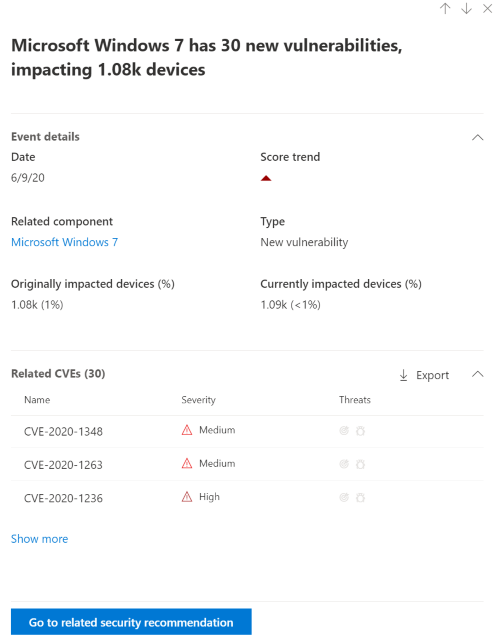

# Event timeline

**Applies to:**

- [Microsoft Defender Vulnerability Management](https://go.microsoft.com/fwlink/?linkid=2229011)
- [Microsoft Defender for Endpoint Plan 2](https://go.microsoft.com/fwlink/?linkid=2154037)
- [Microsoft 365 Defender](https://go.microsoft.com/fwlink/?linkid=2118804)
- [Microsoft Defender for Servers Plan 1 & 2](/azure/defender-for-cloud/plan-defender-for-servers-select-plan)

Event timeline is a risk news feed that helps you interpret how risk is introduced into the organization through new vulnerabilities or exploits. You can view events that may impact your organization's risk. For example, you can find new vulnerabilities that were introduced, vulnerabilities that became exploitable, exploit that was added to an exploit kit, and more.

Event timeline also tells the story of your [exposure score](tvm-exposure-score.md) and [Microsoft Secure Score for Devices](tvm-microsoft-secure-score-devices.md) so you can determine the cause of large changes. Events can impact your devices or your score for devices. Reduce you exposure by addressing what needs to be remediated based on the prioritized [security recommendations](tvm-security-recommendation.md).

> [!TIP]
> Did you know you can try all the features in Microsoft Defender Vulnerability Management for free? Find out how to [sign up for a free trial](../defender-vulnerability-management/defender-vulnerability-management-trial.md).

## Navigate to the Event timeline page

There are three entry points from the [Microsoft Defender Vulnerability Management dashboard](tvm-dashboard-insights.md):

- **Organization exposure score card**: Hover over the event dots in the "Exposure Score over time" graph and select "See all events from this day." The events represent software vulnerabilities.
- **Microsoft Secure Score for Devices**: Hover over the event dots in the "Your score for devices over time" graph and select "See all events from this day." The events represent new configuration assessments.
- **Top events card**: Select "Show more" at the bottom of the top events table. The card displays the three most impactful events in the last 7 days. Impactful events can include if the event affects a large number of devices, or if it is a critical vulnerability.

### Exposure score and Microsoft Secure Score for Devices graphs

In the Defender Vulnerability Management dashboard, hover over the Exposure score graph to view top software vulnerability events from that day that impacted your devices. Hover over the Microsoft Secure Score for Devices graph to view new security configuration assessments that affect your score.

If there are no events that affect your devices or your score for devices, then none will be shown.

 

### Drill down to events from that day

Selecting **Show all events from this day** takes you to the Event timeline page with a custom date range for that day.

Select **Custom range** to change the date range to another custom one, or a pre-set time range.

## Event timeline overview

On the Event timeline page, you can view the all the necessary info related to an event.

Features:

- Customize columns
- Filter by event type or percent of impacted devices
- View 30, 50, or 100 items per page

The two large numbers at the top of the page show the number of new vulnerabilities and exploitable vulnerabilities, not events. Some events can have multiple vulnerabilities, and some vulnerabilities can have multiple events.

### Columns

- **Date**: month, day, year
- **Event**: impactful event, including component, type, and number of impacted devices
- **Related component**: software
- **Originally impacted devices**: the number, and percentage, of impacted devices when this event originally occurred. You can also filter by the percent of originally impacted devices, out of your total number of devices.
- **Currently impacted devices**: the current number, and percentage, of devices that this event currently impacts. You can find this field by selecting **Customize columns**.
- **Types**: reflect time-stamped events that impact the score. They can be filtered.
  - Exploit added to an exploit kit
  - Exploit was verified
  - New public exploit
  - New vulnerability
  - New configuration assessment
- **Score trend**: exposure score trend

### Icons

The following icons show up next to events:

-  New public exploit
-  New vulnerability was published
-  Exploit found in exploit kit
-  Exploit verified

### Drill down to a specific event

Once you select an event, a flyout will appear with a list of the details and current CVEs that affect your devices. You can show more CVEs or view the related recommendation.

The arrow below "score trend" helps you determine whether this event potentially raised or lowered your organizational exposure score. Higher exposure score means devices are more vulnerable to exploitation.

From there, select **Go to related security recommendation** view the recommendation that addresses the new software vulnerability in the [security recommendations page](tvm-security-recommendation.md). After reading the description and vulnerability details in the security recommendation, you can submit a remediation request, and track the request in the [remediation page](tvm-remediation.md).

## View Event timelines in software pages

To open a software page, select an event > select the hyperlinked software name (like Visual Studio 2017) in the section called "Related component" in the flyout. [Learn more about software pages](tvm-software-inventory.md#software-pages)

A full page will appear with all the details of a specific software. Mouse over the graph to see the timeline of events for that specific software.

Navigate to the event timeline tab to view all the events related to that software. You can also see security recommendations, discovered vulnerabilities, installed devices, and version distribution.

## Related topics

- [Dashboard](tvm-dashboard-insights.md)
- [Exposure score](tvm-exposure-score.md)
- [Security recommendations](tvm-security-recommendation.md)
- [Remediate vulnerabilities](tvm-remediation.md)
- [Software inventory](tvm-software-inventory.md)
