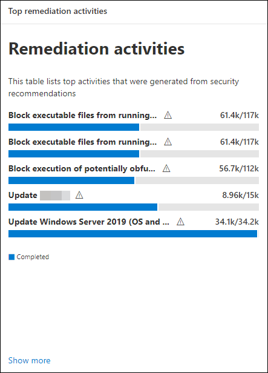

# Remediate vulnerabilities

**Applies to:**

- [Microsoft Defender Vulnerability Management](https://go.microsoft.com/fwlink/?linkid=2229011)
- [Microsoft Defender for Endpoint Plan 2](https://go.microsoft.com/fwlink/?linkid=2154037)
- [Microsoft 365 Defender](https://go.microsoft.com/fwlink/?linkid=2118804)
- [Microsoft Defender for Servers Plan 1 & 2](/azure/defender-for-cloud/plan-defender-for-servers-select-plan)

Watch this short video to learn how Microsoft Defender Vulnerability Management discovers vulnerabilities and misconfigurations on your endpoints and provides actionable insights that help you quickly remediate threats and vulnerabilities in your environment.

> [!VIDEO https://www.microsoft.com/en-us/videoplayer/embed/RE4qLVs]

> [!TIP]
> Did you know you can try all the features in Microsoft Defender Vulnerability Management for free? Find out how to [sign up for a free trial](../defender-vulnerability-management/defender-vulnerability-management-trial.md).

## Request remediation

Vulnerability management capabilities bridges the gap between Security and IT administrators through the remediation request workflow. Security admins like you can request for the IT Administrator to remediate a vulnerability from the **Recommendation** pages to Intune.

### Enable Microsoft Intune connection

To use this capability, enable your Microsoft Intune connections. In the Microsoft 365 Defender portal, navigate to **Settings** \> **Endpoints** \> **General** \> **Advanced features**. Scroll down and look for **Microsoft Intune connection**. By default, the toggle is turned off. Turn your **Microsoft Intune connection** toggle **On**.

**Note**: If you have the Intune connection enabled, you get an option to create an Intune security task when creating a remediation request. This option doesn't appear if the connection isn't set.

See [Use Intune to remediate vulnerabilities identified by Microsoft Defender for Endpoint](/intune/atp-manage-vulnerabilities) for details.

### Remediation request steps

1. Go to the **Vulnerability management** navigation menu in the Microsoft 365 Defender portal, and select [**Recommendations**](tvm-security-recommendation.md).

2. Select a security recommendation you would like to request remediation for, and then select **Remediation options**.

3. Fill out the form, including what you are requesting remediation for, applicable device groups, priority, due date, and optional notes.
    1. If you choose the "attention required" remediation option, selecting a due date won't be available since there's no specific action.

4. Select **Submit request**. Submitting a remediation request creates a remediation activity item within vulnerability management, which can be used for monitoring the remediation progress for this recommendation. This won't trigger a remediation or apply any changes to devices.

5. Notify your IT Administrator about the new request and have them log into Intune to approve or reject the request and start a package deployment.If you want to check how the ticket shows up in Intune, See [Use Intune to remediate vulnerabilities identified by Microsoft Defender for Endpoint](/mem/intune/protect/atp-manage-vulnerabilities) for details.

6. Go to the [**Remediation**](tvm-remediation.md) page to view the status of your remediation request.

> [!NOTE]
> If your request involves remediating more than 10,000 devices, we can only send 10,000 devices for remediation to Intune.

After your organization's cybersecurity weaknesses are identified and mapped to actionable [security recommendations](tvm-security-recommendation.md), start creating security tasks. You can create tasks through the integration with Microsoft Intune where remediation tickets are created.

Lower your organization's exposure from vulnerabilities and increase your security configuration by remediating the security recommendations.

## View your remediation activities

When you submit a remediation request from the Security recommendations page, it kicks off a remediation activity. A security task is created that can be tracked on a **Remediation** page, and a remediation ticket is created in Microsoft Intune.

If you chose the "attention required" remediation option, there will be no progress bar, ticket status, or due date since there's no actual action we can monitor.

Once you are in the Remediation page, select the remediation activity that you want to view. You can follow the remediation steps, track progress, view the related recommendation, export to CSV, or mark as complete.

:::image type="content" source="../../media/remediation-flyouteolswnew.png" lightbox="../../media/remediation-flyouteolswnew.png" alt-text="Example of the Remediation page, with a selected remediation  activity, and that activity's flyout listing the description, IT service and device management tools, and device remediation":::

> [!NOTE]
> There is a 180 day retention period for completed remediation activities. To keep the Remediation page performing optimally, the remediation activity will be removed 6 months after its completion.

### Completed by column

Track who closed the remediation activity with the "Completed by" column on the Remediation page.

- **Email address**: The email of the person who manually completed the task
- **System confirmation**: The task was automatically completed (all devices remediated)
- **N/A**: Information isn't available because we don't know how this older task was completed

:::image type="content" alt-text="Created by and completed by columns with two rows. One row for completed by has example of an email, the other row says system confirmation." source="../../media/defender-vulnerability-management/tvm-completed-by.png":::

### Top remediation activities in the dashboard

View **Top remediation activities** in the [**Vulnerability management** dashboard](tvm-dashboard-insights.md). Select any of the entries to go to the **Remediation** page. You can mark the remediation activity as completed after the IT admin team remediates the task.

## Related articles

- [Dashboard](tvm-dashboard-insights.md)
- [Security recommendations](tvm-security-recommendation.md)
