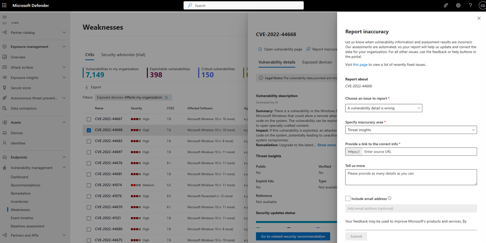

# Software inventory

**Applies to:**

- [Microsoft Defender Vulnerability Management](https://go.microsoft.com/fwlink/?linkid=2229011)
- [Microsoft Defender for Endpoint Plan 2](https://go.microsoft.com/fwlink/?linkid=2154037)
- [Microsoft 365 Defender](https://go.microsoft.com/fwlink/?linkid=2118804)
- [Microsoft Defender for Servers Plan 1 & 2](/azure/defender-for-cloud/plan-defender-for-servers-select-plan) 

The software inventory in Defender Vulnerability Management is a list of known software in your organization. The default filter on the software inventory page displays all software with official [Common Platform Enumerations (CPE)](https://nvd.nist.gov/products/cpe). The view includes details such as the name of the vendor, number of weaknesses, threats, and number of exposed devices.

> [!TIP]
> Did you know you can try all the features in Microsoft Defender Vulnerability Management for free? Find out how to [sign up for a free trial](../defender-vulnerability-management/defender-vulnerability-management-trial.md).

You can remove the **CPE Available** filter, to gain further visibility and increase your search scope across all installed software in your organization. This means all software, including software without a CPE, will now display in the software inventory list.

> [!NOTE]
> As CPEs are used by vulnerability management to identify the software and any vulnerabilities, even though software products without a CPE will be shown in the software inventory page, they will not be supported by vulnerability management and information like, exploits, number of exposed devices, and weaknesses won't be available for them.

## How it works

In the field of discovery, we're leveraging the same set of signals that is responsible for detection and vulnerability assessment in [Microsoft Defender for Endpoint detection and response capabilities](../defender-endpoint/overview-endpoint-detection-response.md).

Since it's real time, in a matter of minutes, you'll see vulnerability information as they get discovered. The engine automatically grabs information from multiple security feeds. In fact, you'll see if a particular software is connected to a live threat campaign. It also provides a link to a Threat Analytics report soon as it's available.

## Navigate to the Software inventory page

Access the software inventory page by selecting **Software inventory** from the Vulnerability management navigation menu in the [Microsoft 365 Defender portal](../defender/microsoft-365-security-center-mde.md).

> [!NOTE]
> If you search for software using the Microsoft Defender for Endpoint global search, make sure to put an underscore instead of a space. For example, for the best search results you'd write "windows_10" or "windows_11" instead of "Windows 10" or "Windows 11".

## Software inventory overview

The **Software inventory** page opens with a list of software installed in your network, including the vendor name, weaknesses found, threats associated with them, exposed devices, impact to exposure score, and tags.

By default, the view is filtered by **Product Code (CPE): Available**. You can also filter the list view based on weaknesses found in the software, threats associated with them, and tags like whether the software has reached end-of-support.

:::image type="content" alt-text="Example of the landing page for software inventory." source="../../media/defender-vulnerability-management/software-inventory-page.png" lightbox="../../media/defender-vulnerability-management/software-inventory-page.png":::

Select the software that you want to investigate. A flyout panel will open with a more compact view of the information on the page. You can either dive deeper into the investigation and select **Open software page**, or flag any technical inconsistencies by selecting **Report inaccuracy**.

### Software that isn't supported

Software that isn't currently supported by vulnerability management may be present in the software inventory page. Because it is not supported, only limited data will be available. Filter by unsupported software with the "Not available" option in the "Weakness" section.

:::image type="content" alt-text="Unsupported software filter." source="../../media/defender-vulnerability-management/tvm-unsupported-software-filter.png" lightbox="../../media/defender-vulnerability-management/tvm-unsupported-software-filter.png":::

The following indicates that software is not supported:

- Weaknesses field shows "Not available"
- Exposed devices field shows a dash
- Informational text added in side panel and in software page
- The software page won't have the security recommendations, discovered vulnerabilities, or event timeline sections

## Software inventory on devices

From the Microsoft 365 Defender portal navigation panel, go to the **[Device inventory](../defender-endpoint/machines-view-overview.md)**. Select the name of a device to open the device page (like Computer1), then select the **Software inventory** tab to see a list of all the known software present on the device. Select a specific software entry to open the flyout with more information.

Software may be visible at the device level even if it's currently not supported by vulnerability management. However, only limited data will be available. You'll know if software is unsupported because it will say "Not available" in the "Weakness" column.

Software with no CPE can also show up under this device-specific software inventory.

### Software evidence

See evidence of where we detected a specific software on a device from the registry, disk, or both. You can find it on any device in the device software inventory.

Select a software name to open the flyout, and look for the section called "Software Evidence."

:::image type="content" alt-text="Software evidence example of Windows 10 from the devices list, showing software evidence registry path." source="../../media/defender-vulnerability-management/tvm-software-evidence.png" lightbox="../../media/defender-vulnerability-management/tvm-software-evidence.png":::

## Software pages

You can view software pages a few different ways:

- Software inventory page > Select a software name > Select **Open software page** in the flyout
- [Security recommendations page](tvm-security-recommendation.md) > Select a recommendation > Select **Open software page** in the flyout
- [Event timeline page](threat-and-vuln-mgt-event-timeline.md) > Select an event > Select the hyperlinked software name (like Visual Studio 2017) in the section called "Related component" in the flyout

 A full page will appear with all the details of a specific software and the following information:

- Side panel with vendor information, prevalence of the software in the organization (including number of devices it's installed on, and exposed devices that aren't patched), whether and exploit is available, and impact to exposure score.
- Data visualizations showing the number of, and severity of, vulnerabilities and misconfigurations. Also, graphs with the number of exposed devices.
- Tabs showing information such as:
  - Corresponding security recommendations for the weaknesses and vulnerabilities identified.
  - Named CVEs of discovered vulnerabilities.
  - Devices that have the software installed (along with device name, domain, OS, and more).
  - Software version list (including number of devices the version is installed on, the number of discovered vulnerabilities, and the names of the installed devices).

    :::image type="content" alt-text="Software example page for Visual Studio 2017 with the software details, weaknesses, exposed devices, and more." source="../../media/defender-vulnerability-management/tvm-software-page-example.png" lightbox="../../media/defender-vulnerability-management/tvm-software-page-example.png":::

## Report inaccuracy

Report an inaccuracy when you see vulnerability information and assessment results that are incorrect.

1. Open the software flyout on the Software inventory page.
2. Select **Report inaccuracy**.
3. From the flyout pane, choose an issue to report from:

    - a software detail is wrong
    - the software is not installed on any device in my org
    - the number of installed or exposed devices is wrong

4. Fill in the requested details about the inaccuracy. This will vary depending on the issue you're reporting.

5. Select **Submit**. Your feedback is immediately sent to the vulnerability management experts.

## Related articles

- [Security recommendations](tvm-security-recommendation.md)
- [Event timeline](threat-and-vuln-mgt-event-timeline.md)
- [View and organize the Microsoft Defender for Endpoint Devices list](../defender-endpoint/machines-view-overview.md)
