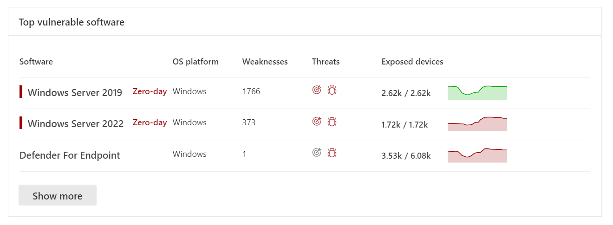
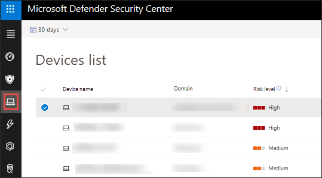

# Vulnerabilities in my organization

[!INCLUDE [Microsoft 365 Defender rebranding](../../includes/microsoft-defender.md)]

**Applies to:**

- [Microsoft Defender for Endpoint Plan 2](https://go.microsoft.com/fwlink/?linkid=2154037)
- [Microsoft Defender Vulnerability Management](index.yml)
- [Microsoft 365 Defender](https://go.microsoft.com/fwlink/?linkid=2118804)

[!include[Prerelease information](../../includes/prerelease.md)]

> To sign up for the Defender Vulnerability Management public preview or if you have any questions, email us at mdvmtrial@microsoft.com
>
> Already have  Microsoft Defender for Endpoint P2? [Sign up for a free trial of the Defender Vulnerability Management Add-on.](https://signup.microsoft.com/get-started/signup?products=5908ecaa-b8a7-4a04-b6c0-d44fd934b6f2)

> [!IMPORTANT]
> Defender Vulnerability Management can help identify Log4j vulnerabilities in applications and components. [Learn more](../defender-endpoint/tvm-manage-Log4shell-guidance.md).

Microsoft Defender Vulnerability Management uses the same signals in Defender for Endpoint's endpoint protection to scan and detect vulnerabilities.

The **Weaknesses** page lists the software vulnerabilities your devices are exposed to by listing the Common Vulnerabilities and Exposures (CVE) ID. You can also view the severity, Common Vulnerability Scoring System (CVSS) rating, prevalence in your organization, corresponding breach, threat insights, and more.

> [!NOTE]
> If there is no official CVE-ID assigned to a vulnerability, the vulnerability name is assigned by threat and vulnerability management.

> [!TIP]
> To get emails about new vulnerability events, see [Configure vulnerability email notifications in Microsoft Defender for Endpoint](../defender-endpoint/configure-vulnerability-email-notifications.md)

## Navigate to the Weaknesses page

Access the Weaknesses page a few different ways:

- Selecting **Weaknesses** from the **Vulnerability management** navigation menu in the [Microsoft 365 Defender portal](https://security.microsoft.com).

### Navigation menu

Go to the **Vulnerability management** navigation menu and select **Weaknesses** to open the list of CVEs.

### Vulnerabilities in global search

1. Go to the global search drop-down menu.
2. Select **Vulnerability** and key-in the Common Vulnerabilities and Exposures (CVE) ID that you're looking for, for example "CVE-2018-5568", then select the search icon. The **Weaknesses** page opens with the CVE information that you're looking for.
3. Select the CVE to open a flyout panel with more information, including the vulnerability description, details, threat insights, and exposed devices.

To see the rest of the vulnerabilities in the **Weaknesses** page, type CVE, then select search.

## Weaknesses overview

Remediate the vulnerabilities in exposed devices to reduce the risk to your assets and organization. If the **Exposed Devices** column shows 0, that means you aren't at risk.

   :::image type="content" source="../../media/defender-vulnerability-management/tvm-weaknesses-overview.png" alt-text="Screenshot of the weaknesses landing  page" lightbox="../../media/defender-vulnerability-management/tvm-weaknesses-overview.png":::

### Breach and threat insights

View any related breach and threat insights in the **Threat** column when the icons are colored red.

 > [!NOTE]
 > Always prioritize recommendations that are associated with ongoing threats. These recommendations are marked with the threat insight icon  and breach insight icon .

The breach insights icon is highlighted if there's a vulnerability found in your organization.

The threat insights icon is highlighted if there are associated exploits in the vulnerability found in your organization. Hovering over the icon shows whether the threat is a part of an exploit kit, or connected to specific advanced persistent campaigns or activity groups. When available, there's a link to a Threat Analytics report with zero-day exploitation news, disclosures, or related security advisories.

### Gain vulnerability insights

If you select a CVE, a flyout panel will open with more information such as the vulnerability description, details, threat insights, and exposed devices.

- The "OS Feature" category is shown in relevant scenarios
- You can go to the related security recommendation for every CVE with exposed device

 

### Software that isn't supported

CVEs for software that isn't currently supported by threat & vulnerability management is still present in the Weaknesses page. Because the software is not supported, only limited data will be available.

Exposed device information will not be available for CVEs with unsupported software. Filter by unsupported software by selecting the "Not available" option in the "Exposed devices" section.

:::image type="content" alt-text="Exposed devices filter." source="../../media/defender-vulnerability-management/tvm-exposed-devices-filter.png":::

## View Common Vulnerabilities and Exposures (CVE) entries in other places

### Top vulnerable software in the dashboard

1. Go to the [threat and vulnerability management dashboard](tvm-dashboard-insights.md) and scroll down to the **Top vulnerable software** widget. You will see the number of vulnerabilities found in each software, along with threat information and a high-level view of device exposure over time.

    

2. Select the software you want to investigate to go to a drilldown page.

3. Select the **Discovered vulnerabilities** tab.

4. Select the vulnerability you want to investigate for more information on vulnerability details

### Discover vulnerabilities in the device page

View related weaknesses information in the device page.

1. Go to the Microsoft 365 Defender navigation menu bar, then select the device icon. The **Device inventory** page opens.

2. In the **Device inventory** page, select the device name that you want to investigate.

    

3. The device page will open with details and response options for the device you want to investigate.

4. Select **Discovered vulnerabilities**.

   :::image type="content" alt-text="Device page with details and response options." source="../../media/defender-vulnerability-management/tvm-discovered-vulnerabilities.png" lightbox="../../media/defender-vulnerability-management/tvm-discovered-vulnerabilities.png":::

5. Select the vulnerability that you want to investigate to open up a flyout panel with the CVE details, such as: vulnerability description, threat insights, and detection logic.

#### CVE Detection logic

Similar to the software evidence, we now show the detection logic we applied on a device in order to state that it's vulnerable. The new section is called "Detection Logic" (in any discovered vulnerability in the device page) and shows the detection logic and source.

The "OS Feature" category is also shown in relevant scenarios. A CVE would affect devices that run a vulnerable OS only if a specific OS component is enabled. Let's say Windows Server 2019 or Windows Server 2022 has vulnerability in its DNS component. With this new capability, we'll only attach this CVE to the Windows Server 2019 and Windows Server 2022 devices with the DNS capability enabled in their OS.

:::image type="content" alt-text="Detection Logic example which lists the software detected on the device and the KBs." source="../../media/defender-vulnerability-management/tvm-cve-detection-logic.png":::

## Report inaccuracy

Report a false positive when you see any vague, inaccurate, or incomplete information. You can also report on security recommendations that have already been remediated.

1. Open the CVE on the Weaknesses page.
2. Select **Report inaccuracy** and a flyout pane will open.
3. Select the inaccuracy category from the drop-down menu and fill in your email address and inaccuracy details.
4. Select **Submit**. Your feedback is immediately sent to the threat and vulnerability management experts.

## Related articles

- [Security recommendations](tvm-security-recommendation.md)
- [Software inventory](tvm-software-inventory.md)
- [Dashboard insights](tvm-dashboard-insights.md)

