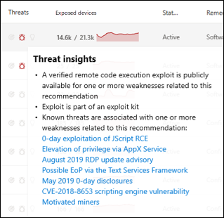

# Vulnerabilities in my organization

The [Weaknesses page](https://security.microsoft.com/vulnerabilities/cves) in Defender Vulnerability Management lists known Common Vulnerabilities and Exposures (CVE) by their CVE ID.

CVE IDs are unique IDs assigned to publicly disclosed cybersecurity vulnerabilities that affect software, hardware and firmware. They provide organizations with a standard way to identify and track vulnerabilities, and helps them understand, prioritize, and address these vulnerabilities in their organization. CVEs are catalogued in a public registry accessed from [https://www.cve.org/](https://www.cve.org/).

Defender Vulnerability Management leverages endpoint sensors to scan and detect for these and other vulnerabilities in an organization.

**Applies to:**

- [Microsoft Defender Vulnerability Management](https://go.microsoft.com/fwlink/?linkid=2229011)
- [Microsoft Defender for Endpoint Plan 2](https://go.microsoft.com/fwlink/?linkid=2154037)
- [Microsoft Defender XDR](https://go.microsoft.com/fwlink/?linkid=2118804)
- [Microsoft Defender for Servers Plan 1 & 2](/azure/defender-for-cloud/plan-defender-for-servers-select-plan)

> [!IMPORTANT]
> Defender Vulnerability Management can help identify Log4j vulnerabilities in applications and components. [Learn more](../defender-endpoint/tvm-manage-Log4shell-guidance.md).

> [!TIP]
> Did you know you can try all the features in Microsoft Defender Vulnerability Management for free? Find out how to [sign up for a free trial](../defender-vulnerability-management/defender-vulnerability-management-trial.md).

## Weaknesses overview page

To access the Weaknesses page, select **Weaknesses** from the **Vulnerability management** navigation menu in the [Microsoft Defender portal](https://security.microsoft.com)

The Weaknesses page opens with a list of the CVEs your devices are exposed to. You can view the severity, Common Vulnerability Scoring System (CVSS) rating, corresponding breach and threat insights, and more.

   :::image type="content" source="../../media/defender-vulnerability-management/tvm-weaknesses-overviewnew.png" alt-text="Screenshot of the weaknesses landing  page" lightbox="../../media/defender-vulnerability-management/tvm-weaknesses-overviewnew.png":::

> [!NOTE]
> If there is no official CVE-ID assigned to a vulnerability, the vulnerability name is assigned by Microsoft Defender Vulnerability Management and will be the format **TVM-2020-002".

> [!NOTE]
> The maximum number of records you can export from the weaknesses page to a CSV file is 10,000.

### Breach and threat insights

It's important to prioritize recommendations that are associated with ongoing threats. You can use the information available in the **Threats** column to help you prioritize vulnerabilities. To see vulnerabilities with ongoing threats, filter the **Threats** column by:

- Associated active alert
- Exploit is available
- Exploit is Verified
- This exploit is part of an exploit kit

The threat insights icon  is highlighted in the **Threats** column if there are associated exploits in a vulnerability.

   :::image type="content" source="../../media/defender-vulnerability-management/weaknesses-threats.png" alt-text="Screenshot of the threats column icons" lightbox="../../media/defender-vulnerability-management/weaknesses-threats.png":::

Hovering over the icon shows whether the threat is a part of an exploit kit, or connected to specific advanced persistent campaigns or activity groups. When available, there's a link to a Threat Analytics report with zero-day exploitation news, disclosures, or related security advisories.

The breach insights icon is highlighted if there's a vulnerability found in your organization. .

The **Exposed Devices** column shows how many devices are currently exposed to vulnerability. If the column shows 0, that means you aren't at risk.

## Gain vulnerability insights

If you select a CVE from the weaknesses page, a flyout panel will open with more information such as the vulnerability description, details and threat insights. The AI generated vulnerability description provides detailed information on the vulnerability, its impact, recommended remediation steps, and any additional information, if available.

   :::image type="content" source="../../media/defender-vulnerability-management/weaknesses-cve-description.png" alt-text="Screenshot of the weaknesses weaknesses-flyout pane" lightbox="../../media/defender-vulnerability-management/weaknesses-cve-description.png":::

For each CVE, you can see a list of the exposed devices and the affected software.

### Related security recommendations

Use the security recommendations to remediate the vulnerabilities in exposed devices and to reduce the risk to your assets and organization. When a security recommendation is available you can select **Go to the related security recommendation** for details on how to remediate the vulnerability.

:::image type="content" alt-text="Weakness flyout example." source="../../media/defender-vulnerability-management/weaknesses-cve-vulntab.png" lightbox="../../media/defender-vulnerability-management/weaknesses-cve-vulntab.png":::

Recommendations for a CVE are often to remediate the vulnerability through a security update for the related software. However, Some CVEs won't have a security update available. This might apply to all the related software for a CVE or just a subset, for example, a software vendor might decide not to fix the issue on a particular vulnerable version.

When a security update is only available for some of the related software, the CVE will have the tag 'Some updates available' under the CVE name. Once there is at least one update available, you'll have the option to go to the related security recommendation.

If there is no security update available, the CVE will have the tag 'No security update' under the CVE name. There will be no option to go to the related security recommendation as software that doesn't have a security update available is excluded from the Security recommendations page.

 > [!NOTE]
 > Security recommendations only include devices and software packages that have security updates available.

### Request CVE support

A CVE for software that isn't currently supported by vulnerability management still appears in the Weaknesses page. Because the software is not supported, only limited data will be available. Exposed device information will not be available for CVEs with unsupported software.

To view a list of unsupported software, filter the weaknesses page by the "Not available" option in the "Exposed devices" section.

You can request for support to be added to Defender Vulnerability Management for a particular CVE. To request support:

1. Select the CVE from the [Weaknesses](https://security.microsoft.com/vulnerabilities/cves) page in the Microsoft Defender portal
2. Select **Please support this CVE** from the Vulnerability details tab

This request will be sent to Microsoft and will assist us in prioritizing this CVE among others in our system.

:::image type="content" alt-text="Weakness flyout with support CVE button example." source="../../media/defender-vulnerability-management/weaknesses-support-cve.png" lightbox="../../media/defender-vulnerability-management/weaknesses-support-cve.png":::

## View Common Vulnerabilities and Exposures (CVE) entries in other places

### Top vulnerable software in the dashboard

1. Go to the [Defender Vulnerability Management dashboard](tvm-dashboard-insights.md) and scroll down to the **Top vulnerable software** widget. You will see the number of vulnerabilities found in each software, along with threat information and a high-level view of device exposure over time.

:::image type="content" alt-text="Top vulnerable software card." source="../../media/defender-vulnerability-management/tvm-top-vulnerable-software500.png" lightbox="../../media/defender-vulnerability-management/tvm-top-vulnerable-software500.png":::

2. Select the software you want to investigate.
3. Select the **Discovered vulnerabilities** tab.
4. Select the vulnerability that you want to investigate to open up a flyout panel with the CVE details.

### Discover vulnerabilities in the device page

View related weaknesses information in the device page.

1. Select **Devices** from the **Assets** navigation menu in the [Microsoft Defender portal](https://security.microsoft.com).
2. In the **Device inventory** page, select the device name that you want to investigate.
3. Select **Open device page** and select **Discovered vulnerabilities** from the device page.
4. Select the vulnerability that you want to investigate to open up a flyout panel with the CVE details.

#### CVE Detection logic

Similar to the software evidence, we show the detection logic we applied on a device in order to state that it's vulnerable.

To see the detection logic:

1. Select a device from the Device inventory page.
2. Select **Open device page** and select **Discovered vulnerabilities** from the device page.
3. Select the vulnerability you want to investigate.

A flyout will open and the **Detection logic** section shows the detection logic and source.

:::image type="content" alt-text="Detection Logic example which lists the software detected on the device and the KBs." source="../../media/defender-vulnerability-management/tvm-cve-detection-logic.png":::

The "OS Feature" category is also shown in relevant scenarios. This is when a CVE would affect devices that run a vulnerable OS if a specific OS component is enabled. For example, if Windows Server 2019 or Windows Server 2022 has vulnerability in its DNS component we'll only attach this CVE to the Windows Server 2019 and Windows Server 2022 devices with the DNS capability enabled in their OS.

## Report inaccuracy

Report a false positive when you see any vague, inaccurate, or incomplete information. You can also report on security recommendations that have already been remediated.

1. Open the CVE on the Weaknesses page.
2. Select **Report inaccuracy** and a flyout pane will open.
3. From the flyout pane, choose an issue to report.
4. Fill in the requested details about the inaccuracy. This will vary depending on the issue you're reporting.
5. Select **Submit**. Your feedback is immediately sent to the Microsoft Defender Vulnerability Management experts.

:::image type="content" alt-text="Report inaccuracy options." source="../../media/defender-vulnerability-management/report-inaccuracy-software.png" lightbox="../../media/defender-vulnerability-management/report-inaccuracy-software.png":::

## Related articles

- [Security recommendations](tvm-security-recommendation.md)
- [Software inventory](tvm-software-inventory.md)
- [Dashboard insights](tvm-dashboard-insights.md)
