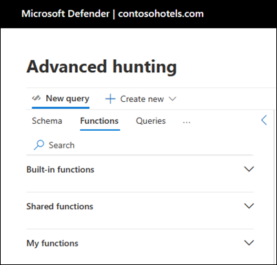

# Use custom functions

[!INCLUDE [Microsoft 365 Defender rebranding](../includes/microsoft-defender.md)]

**Applies to:**
- Microsoft 365 Defender

> [!IMPORTANT]
> Some information relates to prereleased product which may be substantially modified before it's commercially released. Microsoft makes no warranties, express or implied, with respect to the information provided here.

## Types of functions
A function is a type of query in advanced hunting that can be used in other queries as if it's a command. You can create your own custom functions so you can reuse any query logic when you hunt in your environment.

There are three different types of functions in advanced hunting:

- **Built-in functions** – Prebuilt functions included with Microsoft 365 Defender advanced hunting. These are available in all advanced hunting instances and can't be modified.
- **Shared functions** – Custom functions created by users, which are available for all users in a specific tenant and can be modified and controlled by users.
- **My functions** – Custom functions created by a user, which can be viewed and modified only by the user who created it.

## Write your own custom function

To create a function from the current query in the editor, select **Save** and then **Save as function**.

Next, provide the following information:

- **Name** - Name of the function. Can contain only numbers, English letters, and underscores. To avoid accidentally using Kusto keywords, begin or end function names with an underscore or begin with a capital letter.
- **Location** - The folder in which you would like to save the function, either shared or private.
- **Description** - A description that can help other users understand the purpose of the function and how it works.
- **Parameters** - Add a parameter for each variable in the function that requires a value when it's used. 
Add parameters to a function so that you can provide the arguments or values for certain variables when calling the function. This allows the same function to be used in different queries, each allowing for different values for the parameters. Parameters are defined by the following properties:
  - **Type** - Data type for the value
  - **Name** - The name that must be used in the query to replace the parameter value
  - **Default value** - Value to be used for the parameter if a value isn't provided

  Parameters are listed in the order they were created, with parameters that have no default value listed above those that have a default value.

## Use a custom function
Use a function in a query by typing its name along with values for any parameter just as you would type in a command. The output of the function can either be returned as results or piped to another command.

Add a function to the current query by double-clicking on its name or selecting the three dots to the right of the function and selecting **Open in query editor**. 

If a query requires arguments, provide them using the following syntax: *function_name(parameter 1, parameter 2, ...)*

> [!NOTE]
> Functions can't be used inside another function.

## Work with function codes
You can view the code of a function either to gain insight into how it works or to modify its code. Select the three dots to the right of the function and select **Load function code** to open a new tab with the function code. 

## Edit a custom function

Edit the properties of a function by selecting the three dots to the right of the function and selecting **Edit function**. Make any modifications that you want to the properties and parameters of the function then select **Save**.

If the function code is already loaded to the editor, you can also select **Save** to apply any changes to the code or properties of the function.

> [!NOTE]
> Once a function is in use in a saved query or a detection rule, you can't edit the function to expand its scope. For example, if you saved a function that queries identity tables, and this function is used in a detection rule, you can't edit the function to include a device table after the fact. To do that, you can save a new function. Product scoping can be narrowed for the same function but not extended.

## See also

- [Advanced hunting overview](advanced-hunting-overview.md)
- [Learn the query language](advanced-hunting-query-language.md)
- [Understand the schema](advanced-hunting-schema-tables.md)
- [Get more query examples](advanced-hunting-shared-queries.md)
[!INCLUDE [Microsoft 365 Defender rebranding](../../includes/defender-m3d-techcommunity.md)]
