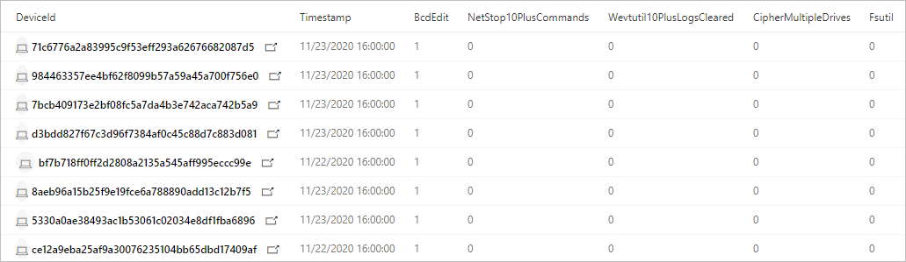

# Hunt for ransomware

[!INCLUDE [Microsoft 365 Defender rebranding](../includes/microsoft-defender.md)]

**Applies to:**
- Microsoft 365 Defender

Ransomware has rapidly evolved from being simple commodity malware affecting individual computer users to an enterprise threat that is severely impacting industries and government institutions. While [Microsoft 365 Defender](microsoft-365-defender.md) provides many capabilities that detect and block ransomware and associated intrusion activities, performing proactive checks for signs of compromise can help keep your network protected.

> [Read about human-operated ransomware](https://www.microsoft.com/security/blog/2020/03/05/human-operated-ransomware-attacks-a-preventable-disaster/)

With [advanced hunting](advanced-hunting-overview.md) in Microsoft 365 Defender, you can create queries that locate individual artifacts associated with ransomware activity. You can also run more sophisticated queries that can look for signs of activity and weigh those signs to find devices that require immediate attention.

## Signs of ransomware activity
Microsoft security researchers have observed various common yet subtle artifacts in many ransomware campaigns launched by sophisticated intruders. These signs mostly involve use of system tools to prepare for encryption, prevent detection, and clear forensic evidence.

| Ransomware activity | Common tools | Intent |
|--|--|--|
| Stop processes | _taskkill.exe_, _net stop_ | Ensure files targeted for encryption are not locked by various applications. |
| Turn off services | _sc.exe_ | - Ensure files targeted for encryption are not locked by various applications.<br>- Prevent security software from disrupting encryption and other ransomware activity.<br>- Stop backup software from creating recoverable copies.  |
| Delete logs and files | _cipher.exe_, _wevtutil_, _fsutil.exe_ | Remove forensic evidence. |
| Delete shadow copies  | _vsadmin.exe_, _wmic.exe_ | Remove drive shadow copies that can be used to recover encrypted files. |
| Delete and stop backups | _wbadmin.exe_ | Delete existing backups and stop scheduled backup tasks, preventing recovery after encryption. |
| Modify boot settings | _bcdedit.exe_ | Turn off warnings and automatic repairs after boot failures that can be caused by the encryption process. |
| Turn off recovery tools | _schtasks.exe_, _regedit.exe_, | Turn off System Restore and other system recovery options. |

## Check for individual signs of ransomware activity
Many activities that constitute ransomware behavior, including the activities described in the preceding section, can be benign. When using the following queries to locate ransomware, run more than one query to check whether the same devices are exhibiting various signs of possible ransomware activity.

### Stopping multiple processes using _taskkill.exe_
This query checks for attempts to stop at least 10 separate processes using the _taskkill.exe_ utility. [Run query](https://security.microsoft.com/hunting?query=H4sIAAAAAAAEAI2RS2vCUBCFz7rgfwiuIkit3eumVSgtpYvuS9SLDTY2eLUvxN_eb8YHKlFkyNzJzDkn505aailRX7mmGlFlmhNBhUrOSGeuT3L0s6QqNaMagolEcMyCbApjx2e8TYhcH8Q1mB-emq50z_lF39gvBzo9-gEF-6Yhlyh9653ejCfRK6zCsaZfuJOu-x2jkqqN-0Yls-8-gp6dZ52OVuT6Sad1plulyN0KIkMt15_zt7zHDe8OBwv3btoJToa7Tnp0T8Ou9WzfT761gPOm3_FQ16Zxp2qcCdg33_rlyokG-iXv7_4BRNMnhkortmvTW6rqnZ7bgP2Vtm70D3d9wcFaAgAA&runQuery=true&timeRangeId=week)

```kusto
// Find attempts to stop processes using taskkill.exe
DeviceProcessEvents
| where Timestamp > ago(1d)
| where FileName =~ "taskkill.exe" 
| summarize taskKillCount = dcount(ProcessCommandLine), TaskKillList = make_set(ProcessCommandLine) by DeviceId, bin(Timestamp, 2m)
| where taskKillCount > 10
```
  
### Stopping processes using _net stop_
This query checks for attempts to stop at least 10 separate processes using the _net stop_ command. [Run query](https://security.microsoft.com/hunting?query=H4sIAAAAAAAEAI2RQUvDUBCE5yz0P4ScUijWereXVkGQIti7aA1pqakhL7VVxN_ebzc1NBChPLJv2Z2ZN5sdaqhId1ppozeyF1WcVLkK7kCl0gcx-F2QFSrJFmACJ3XMlmgKGfmGWnXC6OlCU2qfIIz12OLfUk_h2FuG_IG505JayRdpDit3bIW33B2M3WeGSqIRrvudTJvpnWzmPKvc6JcYHx1eEvd8savV07e9TchzTt198AlNZ0kluNLfjHHjIPAvak4J_tvx9XtPR6ypbn1icxShvGgqyVkO-hrAm7VUrRcaTWOs6T_7hs7XjfSqL-Lpvu5BDLxjqKRjI9a9Juvew__T2x5HutIB3T1qt4QCAAA&runQuery=true&timeRangeId=week)

```kusto
// Find attempts to stop processes using net stop
DeviceProcessEvents
| where Timestamp > ago(1d)
| where FileName =~ "net.exe" and ProcessCommandLine has "stop"
| summarize netStopCount = dcount(ProcessCommandLine), NetStopList = make_set(ProcessCommandLine) by DeviceId, bin(Timestamp, 2m)
| where netStopCount > 10
```
### Deletion of data on multiple drives using _cipher.exe_
This query checks for attempts to delete data on multiple drives using _cipher.exe_. This activity is typically done by ransomware to prevent recovery of data after encryption. [Run query](https://security.microsoft.com/hunting?query=H4sIAAAAAAAEAI1SXUvDQBCcZ8H_cOQpgWLoD7AvVUEo4oPvElO1pblUcmn9QPztzk6TEuEsIdzdZndndm73cuRwWGDLb0PrhWfDs8Qab1jhmX8X3D-4HJbcK66W0Rqv8hT8K4RsiPW0PHbMasVQdbiGf3vaAec4wxWtPT0lz3vhSsUCrpVVE33I_Cb6vdNhTA9EeeVaVc8KDjOugmq2SDFlrSyKvCHS1NwJZ55L_HBPondNGDGWXP2JdyMnv927UnXHWwf6l4MunupXTOPfXszVT8_smriFOCxrRU-QclOQDLgCNRwQ1u8vZc8H2o1xp-7a7U1NefSko6pnmKjakNVi4chpiA39j-rGeF6HJ3xyH76NW2ZMFLGsNDJ9i05pZSPmVdDfq-jncfqtOuU5zSuQz6Zq92w7Hfbm-9cUm-d_vZ9J9S81O2KIfAMAAA&runQuery=true&timeRangeId=week)

```kusto
// Look for cipher.exe deleting data from multiple drives
DeviceProcessEvents
| where Timestamp > ago(1d)
| where FileName =~ "cipher.exe" 
// cipher.exe /w flag used for deleting data 
| where ProcessCommandLine has "/w" 
| summarize CipherCount = dcount(ProcessCommandLine),
CipherList = make_set(ProcessCommandLine) by DeviceId, bin(Timestamp, 1m) 
// cipher.exe accessing multiple drives in a short timeframe 
| where CipherCount > 1
```

### Clearing of forensic evidence from event logs using _wevtutil_
This query checks for attempts to clear at least 10 log entries from event logs using _wevtutil_. [Run query](https://security.microsoft.com/hunting?query=H4sIAAAAAAAEAJWRTU_CQBCG37OJ_2HDqSQkwMGjXgoHEg4cUI-m2hUaqGu6BaPxx_vsEFCTxmA225nOvB_tzFBDOc0VOBuyZ2JD3CnKEwMVpzfyPbVWlba8t9Sdnsi9CsPXdLfWf7Wq4xm0QuVSF5oYv4LhtQAfLIucKXWvF5gH5Ke5rak1prKEVRu2xalG3emGW6AdlGmsUv1O5m-fnLzmFHiV_G9FTKg1lUjs6Z5vucPvljsD0TOXhP6_Vm7841dFZnPAN2A_DDu36eSnCSbNnc3B6Zpb4nasZGf59zWA963orZdcEiKelBNvQ_fBNny-utOj3nn-3OUMxMA6CZV1bCt1r8i6d_TXFNKWxxrpC48hm8miAgAA&runQuery=true&timeRangeId=week)

```kusto
// Look for use of wevtutil to clear multiple logs
DeviceProcessEvents
| where Timestamp > ago(1d)
| where ProcessCommandLine has "WEVTUTIL" and ProcessCommandLine has "CL"
| summarize LogClearCount = dcount(ProcessCommandLine), ClearedLogList = make_set(ProcessCommandLine) by DeviceId, bin(Timestamp, 5m)
| where LogClearCount > 10
```

### Turning off services using _sc.exe_
This query checks for attempts to turn off at least 10 existing services using _sc.exe_. [Run query](https://security.microsoft.com/hunting?query=H4sIAAAAAAAEAKWST2vCQBDF31nodwg5RZCqhx7bi3ooeCjovaQxraIxxfU_fvj-ZoiiEIqlhM3Ozrz3ZnZm22or0lAl3xzrk33FHpTpUbn2rEgTzfCk-tACa6kvR-Qgt5wzrKAHNdTHOnveiJZVLGiAP4e5rpAnFHaauoZlGMMqHLsmT6FvfC-slFylEnWpoVnLvM3Twy74UnJNuJdVa6gpnsAe-81iVzbE3_kZiCV9mlHZf3Sue5pzii-3C9pU3BWYo_NGKPdvGJZh4x2N9Owzyi6e5K5qmmrVKg_9dNY11hzvu0_8fu0ItQP_6zfxCqLlEUMlNVO36BNW_ax_74K9l646-gFts39I1AIAAA&runQuery=true&timeRangeId=week)

```kusto
// Look for sc.exe disabling services
DeviceProcessEvents
| where Timestamp > ago(1d)
| where ProcessCommandLine has "sc" and ProcessCommandLine has "config" and ProcessCommandLine has "disabled"
| summarize ScDisableCount = dcount(ProcessCommandLine), ScDisableList = make_set(ProcessCommandLine) by DeviceId, bin(Timestamp, 5m)
| where ScDisableCount > 10
```

### Turning off System Restore
This query identifies attempts to stop System Restore and prevent the system from creating restore points, which can be used to recover data encrypted by ransomware. [Run query](https://security.microsoft.com/hunting?query=H4sIAAAAAAAEAK2S3UrDQBCFz7XgO6y9id4o6HWvrIVCkaJPENOYFNumZGO1ID673w4xJA1isbJMZnZ-zpzM7EiptlooQc9UqjDLc-7wp1qrwj7Via44MzK35FTotTI5PXMr0aVe8cy15NzoGo-zqg_0m3KQSsRpQtbC6uMGpdt3jHeJfU_GymqG-uQb9XpcEn1HIuvmGpZT0Aq99Dim4G3ousNO8K04sSE6EEN22kL6jvzO-LaDNW2QzqxLmGBsPo9vUMt_oA8Na3DQv3vwcmPiifpmds48jkhut8T2FLikxm_T4bI_m_6uQt-wrXO28lPPSBcdziOqPFlP9RYy47tDKtuZM07hVtSvaJ_HYRPL63-NyMgtmtWv5684jy2WDx2O0ZEM562ZBLQvURxur6gDAAA&runQuery=true&timeRangeId=week)

```kusto
DeviceProcessEvents
//Pivoting for rundll32  
| where InitiatingProcessFileName =~ 'rundll32.exe'   
//Looking for empty command line   
and InitiatingProcessCommandLine !contains " " and InitiatingProcessCommandLine != ""  
//Looking for schtasks.exe as the created process  
and FileName in~ ('schtasks.exe')  
//Disabling system restore   
and ProcessCommandLine has 'Change' and ProcessCommandLine has 'SystemRestore' 
and ProcessCommandLine has 'disable'
```

### Backup deletion
This query identifies use of _wmic.exe_ to delete shadow copy snapshots prior to encryption. [Run query](https://security.microsoft.com/hunting?query=H4sIAAAAAAAEAJWS2wqCQBCG_-ugd5CupTfoqgMIEV70AqFLGp5QyYLo2fsavEjxwlhWZ7-df2Z2dndyuitVxD9UrdKshrGHOxVqsZda6CVPnRJYzfR0QJVhnXRRbmSjN98VXrlFXEMfzNWkfphti50zLmSMdURfmFcCaSxqY3aMX4eqVKUn1OsV_8eLWX_rbwcVVhblBovY8bT76U-AxoedWeeWp7WzV0YDMqSQFNZavuuopnHH_Iku-lbJnLPMyxnYDTp4bZ5P9M5uNpsZIWSn7l_CuNoPSggb4z4CAAA&runQuery=true&timeRangeId=week)

```kusto
DeviceProcessEvents
| where FileName =~ "wmic.exe"
| where ProcessCommandLine has "shadowcopy" and ProcessCommandLine has "delete"
| project DeviceId, Timestamp, InitiatingProcessFileName, FileName,
ProcessCommandLine, InitiatingProcessIntegrityLevel, InitiatingProcessParentFileName
```

## Check for multiple signs of ransomware activity
Instead of running several queries separately, you can also use a comprehensive query that checks for multiple signs of ransomware activity to identify affected devices. The following consolidated  query:
- Looks for both relatively concrete and subtle signs of ransomware activity
- Weighs the presence of these signs
- Identifies devices with a higher chance of being targets of ransomware 

When run, this consolidated query returns a list of devices that have exhibited multiple signs of attack. The count of each type of ransomware activity is also shown. To run this consolidated query, copy it directly to the [advanced hunting query editor](https://security.microsoft.com/advanced-hunting). 

```kusto
// Find attempts to stop processes using taskkill.exe
let taskKill = DeviceProcessEvents
| where Timestamp > ago(1d)
| where FileName =~ "taskkill.exe" 
| summarize taskKillCount = dcount(ProcessCommandLine), TaskKillList = make_set(ProcessCommandLine) by DeviceId, bin(Timestamp, 2m)
| where taskKillCount > 10;
// Find attempts to stop processes using net stop
let netStop = DeviceProcessEvents
| where Timestamp > ago(1d)
| where FileName =~ "net.exe" and ProcessCommandLine has "stop"
| summarize netStopCount = dcount(ProcessCommandLine), NetStopList = make_set(ProcessCommandLine) by DeviceId, bin(Timestamp, 2m)
| where netStopCount > 10;
// Look for cipher.exe deleting data from multiple drives
let cipher = DeviceProcessEvents
| where Timestamp > ago(1d)
| where FileName =~ "cipher.exe" 
// cipher.exe /w flag used for deleting data 
| where ProcessCommandLine has "/w" 
| summarize CipherCount = dcount(ProcessCommandLine), 
CipherList = make_set(ProcessCommandLine) by DeviceId, bin(Timestamp, 1m) 
// cipher.exe accessing multiple drives in a short timeframe 
| where CipherCount > 1;
// Look for use of wevtutil to clear multiple logs
let wevtutilClear = DeviceProcessEvents
| where Timestamp > ago(1d)
| where ProcessCommandLine has "WEVTUTIL" and ProcessCommandLine has "CL"
| summarize LogClearCount = dcount(ProcessCommandLine), ClearedLogList = make_set(ProcessCommandLine) by DeviceId, bin(Timestamp, 5m)
| where LogClearCount > 10;
// Look for sc.exe disabling services
let scDisable = DeviceProcessEvents
| where Timestamp > ago(1d)
| where ProcessCommandLine has "sc" and ProcessCommandLine has "config" and ProcessCommandLine has "disabled"
| summarize ScDisableCount = dcount(ProcessCommandLine), ScDisableList = make_set(ProcessCommandLine) by DeviceId, bin(Timestamp, 5m)
| where ScDisableCount > 10;
// Main query for counting and aggregating evidence
DeviceProcessEvents
| where Timestamp > ago(1d)
| where FileName =~ "vssadmin.exe" and ProcessCommandLine has_any("list shadows", "delete shadows")
or FileName =~ "fsutil.exe" and ProcessCommandLine has "usn" and ProcessCommandLine has "deletejournal"
or ProcessCommandLine has("bcdedit") and ProcessCommandLine has_any("recoveryenabled no", "bootstatuspolicy ignoreallfailures")
or ProcessCommandLine has "wbadmin" and ProcessCommandLine has "delete" and ProcessCommandLine has_any("backup", "catalog", "systemstatebackup")
or (ProcessCommandLine has "wevtutil" and ProcessCommandLine has "cl") 
or (ProcessCommandLine has "wmic" and ProcessCommandLine has "shadowcopy delete")
or (ProcessCommandLine has "sc" and ProcessCommandLine has "config" and ProcessCommandLine has "disabled")
| extend Bcdedit = iff(ProcessCommandLine has "bcdedit" and ProcessCommandLine has_any("recoveryenabled no", "bootstatuspolicy ignoreallfailures"), 1, 0)
| extend ShadowCopyDelete = iff (ProcessCommandLine has "shadowcopy delete", 1, 0)
| extend VssAdminShadows = iff(ProcessCommandLine has "vssadmin" and ProcessCommandLine has_any("list shadows", "delete shadows"), 1, 0)
| extend Wbadmin = iff(ProcessCommandLine has "wbadmin" and ProcessCommandLine has "delete" and ProcessCommandLine has_any("backup", "catalog", "systemstatebackup"), 1,0)
| extend Fsutil = iff(ProcessCommandLine has "fsutil" and ProcessCommandLine has "usn" and ProcessCommandLine has "deletejournal", 1, 0)
| summarize FirstActivity = min(Timestamp), ReportId = any(ReportId), Commands = make_set(ProcessCommandLine) by DeviceId, Fsutil, Wbadmin, ShadowCopyDelete, Bcdedit, VssAdminShadows, bin(Timestamp, 6h)
// Joining extra evidence
| join kind=leftouter (wevtutilClear) on $left.DeviceId == $right.DeviceId
| join kind=leftouter (cipher) on $left.DeviceId == $right.DeviceId
| join kind=leftouter (netStop) on $left.DeviceId == $right.DeviceId
| join kind=leftouter (taskKill) on $left.DeviceId == $right.DeviceId
| join kind=leftouter (scDisable) on $left.DeviceId == $right.DeviceId
| extend WevtutilUse = iff(LogClearCount > 10, 1, 0)
| extend CipherUse = iff(CipherCount > 1, 1, 0)
| extend NetStopUse = iff(netStopCount > 10, 1, 0)
| extend TaskkillUse = iff(taskKillCount > 10, 1, 0)
| extend ScDisableUse = iff(ScDisableCount > 10, 1, 0)
// Adding up all evidence
| mv-expand CommandList = NetStopList, TaskKillList, ClearedLogList, CipherList, Commands, ScDisableList
// Format results
| summarize BcdEdit = iff(make_set(Bcdedit) contains "1" , 1, 0), NetStop10PlusCommands = iff(make_set(NetStopUse) contains "1", 1, 0), Wevtutil10PlusLogsCleared = iff(make_set(WevtutilUse) contains "1", 1, 0),
CipherMultipleDrives = iff(make_set(CipherUse) contains "1", 1, 0), Fsutil = iff(make_set(Fsutil) contains "1", 1, 0), ShadowCopyDelete = iff(make_set(ShadowCopyDelete) contains "1", 1, 0),
Wbadmin = iff(make_set(Wbadmin) contains "1", 1, 0), TaskKill10PlusCommand = iff(make_set(TaskkillUse) contains "1", 1, 0), VssAdminShadow = iff(make_set(VssAdminShadows) contains "1", 1, 0), 
ScDisable = iff(make_set(ScDisableUse) contains "1", 1, 0), TotalEvidenceCount = count(CommandList), EvidenceList = make_set(Commands), StartofBehavior = min(FirstActivity) by DeviceId, bin(Timestamp, 1d)
| extend UniqueEvidenceCount = BcdEdit + NetStop10PlusCommands + Wevtutil10PlusLogsCleared + CipherMultipleDrives + Wbadmin + Fsutil + TaskKill10PlusCommand + VssAdminShadow + ScDisable + ShadowCopyDelete
| where UniqueEvidenceCount > 2
```
### Understand and tweak the query results
The consolidated query returns the following results:

- **DeviceId**—identifies the affected device 
- **TimeStamp**—first time any sign of ransomware activity was observed on the device
- **Specific signs of activity**—the count for each sign shown in multiple columns, such as _BcdEdit_ or _FsUtil_
- **TotalEvidenceCount**—number of observed signs
- **UniqueEvidenceCount**—number of types of observed signs



*Query results showing affected devices and counts of various signs of ransomware activity*

By default, the query result lists only devices that have more than two types of ransomware activity. To see all devices with any sign of ransomware activity, modify the following `where` operator and set the number to zero (0). To see fewer devices, set a higher number. 

```kusto
| where UniqueEvidenceCount > 2
```

## Related topics
- [Advanced hunting overview](advanced-hunting-overview.md)
- [Learn the query language](advanced-hunting-query-language.md)
- [Work with query results](advanced-hunting-query-results.md)
- [Use shared queries](advanced-hunting-shared-queries.md)
- [Understand the schema](advanced-hunting-schema-tables.md)
- [Apply query best practices](advanced-hunting-best-practices.md)