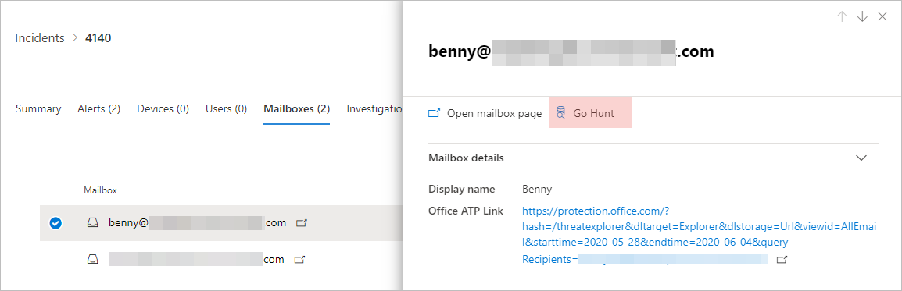
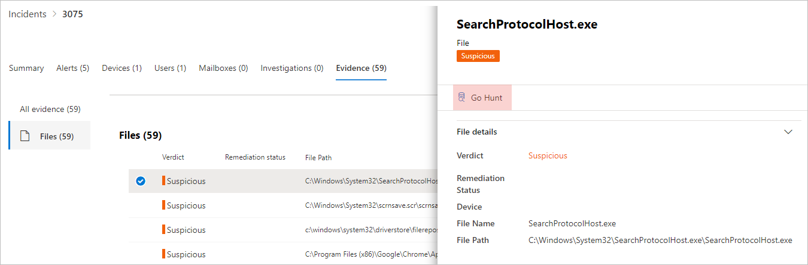
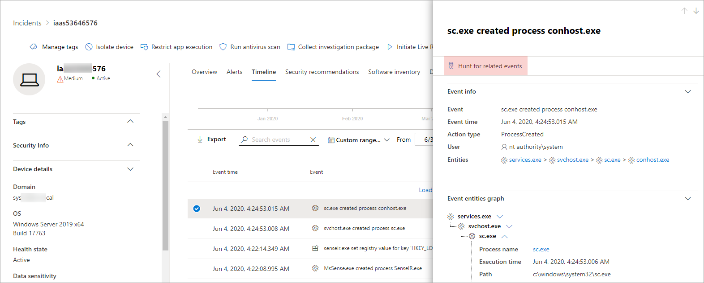

# Quickly hunt for entity or event information with go hunt

[!INCLUDE [Microsoft 365 Defender rebranding](../includes/microsoft-defender.md)]


**Applies to:**
- Microsoft 365 Defender

With the *go hunt* action, you can quickly investigate events and various entity types using powerful query-based [advanced hunting](advanced-hunting-overview.md) capabilities. This action automatically runs an advanced hunting query to find relevant information about the selected event or entity.

The *go hunt* action is available in various sections of the security center whenever event or entity details are displayed. For example, you can use *go hunt* from the following sections:

- In the [incident page](investigate-incidents.md#incident-overview), you can review details about users, devices, and many other entities associated with an incident. As you select an entity, you get additional information as well as various actions you could take on that entitity. In the example below, a mailbox is selected, showing details about the mailbox as well the option to hunt for more information about the mailbox.

    

- In the incident page, you can also access a list of entities under the evidence tab. Selecting one of those entities provides an option to quickly hunt for information about that entity.

    


- When viewing the timeline for a device, you can select an event in the timeline to view additional information about that event. Once an event is selected, you get the option to hunt for other relevant events in advanced hunting.

    

Selecting **Go hunt** or **Hunt for related events** passes different queries, depending on whether you've selected an entity or an event.

## Query for entity information
When using *go hunt* to query for information about a user, device, or any other type of entity, the query checks all relevant schema tables for any events involving that entity. To keep the results manageable, the query is scoped to around the same time period as the earliest activity in the past 30 days that involves the entity and is associated with the incident.

Here is an example of the go hunt query for a device:

```kusto
let selectedTimestamp = datetime(2020-06-02T02:06:47.1167157Z);
let deviceName = "fv-az770.example.com";
let deviceId = "device-guid";
search in (DeviceLogonEvents, DeviceProcessEvents, DeviceNetworkEvents, DeviceFileEvents, DeviceRegistryEvents, DeviceImageLoadEvents, DeviceEvents, DeviceImageLoadEvents, IdentityLogonEvents, IdentityQueryEvents)
Timestamp between ((selectedTimestamp - 1h) .. (selectedTimestamp + 1h))
and DeviceName == deviceName
// or RemoteDeviceName == deviceName
// or DeviceId == deviceId
| take 100
```
### Supported entity types
You can use *go hunt* after selecting any of these entity types:

- Files
- Emails
- Email clusters
- Mailboxes
- Users
- Devices
- IP addresses
- URLs

## Query for event information
When using *go hunt* to query for information about a timeline event, the query checks all relevant schema tables for other events around the time of the selected event. For example, the following query lists events in various schema tables that occured around the same time period on the same device:

```kusto
// List relevant events 30 minutes before and after selected LogonAttempted event
let selectedEventTimestamp = datetime(2020-06-04T01:29:09.2496688Z);
search in (DeviceFileEvents, DeviceProcessEvents, DeviceEvents, DeviceRegistryEvents, DeviceNetworkEvents, DeviceImageLoadEvents, DeviceLogonEvents)
    Timestamp between ((selectedEventTimestamp - 30m) .. (selectedEventTimestamp + 30m))
    and DeviceId == "079ecf9c5798d249128817619606c1c47369eb3e"
| sort by Timestamp desc
| extend Relevance = iff(Timestamp == selectedEventTimestamp, "Selected event", iff(Timestamp < selectedEventTimestamp, "Earlier event", "Later event"))
| project-reorder Relevance
```

## Adjust the query
With some knowledge of the [query language](advanced-hunting-query-language.md), you can adjust the query to your preference. For example, you can adjust this line, which determines the size of the time window:

```kusto
Timestamp between ((selectedTimestamp - 1h) .. (selectedTimestamp + 1h))
```

In addition to modifying the query to get more relevant results, you can also:
- [View the results as charts](advanced-hunting-query-results.md#view-query-results-as-a-table-or-chart)
- [Create a custom detection rule](custom-detection-rules.md)

## Related topics
- [Advanced hunting overview](advanced-hunting-overview.md)
- [Learn the query language](advanced-hunting-query-language.md)
- [Work with query results](advanced-hunting-query-results.md)
- [Custom detection rules](custom-detection-rules.md)
