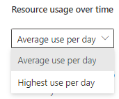

# Use the advanced hunting query resource report

[!INCLUDE [Microsoft 365 Defender rebranding](../includes/microsoft-defender.md)]

**Applies to:**
- Microsoft 365 Defender

## Understand advanced hunting quotas and usage parameters

To keep the service performant and responsive, advanced hunting sets various quotas and usage parameters (also known as "service limits"). These quotas and parameters apply separately to queries run manually and to queries run using [custom detection rules](custom-detection-rules.md). Customers who run multiple queries regularly should be mindful of these limits and [apply optimization best practices](advanced-hunting-best-practices.md) to minimize disruptions.

Refer to the following table to understand existing quotas and usage parameters.

| Quota or parameter | Size | Refresh cycle | Description |
|--|--|--|--|
| Data range | 30 days | Every query | Each query can look up data from up to the past 30 days. |
| Result set | 10,000 rows | Every query | Each query can return up to 10,000 records. |
| Timeout | 10 minutes | Every query | Each query can run for up to 10 minutes. If it does not complete within 10 minutes, the service displays an error.
| CPU resources | Based on tenant size | Every 15 minutes | The [portal displays an error](advanced-hunting-errors.md) whenever a query runs and the tenant has consumed over 10% of allocated resources. Queries are blocked if the tenant has reached 100% until after the next 15-minute cycle. |

> [!NOTE]
> A separate set of quotas and parameters apply to advanced hunting queries performed through the API. [Read about advanced hunting APIs](./api-advanced-hunting.md)

## View query resources report to find inefficient queries

The query resources report shows your organization's consumption of CPU resources for hunting based on queries that ran in the last 30 days using any of the hunting interfaces.
This report is useful in identifying the most resource-intensive queries and understanding how to prevent throttling due to excessive use.

### Access the query resources report

The report can be accessed in two ways:

- In the advanced hunting page, select **Query resources report**:

  :::image type="content" source="../../media/ah-query-resources/view-query-resources report.png" alt-text="view the query resources report button in the AH portal" lightbox="../../media/ah-query-resources/view-query-resources report.png":::

- Within the **Reports** page, find the new report entry in the **General** section

  :::image type="content" source="../../media/ah-query-resources/reports-general-query-resources.png" alt-text="view the query resources report in the Reports section" lightbox="../../media/ah-query-resources/reports-general-query-resources.png":::

All users can access the reports, however, only the AAD global admin, AAD security admin, and AAD security reader roles can see queries done by all users in all interfaces. Any other user can only see:

- Queries they ran via the portal
- Public API queries they ran themselves and not through the application
- Custom detections they created

### Query resource report contents

By default, the report table displays queries from the last day, and is sorted by Resource usage, to help you easily identify which queries consumed the highest amount of CPU resources.

The query resources report contains all queries that ran, including detailed resource information per query:

- **Time** – when the query was run
- **Interface** – whether the query ran in the portal, in custom detections, or via API query
- **User/App** – the user or app that ran the query
- **Resource usage** – an indicator of the amount of CPU resources a query consumed (can be Low, Medium, or High, where High means the query used a large amount of CPU resources and should be improved to be more efficient)
- **State** – whether the query was completed, failed, or was throttled
- **Query time** – how long it took to run the query
- **Time range** – the time range used in the query

> [!TIP]
> If the query state is **Failed**, you can hover the field to view the reason for the query failure.

:::image type="content" source="../../media/ah-query-resources/excessive-usage-sample.png" alt-text="view inefficient queries" lightbox="../../media/ah-query-resources/excessive-usage-sample.png":::

### Find resource-heavy queries

Queries with high resource usage or a long query time can probably be optimized to prevent throttling via this interface.

The graph displays resource usage over time per interface. You can easily identify excessive usage and click the spikes in the graph to filter the table accordingly. Once you select an entry in the graph, the table is filtered to that specific date.

You can identify the queries that used the most resources on that day and take action to improve them – by [applying query best practices](advanced-hunting-best-practices.md) or educating the user who ran the query or created the rule to take query efficiency and resources into consideration. For guided mode, the user needs to [switch to advanced mode](advanced-hunting-query-builder-details.md#switch-to-advanced-mode-after-building-a-query) to edit the query.

The graph supports two views:

- Average use per day –  the average use of resources per day
- Highest use per day – the highest actual use of resources per day

This means that, for instance, if on a specific day you ran two queries, one used 50% of your resources and one used 100%, the average daily use value would show 75%, while the top daily use would show 100%.

## Related topics

- [Advanced hunting best practices](advanced-hunting-best-practices.md)
- [Handle advanced hunting errors](advanced-hunting-errors.md)
- [Advanced hunting overview](advanced-hunting-overview.md)
[!INCLUDE [Microsoft 365 Defender rebranding](../../includes/defender-m3d-techcommunity.md)]
