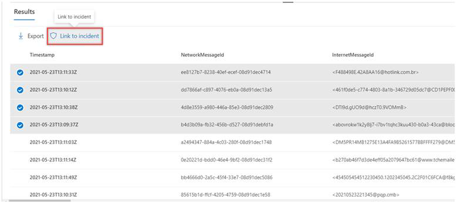
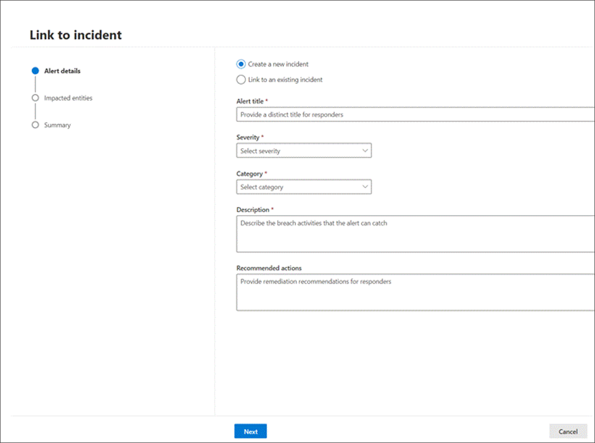
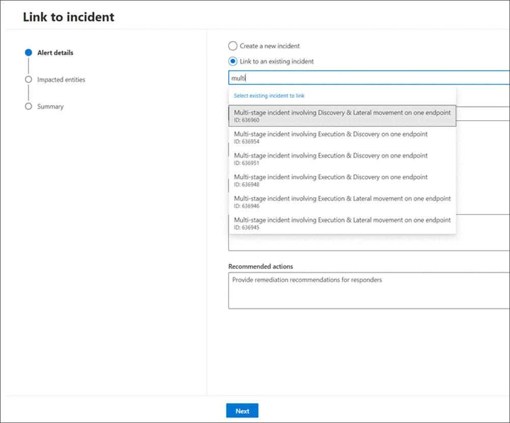
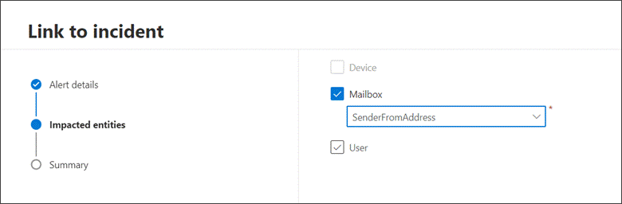
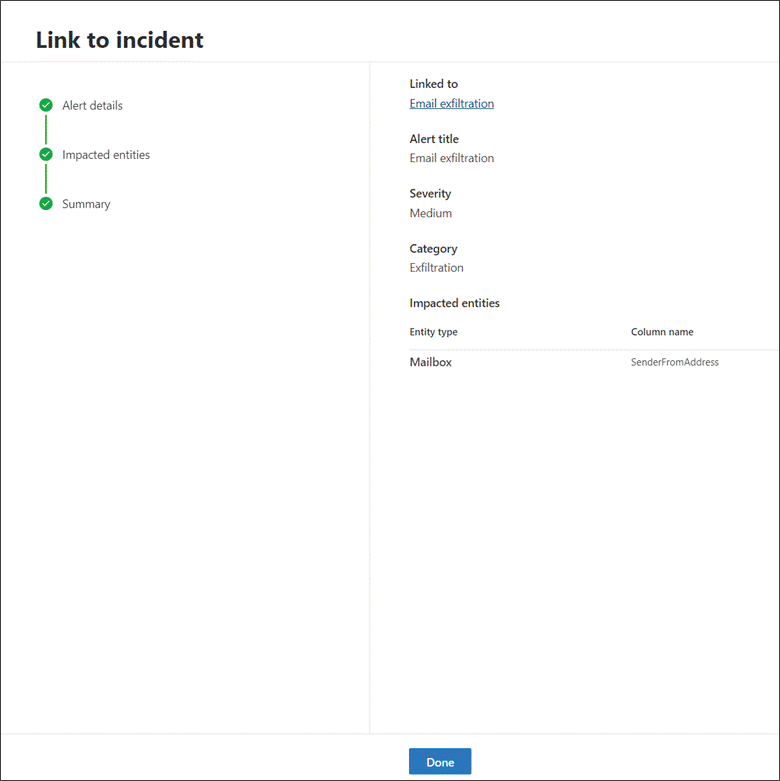
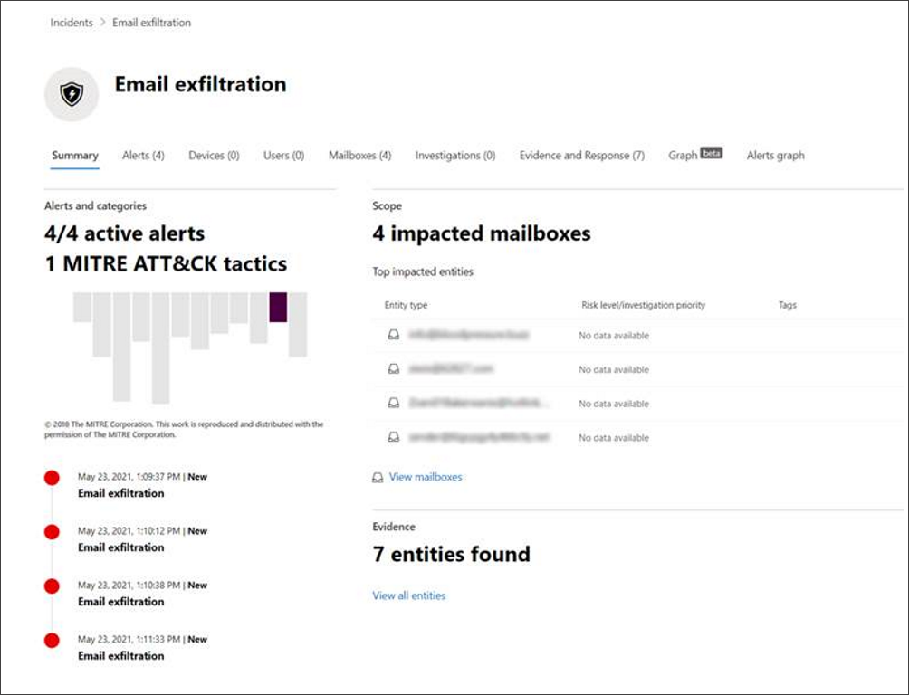

# Link query results to an incident

[!INCLUDE [Microsoft 365 Defender rebranding](../includes/microsoft-defender.md)]

**Applies to:**
- Microsoft 365 Defender
- Microsoft Defender for Endpoint

The link to incident feature lets you select advanced hunting query results to add to a new or existing incident under investigation. This feature helps you easily capture records from advanced hunting activities so you can create a richer timeline or context of events regarding an incident. 

## Link results to new or existing incidents

1. In the advanced hunting query page, first enter your query in the query field provided then select Run query to get your results.

    [INSERT SCREENSHOT]
1. In the Results page, select the events or records that are related to a new or current investigation you are working on, then select Link to incident.
    
1. 	In the Alert details section, select **Create new incident** to group the selected records to a new incident, or **Link to an existing incident** to add the selected records to an existing one.

    1. For the **Create new incident** selection, provide the following details:
        - Alert title - provide a descriptive title for the results that your incident responders can understand. This will become the alert title
	    - Severity - Choose the severity applicable to the alert.
		- Cateogry - Choose…
		- Description - 
		- Recommended actions - Provide remediation action
    	
    2. For **Link to an existing incident**, choose the related incident from the dropdown list of existing incidents. 

    
    Then select **Next**.
2. In the Impacted entities section, select the main affected or impacted entity. Only the possible entities based on the query results appear on this section. To help you decide…. For example, in the example, the Sender is the impacted entity. We have four different senders therefore four alerts are created and linked to the chosen incident. Select **Next**.
        
3. Review the details you have provided in the Summary section.
      
4. Select **Done** to convert the selected events to individual alerts, which are all related to an incident.

## View linked records in the incident

You can select the incident name to view the incident that the events are linked to.
      

In our example, the four alerts, representing the four selected events, were linked successfully to a new incident. 

In the alert page, you can find the complete information on the event or events in timeline view (if available) and query results view.
      
