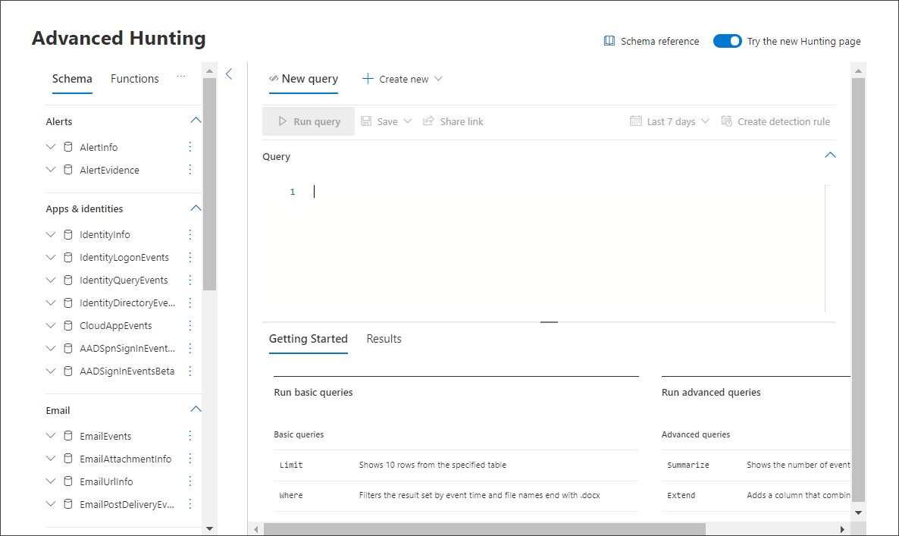
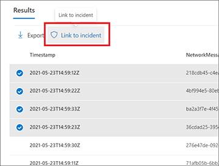
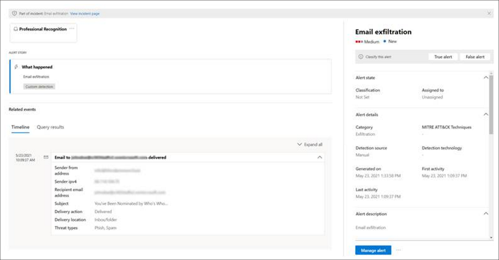
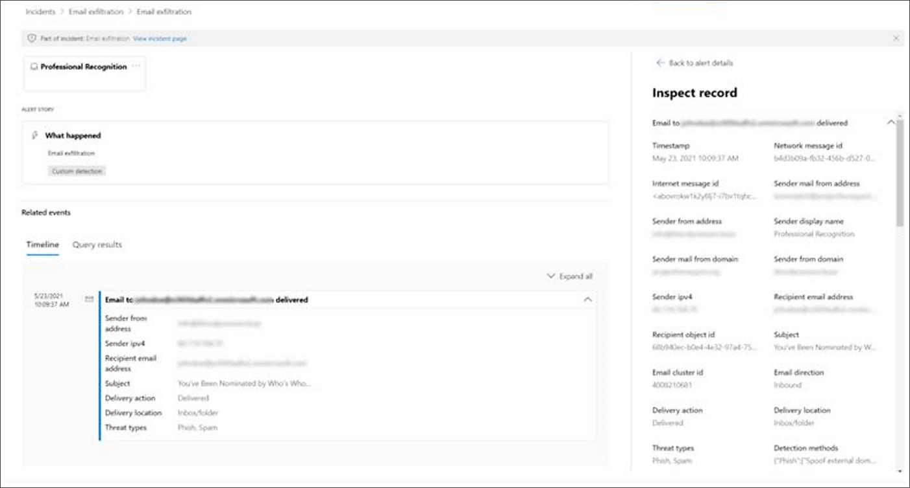
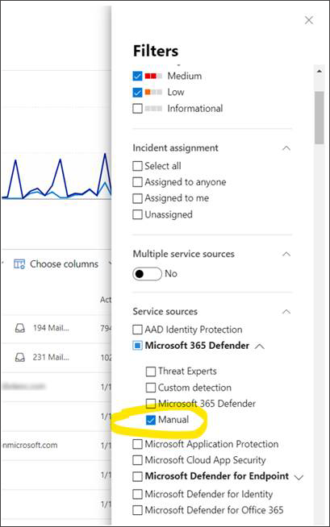

# Link query results to an incident

[!INCLUDE [Microsoft 365 Defender rebranding](../includes/microsoft-defender.md)]

**Applies to:**
- Microsoft 365 Defender
- Microsoft Defender for Endpoint

The link to incident feature lets you select advanced hunting query results to add to a new or existing incident under investigation. This feature helps you easily capture records from advanced hunting activities so you can create a richer timeline or context of events regarding an incident. 

## Link results to new or existing incidents

1. In the advanced hunting query page, first enter your query in the query field provided then select **Run query** to get your results.

    
2. In the Results page, select the events or records that are related to a new or current investigation you are working on, then select **Link to incident**.

    
3. Find the **Alert details** section in the Link to incident pane, then select **Create new incident** to convert the events to alerts and group the selected records to a new incident:

 
    	
    
    Or select **Link to an existing incident** to add the selected records to an existing one. Choose the related incident from the dropdown list of existing incidents. 

    
4. For either selection, provide the following details, then select **Next**:
      - Alert title - provide a descriptive title for the results that your incident responders can understand. This becomes the alert title.
      - Severity - Choose the severity applicable to the group of alerts.
      - Category - Choose the appropriate threat category for the alerts.
      - Description - Give a helpful description for the grouped alerts.
      - Recommended actions - Provide remediation actions.

5. In the Impacted entities section, select the main affected or impacted entity. Only the applicable entities based on the query results appear on this section. In our example, the Sender is the impacted entity. There are four different senders, therefore four alerts are created and linked to the chosen incident. 
        
6. Select **Next**.
7. Review the details you have provided in the Summary section.
      
8. Select **Done**.

## View linked records in the incident

You can select the incident name to view the incident that the events are linked to.
      

In our example, the four alerts, representing the four selected events, were linked successfully to a new incident. 

In each of the alert pages, you can find the complete information on the event or events in timeline view (if available) and query results view.
      

 

## Filter for events added using advanced hunting
You can view which alerts were generated from advanced hunting by filtering the Incidents queue and Alerts queue by **Manual** detection source.

 