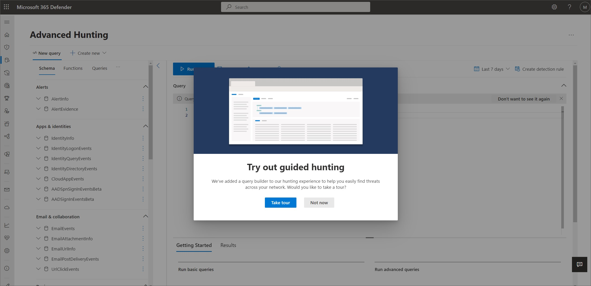
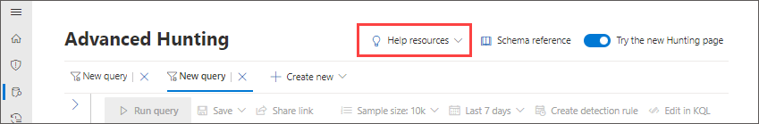

# Choose between guided and advanced modes to hunt in Microsoft 365 Defender

[!INCLUDE [Microsoft 365 Defender rebranding](../includes/microsoft-defender.md)]

**Applies to:**
- Microsoft 365 Defender

You can find the **advanced hunting** page by going to the left navigation bar in Microsoft 365 Defender and selecting **Hunting** > **Advanced hunting**. If the navigation bar is collapsed, select the hunting icon . 

In the **advanced hunting** page, two modes are supported:
- **Guided mode** – to query using the query builder
- **Advanced mode** – to query using the query editor using Kusto Query Language (KQL)

The main difference between the two modes is that the guided mode does not require the hunter to know KQL to query the database, while advanced mode requires KQL knowledge. 

Guided mode features a query builder that has an easy-to-use, visual, building-block style of constructing queries through dropdown filters and conditions. Advanced mode features a query editor area where users can create queries from scratch.

## Get started with guided hunting mode

When you open the advanced hunting page for the first time after guided hunting is made available to you, you are invited to take the tour to learn more about the different parts of the page like the tabs and query areas. 

To take the tour, select **Try out guided hunting** when this banner appears:

Follow the blue teaching bubbles that appear throughout the page and select **Next** to move from one step to the next.

You can take the tour again at any time by going to **Help resources** > **Learn more** and selecting **Take the tour**.

You can then start building your query to hunt for threats. The following articles can help you get the most out of hunting in guided mode:

| Learning goal | Description | Resource |
|--|--|--|
| **Craft your first query** | Learn the basics of the query builder like specifying the data domain and adding conditions and filters to help you create a meaningful query. Learn further by running sample queries. | [Build hunting queries using guided mode](advanced-hunting-query-builder.md) |
| **Learn the different query building basics** |  Get to know the different supported data types and guided mode capabilities to help you fine-tune your query according to your needs. | [Refine your query in guided mode](advanced-hunting-query-builder-details.md) |
| **Learn what you can do with query results** | Learn about charts and various ways you can view or export your results. Explore how you can quickly tweak queries, drill down to get richer information, and take response actions. | - [Work with query results in guided mode](advanced-hunting-query-builder-results.md)  - [Take action on query results](advanced-hunting-take-action.md)   - [Link query results to an incident](advanced-hunting-link-to-incident.md) |
| **Create custom detection rules** | Understand how you can use advanced hunting queries to trigger alerts and take response actions automatically. | - [Custom detections overview](custom-detections-overview.md)  - [Custom detection rules](custom-detection-rules.md) |

## Get started with advanced hunting mode
We recommend going through these steps to quickly get started with advanced hunting: 

| Learning goal | Description | Resource |
|--|--|--|
| **Learn the language** | Advanced hunting is based on [Kusto query language](/azure/kusto/query/), supporting the same syntax and operators. Start learning the query language by running your first query. | [Query language overview](advanced-hunting-query-language.md) |
| **Learn how to use the query results** | Learn about charts and various ways you can view or export your results. Explore how you can quickly tweak queries, drill down to get richer information, and take response actions. | - [Work with query results in advanced mode](advanced-hunting-query-results.md)  - [Take action on query results](advanced-hunting-take-action.md)   - [Link query results to an incident](advanced-hunting-link-to-incident.md)  |
| **Understand the schema** | Get a good, high-level understanding of the tables in the schema and their columns. Learn where to look for data when constructing your queries. | - [Schema reference](advanced-hunting-schema-tables.md)  - [Transition from Microsoft Defender for Endpoint](advanced-hunting-migrate-from-mde.md) |
| **Get expert tips and examples** | Train for free with guides from Microsoft experts. Explore collections of predefined queries covering different threat hunting scenarios. | - [Get expert training](advanced-hunting-expert-training.md)  - [Use shared queries](advanced-hunting-shared-queries.md)  - [Go hunt](advanced-hunting-go-hunt.md)  - [Hunt for threats across devices, emails, apps, and identities](advanced-hunting-query-emails-devices.md) |
| **Optimize queries and handle errors** | Understand how to create efficient and error-free queries. | - [Query best practices](advanced-hunting-best-practices.md) - [Handle errors](advanced-hunting-errors.md) |
| **Create custom detection rules** | Understand how you can use advanced hunting queries to trigger alerts and take response actions automatically. | - [Custom detections overview](custom-detections-overview.md)  - [Custom detection rules](custom-detection-rules.md)|

## See also
- [Understand the schema](advanced-hunting-schema-tables.md)
- [Build hunting queries using guided mode](advanced-hunting-query-builder.md)
- [Learn the query language](advanced-hunting-query-language.md)