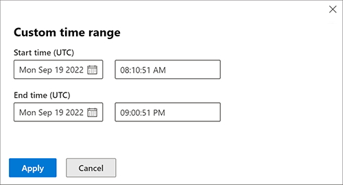

# Proactively hunt for threats with advanced hunting in Microsoft 365 Defender

[!INCLUDE [Microsoft 365 Defender rebranding](../includes/microsoft-defender.md)]

**Applies to:**
- Microsoft 365 Defender

Advanced hunting is a query-based threat hunting tool that lets you explore up to 30 days of raw data. You can proactively inspect events in your network to locate threat indicators and entities. The flexible access to data enables unconstrained hunting for both known and potential threats.

Advanced hunting supports two modes, guided and advanced. Use [guided mode](advanced-hunting-query-builder.md) if you are not yet familiar with Kusto Query Language (KQL) or prefer the convenience of a query builder. Use [advanced mode](advanced-hunting-query-language.md) if you are comfortable using KQL to create queries from scratch. 

**To start hunting, read [Choose between guided and advanced modes to hunt in Microsoft 365 Defender](advanced-hunting-modes.md).**

> [!VIDEO https://www.microsoft.com/en-us/videoplayer/embed/RE4G6DO]

You can use the same threat hunting queries to build custom detection rules. These rules run automatically to check for and then respond to suspected breach activity, misconfigured machines, and other findings.

Advanced hunting supports queries that check a broader data set coming from:

- Microsoft Defender for Endpoint
- Microsoft Defender for Office 365
- Microsoft Defender for Cloud Apps
- Microsoft Defender for Identity

To use advanced hunting, [turn on Microsoft 365 Defender](m365d-enable.md).

For more information on advanced hunting in Microsoft Defender for Cloud Apps data, see the [video](https://www.microsoft.com/en-us/videoplayer/embed/RWFISa). 

## Get access
To use advanced hunting or other [Microsoft 365 Defender](microsoft-365-defender.md) capabilities, you need an appropriate role in Azure Active Directory. [Read about required roles and permissions for advanced hunting](custom-roles.md).

Also, your access to endpoint data is determined by role-based access control (RBAC) settings in Microsoft Defender for Endpoint. [Read about managing access to Microsoft 365 Defender](m365d-permissions.md).

## Data freshness and update frequency
Advanced hunting data can be categorized into two distinct types, each consolidated differently.

- **Event or activity data**—populates tables about alerts, security events, system events, and routine assessments. Advanced hunting receives this data almost immediately after the sensors that collect them successfully transmit them to the corresponding cloud services. For example, you can query event data from healthy sensors on workstations or domain controllers almost immediately after they are available on Microsoft Defender for Endpoint and Microsoft Defender for Identity.
- **Entity data**—populates tables with information about users and devices. This data comes from both relatively static data sources and dynamic sources, such as Active Directory entries and event logs. To provide fresh data, tables are updated with any new information every 15 minutes, adding rows that might not be fully populated. Every 24 hours, data is consolidated to insert a record that contains the latest, most comprehensive data set about each entity.

## Time zone
### Queries
Advanced hunting data uses the UTC (Universal Time Coordinated) timezone. 

Queries should be created in UTC.

### Results
Advanced hunting results are converted to the [timezone](m365d-time-zone.md) set in Microsoft 365 Defender. 

## Related topics
- [Choose between guided and advanced hunting modes](advanced-hunting-modes.md)
- [Build hunting queries using guided mode](advanced-hunting-query-builder.md)
- [Learn the query language](advanced-hunting-query-language.md)
- [Understand the schema](advanced-hunting-schema-tables.md)
- [Microsoft Graph security API](/graph/api/resources/security-api-overview#advanced-hunting)
- [Custom detections overview](custom-detections-overview.md)
[!INCLUDE [Microsoft 365 Defender rebranding](../../includes/defender-m3d-techcommunity.md)]
