# Refine your query in guided mode 

[!INCLUDE [Microsoft 365 Defender rebranding](../includes/microsoft-defender.md)]

**Applies to:**
- Microsoft 365 Defender

> [!IMPORTANT]
> Some information relates to prereleased product which may be substantially modified before it's commercially released. Microsoft makes no warranties, express or implied, with respect to the information provided here.
## Use different data types

Advanced hunting in guided mode supports several data types that you can use to fine-tune your query.

- Numbers 

- Strings 
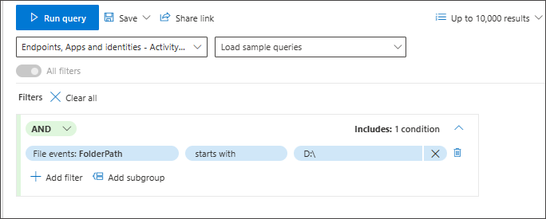

   In the free text box, type the value and press **Enter** to add it. Note that the delimiter between values is **Enter**. 

   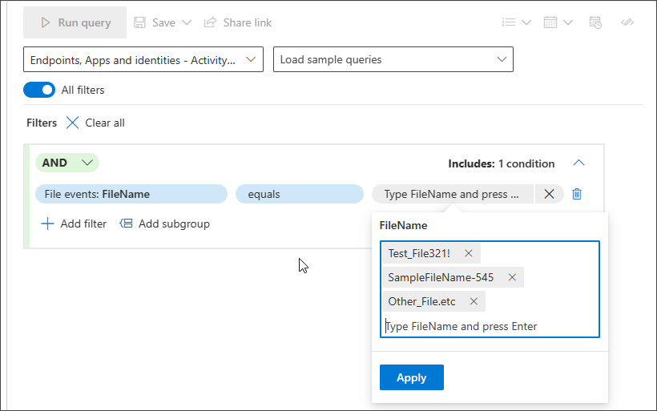

- Boolean 
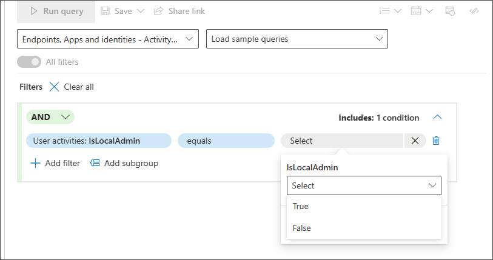

- Datetime 
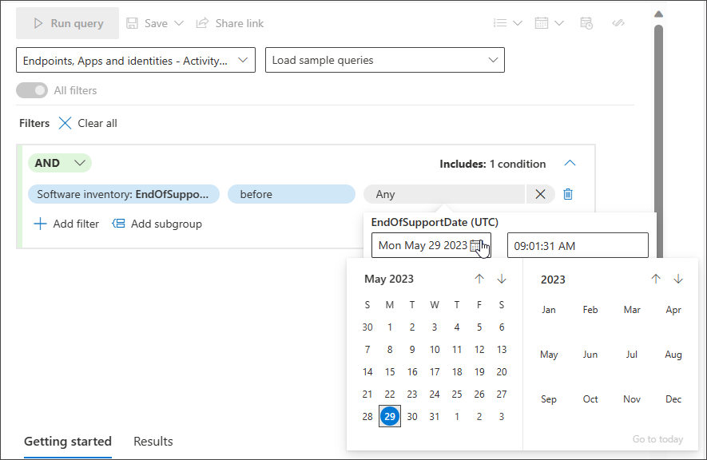

- Closed list - You don't need to remember the exact value you are looking for. You can easily choose from a suggested closed list that supports multi-selection. 
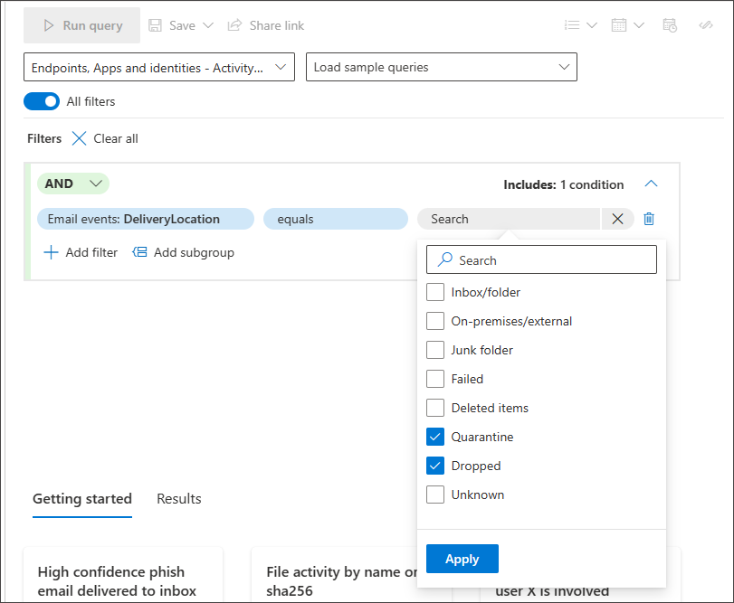

## Use subgroups
You can create groups of conditions by clicking **Add subgroup**:

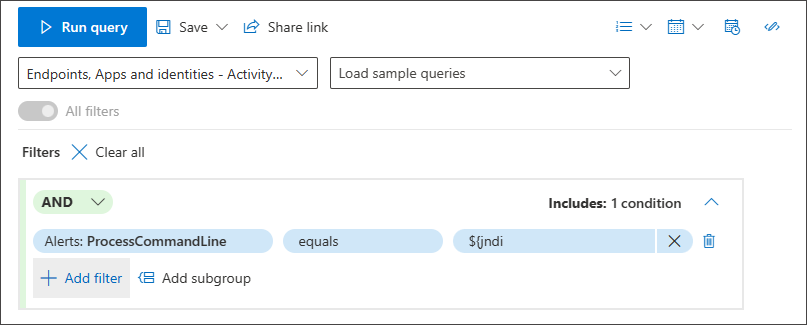

## Use smart auto-complete for search
Smart auto-complete for searching devices and user accounts is supported. 
You don't need to remember the device ID, full device name, or user account name. You can start typing the first few characters of the device or user you are looking for and a suggested list appears from which you can choose what you need:

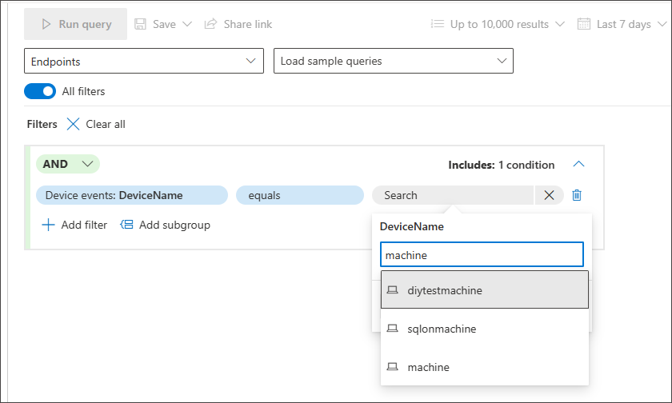

## Use `EventType`
You can even look for specific event types like all failed logons, file modification events, or successful network connections by using the **EventType** filter in any section where it is applicable.

For instance, if you want to add a condition that looks for registry value deletions, you can go to the **Registry Events** section and select **EventType**.

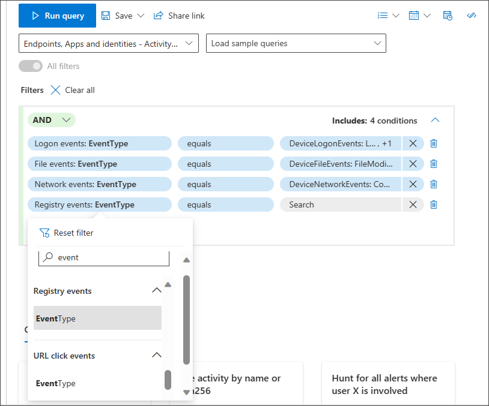

Selecting EventType under Registry Events allows you to choose from different registry events, including the one you're hunting for, **RegistryValueDeleted**.

> [!NOTE] 
>`EventType` is the equivalent of `ActionType` in the data schema, which users of advanced mode might be more familiar with.

## Test your query with a smaller sample size
If you're still working on your query and would like to see its performance and some sample results quickly, adjust the number of records to return by picking a smaller set through the **Sample size** dropdown menu. 
 
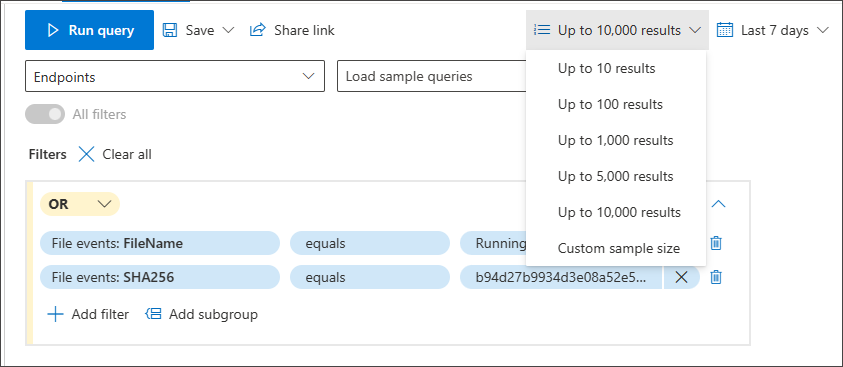

The sample size is set to 10,000 results by default. This is the maximum number of records that can be returned in hunting. However, we highly recommend lowering the sample size to 10 or 100 to quickly test your query as doing so consumes less resources while you are still working on improving the query.

Then, once you finalize your query and are ready to use it to get all the relevant results for your hunting activity, make sure that the sample size is set to 10k, the maximum.

## Switch to advanced mode after building a query
You can click on **Edit in KQL** to view the KQL query generated by your selected conditions. Editing in KQL opens a new tab in advanced mode, with the corresponding KQL query:

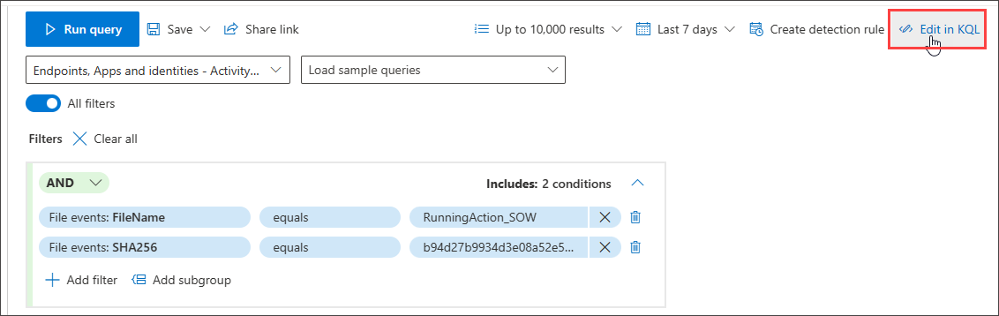

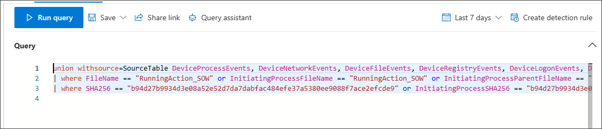

In the above example, the selected view is All, therefore you can see that the KQL query searches all tables that have file properties of name and SHA256, and in all the relevant columns covering these properties. 

If you change the view to **Emails & collaboration**, the query is narrowed down to:

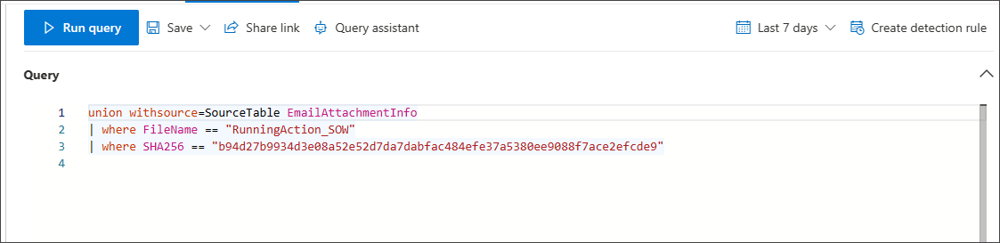

## See also
 - [Advanced hunting quotas and usage parameters](advanced-hunting-limits.md)
 - [Extend advanced hunting coverage with the right settings](advanced-hunting-extend-data.md)
[!INCLUDE [Microsoft 365 Defender rebranding](../../includes/defender-m3d-techcommunity.md)]
