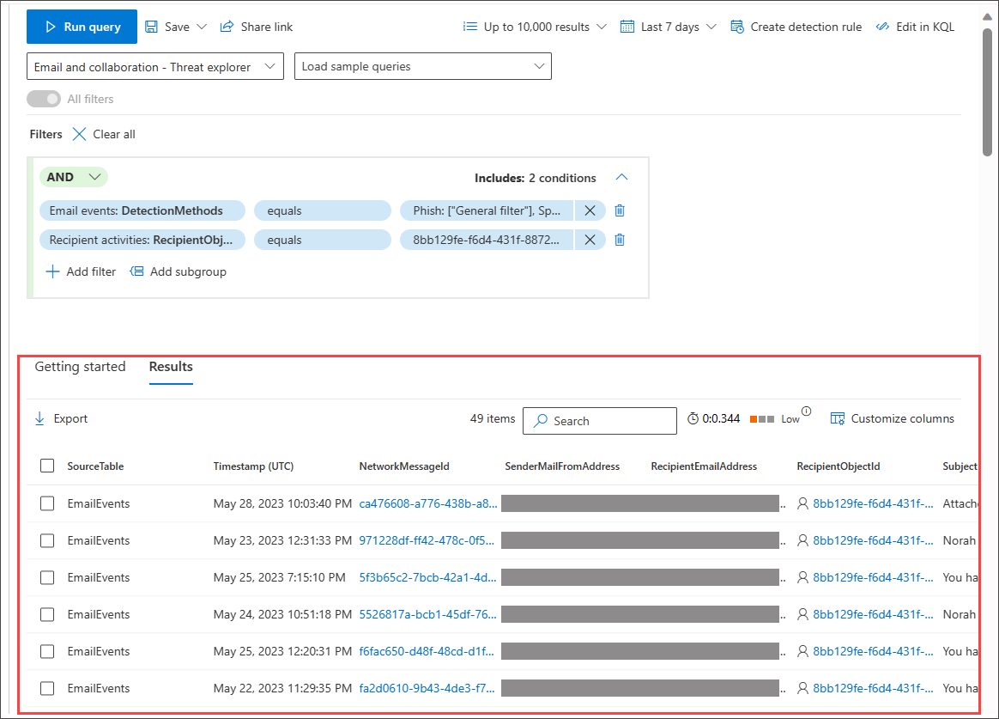

# Work with query results in guided mode
[!INCLUDE [Microsoft 365 Defender rebranding](../includes/microsoft-defender.md)]

**Applies to:**
- Microsoft 365 Defender

> [!IMPORTANT]
> Some information relates to prereleased product which may be substantially modified before it's commercially released. Microsoft makes no warranties, express or implied, with respect to the information provided here.

In hunting using guided mode, the results of the query appear in the **Results** tab.

You can work on the results further by exporting them to a CSV file by selecting **Export**. This downloads the CSV file for your use.

You can view other information in the Results view:

- Number of records in the results list (beside the Search button)
- Duration of the query run time
- Resource usage of the query

## View more columns

A few standard columns are included in the results for easy viewing.

To view more columns:

1. Select **Customize columns** in the upper right-hand portion of the results view.
2. From here, select the columns to include in the results view and deselect columns to hide.

   

3. Select **Apply** to view results with the added columns. Use the scroll bars if necessary.

## See also

- [Advanced hunting quotas and usage parameters](advanced-hunting-limits.md)
- [Switch to advanced mode](advanced-hunting-query-builder-details.md#switch-to-advanced-mode-after-building-a-query)
- [Refine your query in guided mode](advanced-hunting-query-builder-details.md)
[!INCLUDE [Microsoft 365 Defender rebranding](../../includes/defender-m3d-techcommunity.md)]
