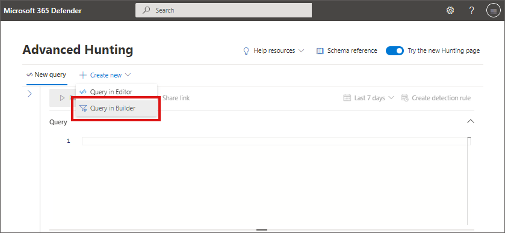
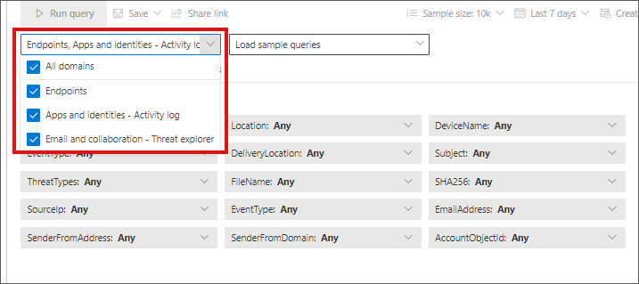
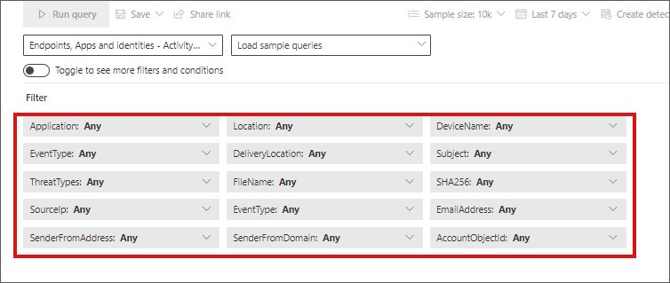
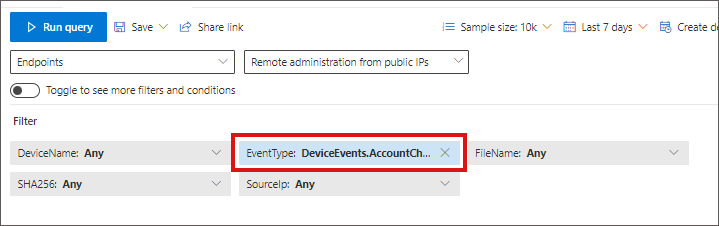
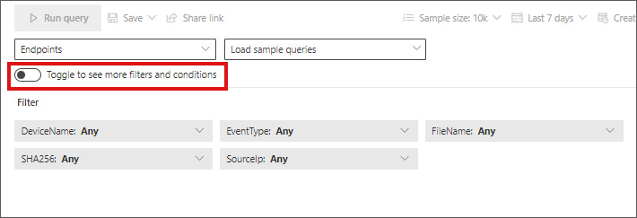
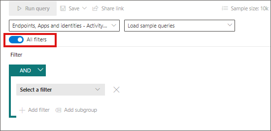
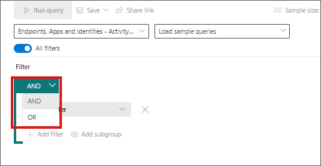
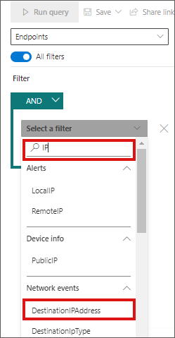
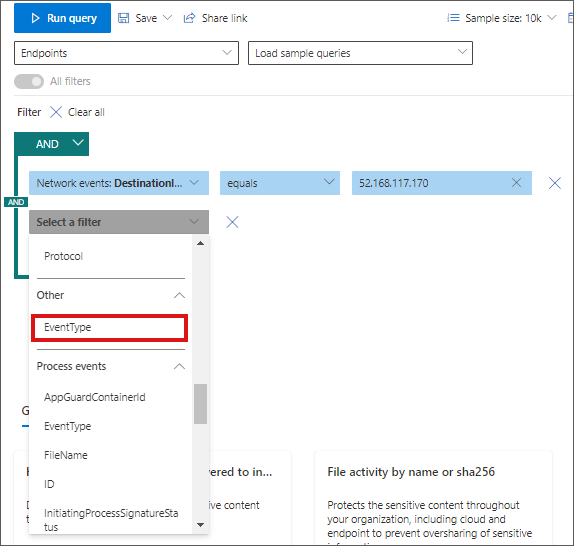
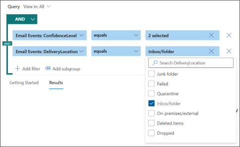

# Build hunting queries using guided mode in Microsoft 365 Defender

[!INCLUDE [Microsoft 365 Defender rebranding](../includes/microsoft-defender.md)]

**Applies to:**
- Microsoft 365 Defender

The query builder in guided mode allows analysts to craft meaningful hunting queries *without knowing Kusto Query Language (KQL) or the data schema*. Analysts from every tier of experience can use the query builder to filter through data from the last 30 days to look for threats, expand incident investigations, perform data analytics on threat data, or focus on specific threat areas.

The analyst can choose which data set to look at and which filters and conditions to use to narrow the data down to what they need. 

## Open Query in builder
In the **Advanced hunting** page, select **Create new** to open a new query tab and select **Query in builder**. 

This brings you to the guided mode, where you can then construct your query by selecting different components using dropdown menus.

## Specify the data domain to hunt in
You can control the scope of the hunt by selecting the **View in** control:

**View in** controls the filters. Selecting **All** allows you to filter the entire dataset. Narrowing down to a specific domain allows filters relevant to that domain only. 

You can choose from:
- All domains - to look through all available data in your query
- Endpoints - to look through endpoint data as provided by Microsoft Defender for Endpoint
- Apps and identities - to look through application and identity data as provided by Microsoft Defender for Cloud Apps and Microsoft Defender for Identity; users familiar with [Activity log](defender-cloud-apps/activity-filters.md) can find the same data here
- Email and collaboration - to look through email and collaboration apps data like SharePoint, OneDrive and others; users familiar with [Threat Explorer](office-365-security/threat-explorer.md) can find the same data here

## Use basic filters

By default, guided hunting includes a few basic filters to get you started fast. 

When you choose one data source, for instance, **Endpoints**, the query builder displays only the applicable filter groups. You can then choose a filter you are interested in narrowing down by selecting that filter group, for instance, **EventType**, and selecting the filter of your choice.

Once the query is ready, select the blue **Run query** button. If the button is grayed out, it means the query needs to be filled out or edited further. 

Note that the basic filter view uses the **AND** operator only, meaning running the query generates results for which all set filters are true. 

## Use more filters

To view more filter groups and conditions, select **Toggle to see more filters and conditions**.

When the **All filters** toggle is active, you can now use the full range of filters and conditions in guided mode.

### Create conditions

To specify a set of data to be used in the query, select **Select a filter**. Explore the different filter sections to find what is available to you.
 

Type the section's titles to find the filter or use the search box at the top of the list. Sections ending in *info* contain filters that provide information about the different components you can look at. Sections ending in *events* contain filters that allow you to look for any system or network event. 

>[!NOTE]
> Choosing a filter that isn't in the basic filters list deactivates or grays out the toggle to return to the basic filters view. To reset the query or remove existing filters in the current query, select **Clear all**. This also reactivates the basic filters list.

[MORE INFO ABOUT OPERATORS]

You can further narrow down your query by using **AND**, and **OR** conditions. AND returns results that fulfill all conditions in the query, while OR returns results that fulfill any of the conditions in the query.  

## Try sample query walk-throughs

Another way to get familiar with guided hunting is to load sample queries pre-created in guided mode. 

In the **Getting started** section of the hunting page, we have provided three guided query examples that you can load. The query examples contain some of the most common filters and inputs you would typically need in your hunting. Loading any of the three sample queries opens a guided tour of how you would construct the entry using guided mode.

Follow the instructions in the blue teaching bubbles to construct your query. Select **Run query**.

## Try some queries

### Hunt for successful connections to specific IP
To hunt for successful network communications to a specific IP address, start typing “ip” to get suggested filters:

To look for events involving this IP address where this IP is the destination of the communication, select `DestinationIPAddress` under the IP Address Events section. Then select the **equals** operator and type the IP and press **Enter**:

Then, to add a second condition which searches for successful network communication events, search for the filter of a specific event type:

**Event** filter looks for the different event types logged. It is equivalent to the **ActionType** column which exists in most of the tables in advanced hunting. Select it to choose one or more event types to filter for. To look for successful network communication events, expand the **DeviceNetworkEvents** section and then choose `ConnectionSuccess`:

Finally, select **Run query** to hunt for all successful network communications to the 52.168.117.170 IP address:

### Hunt for high confidence phish or spam emails delivered to inbox [NEEDS NEW IMAGES]

To look for all high confidence phish and spam emails that were delivered to the inbox folder at the time of delivery, first select ConfidenceLevel under Email Events, select **equals** and choose **High** under both **Phish** and **Spam** from the suggested closed list which supports multi-selection:

Then, add another condition this time specifying the folder or **DeliveryLocation, Inbox/folder**. 

## See also

- [Refine your query in guided mode](advanced-hunting-query-builder-details.md)
- [Work with query results in guided mode](advanced-hunting-query-builder-results.md)
 - [Understand the schema](advanced-hunting-schema-tables.md)
