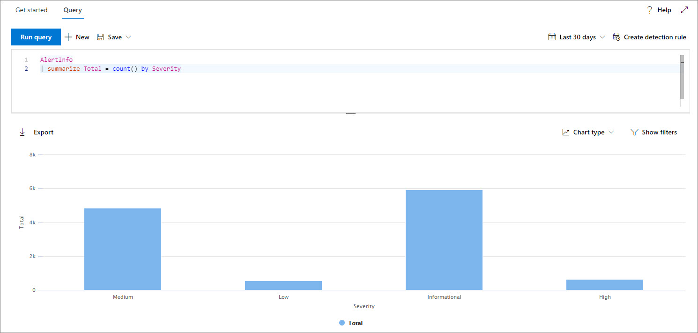
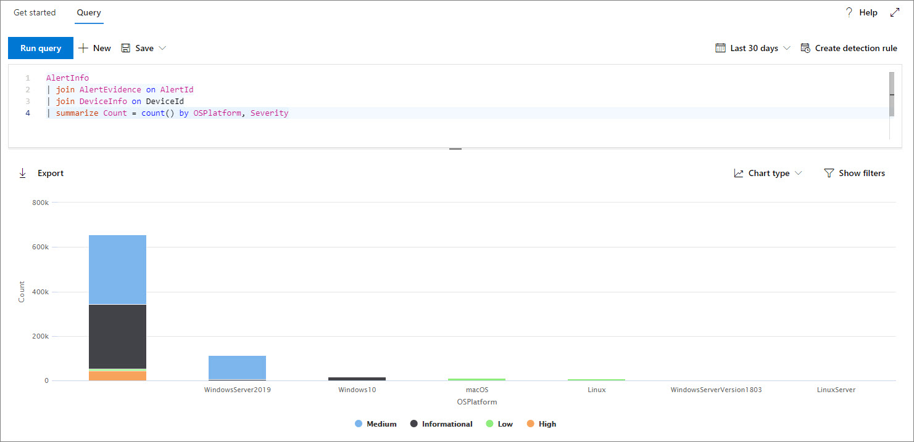
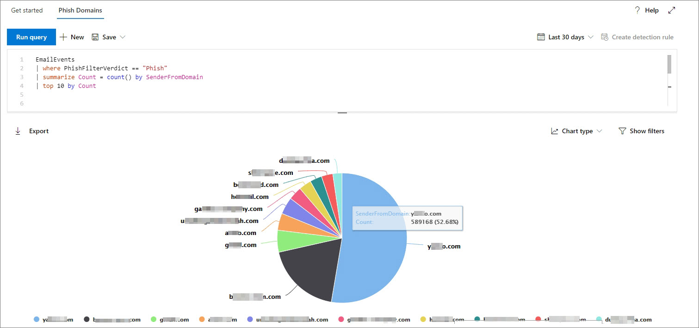
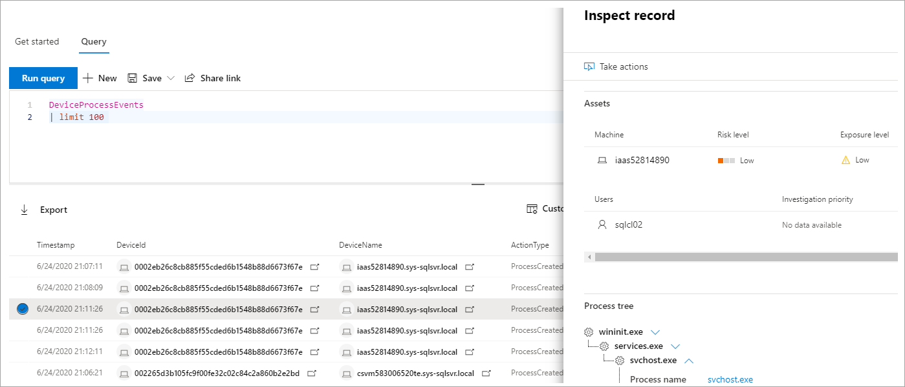
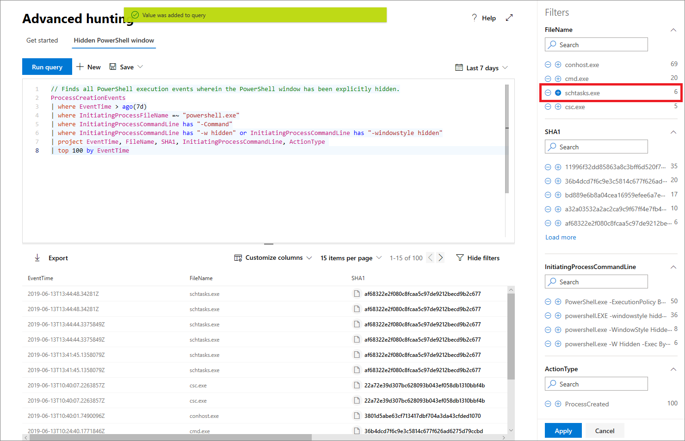

# Work with advanced hunting query results

[!INCLUDE [Microsoft 365 Defender rebranding](../includes/microsoft-defender.md)]


**Applies to:**
- Microsoft 365 Defender

[!INCLUDE [Prerelease information](../includes/prerelease.md)]

While you can construct your [advanced hunting](advanced-hunting-overview.md) queries to return very precise information, you can also work with the query results to gain further insight and investigate specific activities and indicators. You can take the following actions on your query results:

- View results as a table or chart
- Export tables and charts
- Drill down to detailed entity information
- Tweak your queries directly from the results or apply filters

## View query results as a table or chart
By default, advanced hunting displays query results as tabular data. You can also display the same data as a chart. Advanced hunting supports the following views:

| View type | Description |
| -- | -- |
| **Table** | Displays the query results in tabular format |
| **Column chart** | Renders a series of unique items on the x-axis as vertical bars whose heights represent numeric values from another field |
| **Stacked column chart** | Renders a series of unique items on the x-axis as stacked vertical bars whose heights represent numeric values from one or more other fields |
| **Pie chart** | Renders sectional pies representing unique items. The size of each pie represents numeric values from another field. |
| **Donut chart** | Renders sectional arcs representing unique items. The length of each arc represents numeric values from another field. |
| **Line chart** | Plots numeric values for a series of unique items and connects the plotted values |
| **Scatter chart** | Plots numeric values for a series of unique items |
| **Area chart** | Plots numeric values for a series of unique items and fills the sections below the plotted values |

### Construct queries for effective charts
When rendering charts, advanced hunting automatically identifies columns of interest and the numeric values to aggregate. To get meaningful charts, construct your queries to return the specific values you want to see visualized. Here are some sample queries and the resulting charts.

#### Alerts by severity
Use the `summarize` operator to obtain a numeric count of the values you want to chart. The query below uses the `summarize` operator to get the number of alerts by severity.

```kusto
AlertInfo
| summarize Total = count() by Severity
```
When rendering the results, a column chart displays each severity value as a separate column:


*Query results for alerts by severity displayed as a column chart*

#### Alert severity by operating system
You could also use the `summarize` operator to prepare results for charting values from multiple fields. For example, you might want to understand how alert severities are distributed across operating systems (OS). 

The query below uses a `join` operator to pull in OS information from the `DeviceInfo` table, and then uses `summarize` to count values in both the `OSPlatform` and `Severity` columns:

```kusto
AlertInfo
| join AlertEvidence on AlertId
| join DeviceInfo on DeviceId
| summarize Count = count() by OSPlatform, Severity 
```
These results are best visualized using a stacked column chart:


*Query results for alerts by OS and severity displayed as a stacked chart*

#### Phishing emails across top ten sender domains
If you're dealing with a list of values that isn’t finite, you can use the `Top` operator to chart only the values with the most instances. For example, to get the top ten sender domains with the most phishing emails, use the query below:

```kusto
EmailEvents
| where ThreatTypes has "Phish" 
| summarize Count = count() by SenderFromDomain 
| top 10 by Count
```
Use the pie chart view to effectively show distribution across the top domains:


*Pie chart showing distribution of phishing emails across top sender domains*

#### File activities over time
Using the `summarize` operator with the `bin()` function, you can check for events involving a particular indicator over time. The query below counts events involving the file `invoice.doc` at 30 minute intervals to show spikes in activity related to that file:

```kusto
AppFileEvents
| union DeviceFileEvents
| where FileName == "invoice.doc"
| summarize FileCount = count() by bin(Timestamp, 30m)
```
The line chart below clearly highlights time periods with more activity involving `invoice.doc`: 


*Line chart showing the number of events involving a file over time*


## Export tables and charts
After running a query, select **Export** to save the results to local file. Your chosen view determines how the results are exported:

- **Table view** — the query results are exported in tabular form as a Microsoft Excel workbook
- **Any chart** — the query results are exported as a JPEG image of the rendered chart

## Drill down from query results
To quickly inspect a record in your query results, select the corresponding row to open the **Inspect record** panel. The panel provides the following information based on the selected record:

- **Assets** — summarized view of the main assets (mailboxes, devices, and users) found in the record, enriched with available information, such as risk and exposure levels
- **Process tree** — generated for records with process information and enriched using available contextual information; in general, queries that return more columns can result in richer process trees.
- **All details** — all the values from the columns in the record  



To view more information about a specific entity in your query results, such as a machine, file, user, IP address, or URL, select the entity identifier to open a detailed profile page for that entity.

## Tweak your queries from the results
Right-click a value in the result set to quickly enhance your query. You can use the options to:

- Explicitly look for the selected value (`==`)
- Exclude the selected value from the query (`!=`)
- Get more advanced operators for adding the value to your query, such as `contains`, `starts with` and `ends with` 


## Filter the query results
The filters displayed to the right provide a summary of the result set. Each column has its own section that lists the distinct values found for that column and the number of instances.

Refine your query by selecting the `+` or `-` buttons on the values that you want to include or exclude and then selecting **Run query**.



Once you apply the filter to modify the query and then run the query, the results are updated accordingly.

## Related topics
- [Advanced hunting overview](advanced-hunting-overview.md)
- [Learn the query language](advanced-hunting-query-language.md)
- [Use shared queries](advanced-hunting-shared-queries.md)
- [Hunt across devices, emails, apps, and identities](advanced-hunting-query-emails-devices.md)
- [Understand the schema](advanced-hunting-schema-tables.md)
- [Apply query best practices](advanced-hunting-best-practices.md)
- [Custom detections overview](custom-detections-overview.md)
