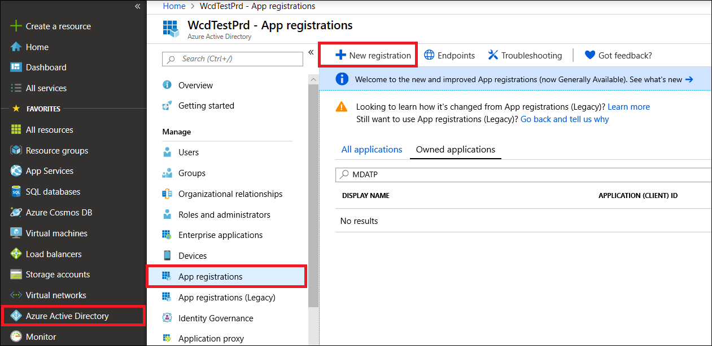
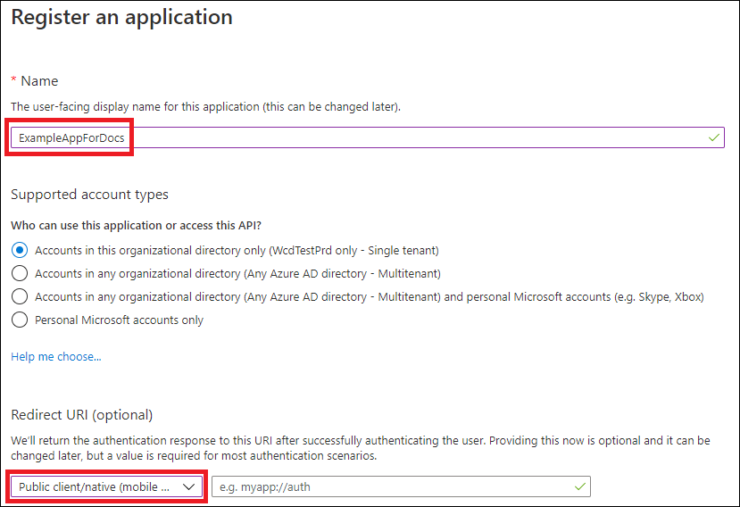
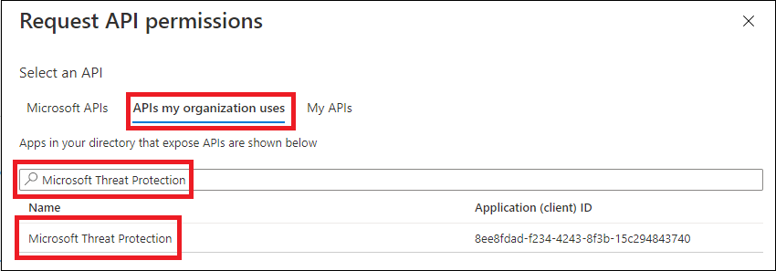
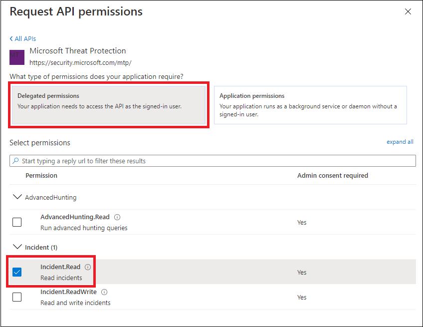
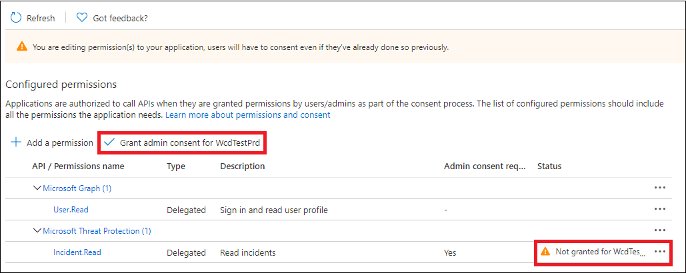

# Create an app to access Microsoft 365 Defender APIs on behalf of a user

[!INCLUDE [Microsoft 365 Defender rebranding](../includes/microsoft-defender.md)]

**Applies to:**

- Microsoft 365 Defender

> [!IMPORTANT]
> Some information relates to prereleased product which may be substantially modified before it's commercially released. Microsoft makes no warranties, express or implied, with respect to the information provided here.

This page describes how to create an application to get programmatic access to Microsoft 365 Defender on behalf of a single user.

If you need programmatic access to Microsoft 365 Defender without a defined user (for example, if you're writing a background app or daemon), see [Create an app to access Microsoft 365 Defender without a user](api-create-app-web.md). If you need to provide access for multiple tenants—for example, if you're serving a large organization or a group of customers—see [Create an app with partner access to Microsoft 365 Defender APIs](api-partner-access.md).If you're not sure which kind of access you need, see [Get started](api-access.md).

Microsoft 365 Defender exposes much of its data and actions through a set of programmatic APIs. Those APIs help you automate workflows and make use of Microsoft 365 Defender's capabilities. This API access requires OAuth2.0 authentication. For more information, see [OAuth 2.0 Authorization Code Flow](/azure/active-directory/develop/active-directory-v2-protocols-oauth-code).

In general, you'll need to take the following steps to use these APIs:

- Create an Azure Active Directory (Azure AD) application.
- Get an access token using this application.
- Use the token to access Microsoft 365 Defender API.

This article explains how to:

- Create an Azure AD application
- Get an access token to Microsoft 365 Defender
- Validate the token

> [!NOTE]
> When accessing Microsoft 365 Defender API on behalf of a user, you will need the correct application permissions and user permissions.

> [!TIP]
> If you have the permission to perform an action in the portal, you have the permission to perform the action in the API.

## Create an app

1. Sign in to [Azure](https://portal.azure.com) as a user with the **Global Administrator** role.

2. Navigate to **Azure Active Directory** > **App registrations** > **New registration**.

   

3. In the form, choose a name for your application and enter the following information for the redirect URI, then select **Register**.

   

   - **Application type:** Public client
   - **Redirect URI:** https://portal.azure.com

4. On your application page, select **API Permissions** > **Add permission** > **APIs my organization uses** >, type **Microsoft Threat Protection**, and select **Microsoft Threat Protection**. Your app can now access Microsoft 365 Defender.

   > [!TIP]
   > *Microsoft Threat Protection* is a former name for Microsoft 365 Defender, and will not appear in the original list. You need to start writing its name in the text box to see it appear.

   

   - Choose **Delegated permissions**. Choose the relevant permissions for your scenario (for example **Incident.Read**), and then select **Add permissions**.

   

    > [!NOTE]
    > You need to select the relevant permissions for your scenario. *Read all incidents* is just an example. To determine which permission you need, please look at the **Permissions** section in the API you want to call.
    >
    > For instance, to [run advanced queries](api-advanced-hunting.md), select the 'Run advanced queries' permission; to [isolate a device](/windows/security/threat-protection/microsoft-defender-atp/isolate-machine), select the 'Isolate machine' permission.

5. Select **Grant admin consent**. Every time you add a permission, you must select **Grant admin consent** for it to take effect.

   

6. Record your application ID and your tenant ID somewhere safe. They're listed under **Overview** on your application page.

   

## Get an access token

For more information on Azure Active Directory tokens, see the [Azure AD tutorial](/azure/active-directory/develop/active-directory-v2-protocols-oauth-client-creds).

### Get an access token using PowerShell

```PowerShell
if(!(Get-Package adal.ps)) { Install-Package -Name adal.ps } # Install the ADAL.PS package in case it's not already present

$tenantId = '' # Paste your directory (tenant) ID here.
$clientId = '' # Paste your application (client) ID here.
$redirectUri = '' # Paste your app's redirection URI

$authority = "https://login.windows.net/$tenantId"
$resourceUrl = 'https://api.security.microsoft.com'

$response = Get-ADALToken -Resource $resourceUrl -ClientId $cleintId -RedirectUri $redirectUri -Authority $authority -PromptBehavior:Always
$response.AccessToken | clip

$response.AccessToken
```

## Validate the token

1. Copy and paste the token into [JWT](https://jwt.ms) to decode it.
1. Make sure that the *roles* claim within the decoded token contains the desired permissions.

In the following image, you can see a decoded token acquired from an app, with ```Incidents.Read.All```, ```Incidents.ReadWrite.All```, and ```AdvancedHunting.Read.All``` permissions:


## Use the token to access the Microsoft 365 Defender API

1. Choose the API you want to use (incidents, or advanced hunting). For more information, see [Supported Microsoft 365 Defender APIs](api-supported.md).
2. In the http request you're about to send, set the authorization header to `"Bearer" <token>`, *Bearer* being the authorization scheme, and *token* being your validated token.
3. The token will expire within one hour. You can send more than one request during this time  with the same token.

The following example shows how to send a request to get a list of incidents **using C#**.

```C#
    var httpClient = new HttpClient();
    var request = new HttpRequestMessage(HttpMethod.Get, "https://api.security.microsoft.com/api/incidents");

    request.Headers.Authorization = new AuthenticationHeaderValue("Bearer", token);

    var response = httpClient.SendAsync(request).GetAwaiter().GetResult();
```

## Related articles

- [Microsoft 365 Defender APIs overview](api-overview.md)
- [Access the Microsoft 365 Defender APIs](api-access.md)
- [Create a 'Hello world' app](api-hello-world.md)
- [Create an app to access Microsoft 365 Defender without a user](api-create-app-web.md)
- [Create an app with multi-tenant partner access to Microsoft 365 Defender APIs](api-partner-access.md)
- [Learn about API limits and licensing](api-terms.md)
- [Understand error codes](api-error-codes.md)
- [OAuth 2.0 authorization for user sign in and API access](/azure/active-directory/develop/active-directory-v2-protocols-oauth-code)