# Configure your Event Hub

[!INCLUDE [Microsoft 365 Defender rebranding](../../includes/microsoft-defender.md)]

**Applies to:**
- [Microsoft 365 Defender](https://go.microsoft.com/fwlink/?linkid=2118804)


Learn how to configure your Event Hub so that you can ingest events from Microsoft 365 Defender.


Setup the required Resource Provider in the Event Hub subscription
--------------------------------------------------------------------

1. Sign in to the [Azure portal](https://portal.azure.com).
1. Select **Subscriptions \> {***Select the subscription the event hub will be deployed
to***} \> Resource providers**.
1. Verify that the **Microsoft.Insights** Provider is registered. Otherwise, register it.

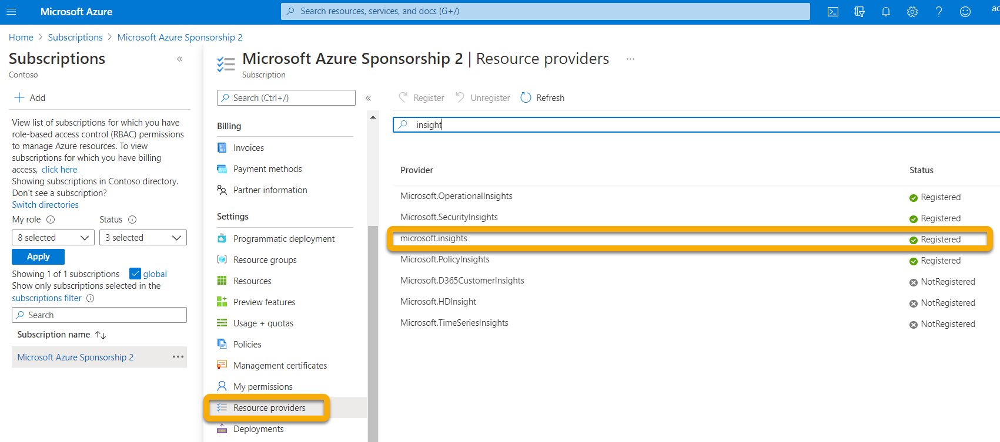

Setup Azure Active Directory App Registration
--------------------------

>![NOTE]
>You must have Administrator role or Azure Active Directory (AAD) must be
set to allow non-Administrators to register apps. You must also have an Owner or
User Access Administrator role to assign the service principal a role.  
For more information, see [Create an Azure AD app & service principal in the
portal - Microsoft identity platform \| Microsoft
Docs](/azure/active-directory/develop/howto-create-service-principal-portal).

1. Create a new registration (which inherently creates a service principal) in
**Azure Active Directory \> App registrations \> New registration.**

1. Fill out the form with just the Name (no Redirect URI is required).

    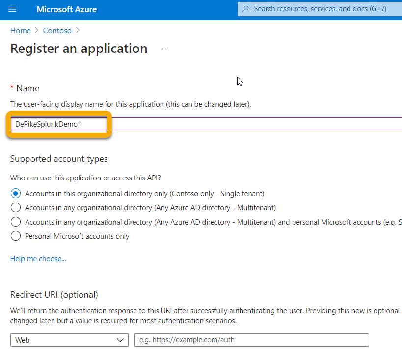

    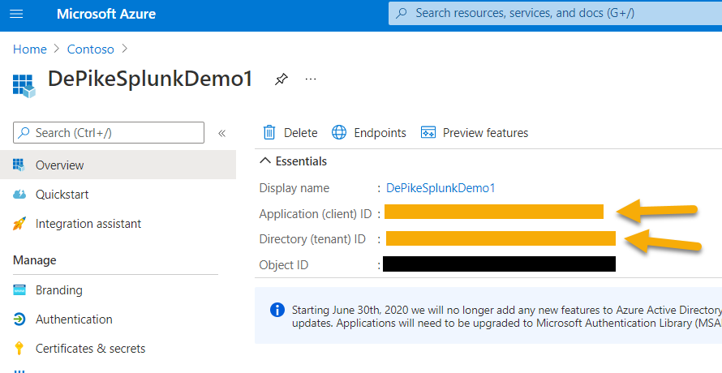

1. Create a secret by clicking on **Certificates & secrets \> New client secret**:

    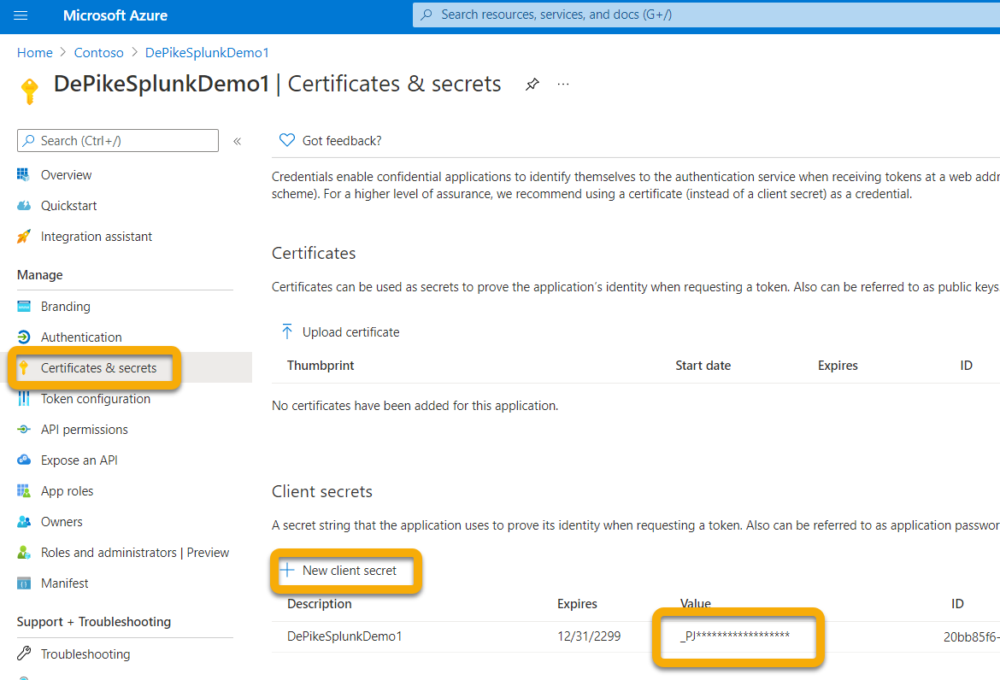

>[!WARNING]
>**You won't be able to access the client secret again so make sure
to save it**.

Setup Event Hub namespace
-------------------------

1. Create an Event Hub Namespace:

    Go **to Event Hubs \> Add** and select the pricing tier, throughput units and
    Auto-Inflate (requires standard pricing and under features) appropriate for the
    load you are expecting.  
    For more information, see [Pricing - Event Hubs \| Microsoft
    Azure](https://azure.microsoft.com/en-us/pricing/details/event-hubs/)

    >[!NOTE]
    > You can use an existing event hub, but the throughput and scaling are set at the namespace level so it is recommended to place an event hub in itsown namespace.

   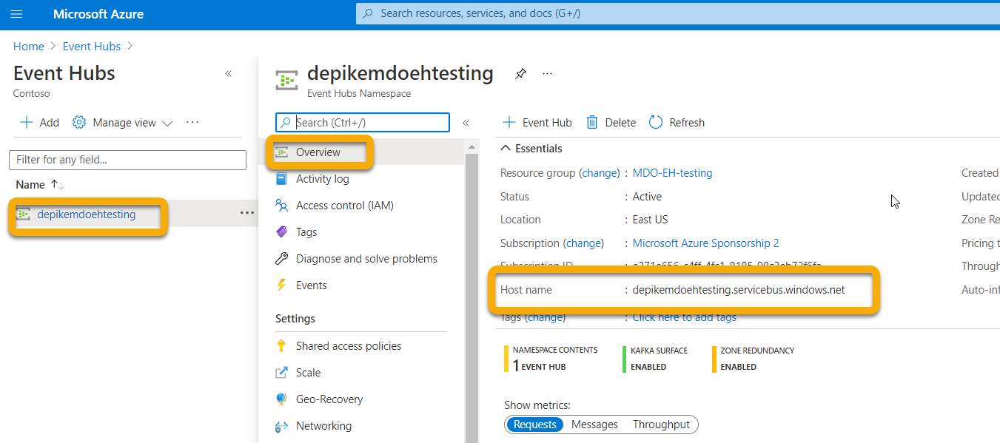

1. You will also need the Resource ID of this Event Hub Namespace. Go to your Azure Event Hubs namespace page \> Properties. Copy the text under Resource ID and record it for use during the M365 Configuration section below. 

    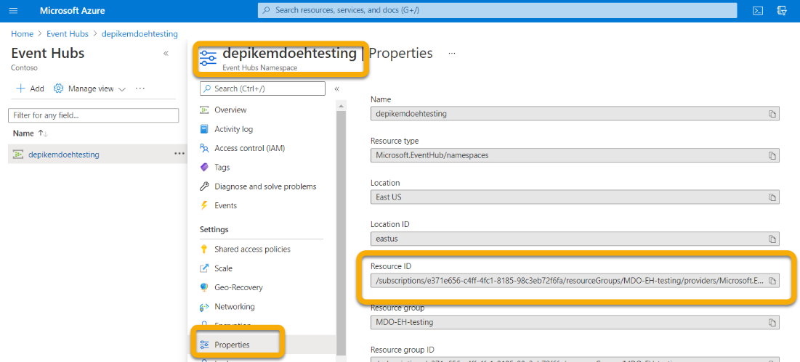

1. Once the Event Hub Namespace is created you will need to add the App Registration Service Principal as Reader, Azure Event Hubs Data Receiver, and the user who will be logging into Microsoft 365 Defender as Contributor (this can also be done at Resource Group or Subscription level).

    This is done in **Event Hubs Namespace \> Access Control (IAM) \> Add** and
verify under **Role assignments**:

    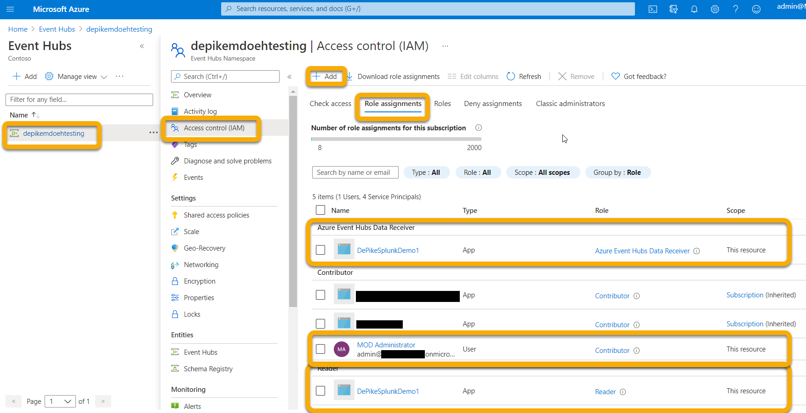

Setup Event Hub
---------------

**Option 1:**

You can create an Event Hub within your Namespace and **all** the Event Types
(Tables) you select to export will be written into this **one** Event Hub.

**Option 2:**

Instead of exporting all the Event Types (Tables) into one Event Hub, you can
export each table into a different Event Hub inside your Event Hub Namespace
(one Event Hub per Event Type).  

In this option, Microsoft 365 Defender will create Event Hubs for you.  
>[!NOTE]
> If you are using an Event Hub Namespace that is **not** part of an Event Hub Cluster, you will only be able to choose up to 10 Event Types (Tables) to export in each Export Settings you define, due to an Azure limitation of 10 Event Hubs per Event Hub Namespace.

For example:

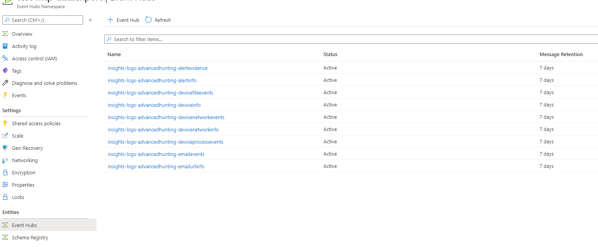

If you choose this option, you can skip to the [Configure Microsoft 365
Defender to send email tables](#configure-microsoft-365-defender-to-send-email-tables) section.

Create an Event Hub within your Namespace by selecting **Event Hubs \> + Event
Hub**.

The Partition Count allows for additional throughput via parallelism, so it is
recommended to increase this number based on the load you are expecting.  
Default Message Retention and Capture values of 1 and Off are recommended.

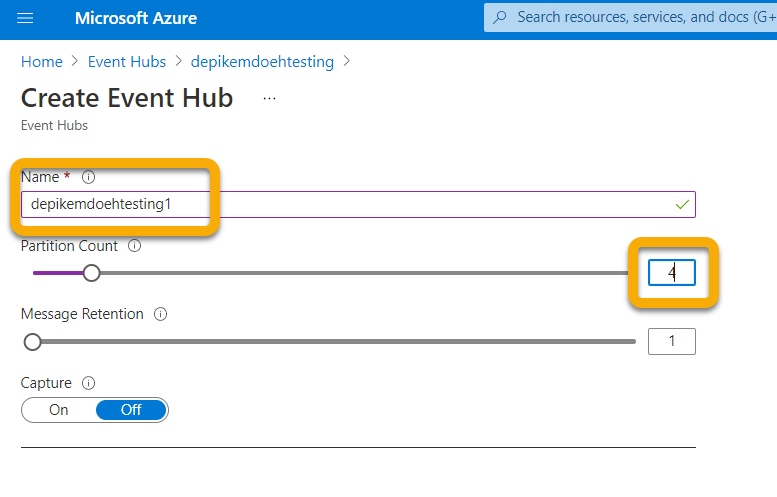

For this Event Hub (not namespace) you will need to configure a Shared Access
Policy with Send, Listen Claims. Click on your **Event Hub \> Shared access
policies \> + Add** and then give it a Policy name (not used elsewhere) and
check **Send** and **Listen**.

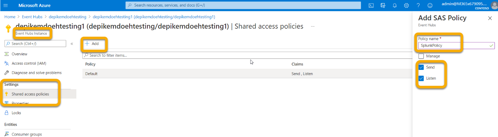

Configure Microsoft 365 Defender to send email tables
================================

Setup Microsoft 365 Defender send Email tables to Splunk via Event Hub:
-----------------------------------------------------------------------

1. Login to Microsoft 365 Defender at <https://security.microsoft.com> with an
account that meets all the following role requirements:

    - Contributor role at the Event Hub *Namespace* Resource level or higher for
    the Event Hub that you will be exporting to. Without this you will get an
    export error when you try to save the settings.

    - Global Admin or Security Admin Role on the tenant tied to Microsoft 365
    Defender and Azure.

    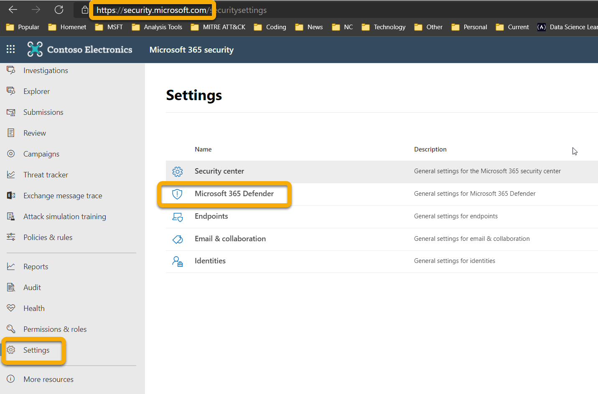

1. Click on **Raw Data Export \> +Add**.

    You will now use the data that your recorded above.

    **Name**: This is local and should be whatever works in your environment.

    **Forward events to event hub**: Select this checkbox.

    **Event-Hub Resource ID**: This is the Event Hub Namespace Resource ID you
    recorded above when you setup the Event Hub.

    **Event-Hub name**:  If you created an Event Hub inside your Event Hub Namespace, paste the Event Hub  name you recorded above.

    If you choose to let Microsoft 365 Defender to create Event Hubs per Event Types
    (Tables) for you, leave this field empty.

    **Event Types**: Select the Advanced Hunting tables that you want to forward to
    the Event Hub and then on to your custom app. Alert tables are from Microsoft
    365 Defender, Devices tables are from Microsoft Defender for Endpoint (EDR), and
    Email tables are from Microsoft Defender for Office 365. Email Events records
    all Email Transactions. The URL (SafeLinks), Attachment (Safe Attachments) and
    Post Delivery Events (ZAP) are also recorded and can be joined to the Email
    Events on the NetworkMessageId field.

    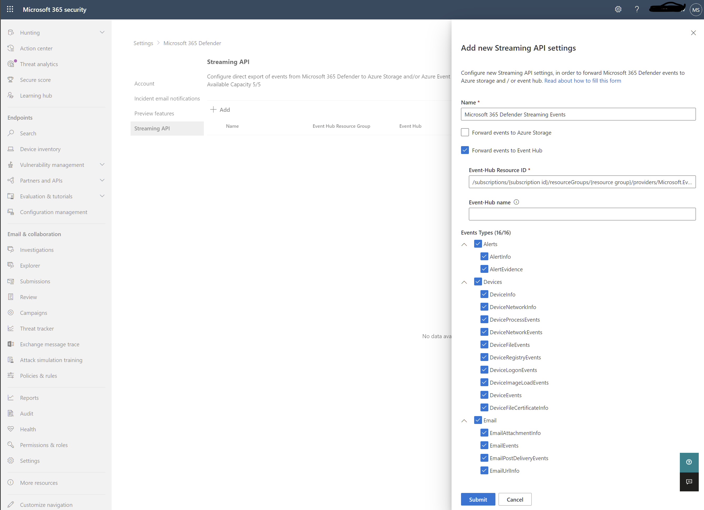

1. Make sure to click **Submit**.

Verify that the events are being exported to the Event Hub
==========================================================

You can verify that events are being sent to the Event Hub by running a basic
Advanced Hunting query. Select **Hunting \> Advanced Hunting \> Query** and
enter the following query:

```
EmailEvents
|joinkind=fullouterEmailAttachmentInfoonNetworkMessageId
|joinkind=fullouterEmailUrlInfoonNetworkMessageId
|joinkind=fullouterEmailPostDeliveryEventsonNetworkMessageId
|whereTimestamp\>ago(1h)
|count
```

This will show you how many emails were received in the last hour joined across
all the other tables. It will also show you if you are seeing events that could
be exported to the event hub. If this count shows 0 then you won't see any data
going out to the Event Hub.

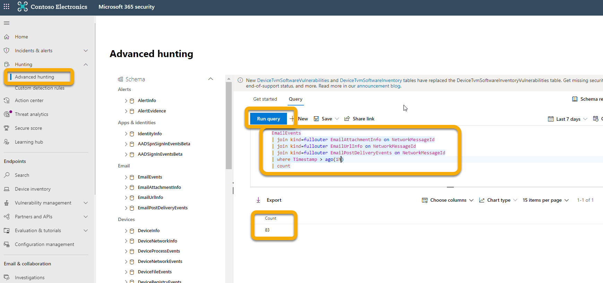

Once you have verified there is data to export, you can view the Event Hub to
verify that messages are incoming. This can take up to one hour. 
 
1. In Azure, go to **Event Hubs \> Click on the Namespace \> Event Hubs \> Click on
the Event Hub**.  
1. Under **Overview**, scroll down and in the Messages graph you should see
Incoming Messages. If you don't see any results, then there will be no messages
for your custom app to ingest.

    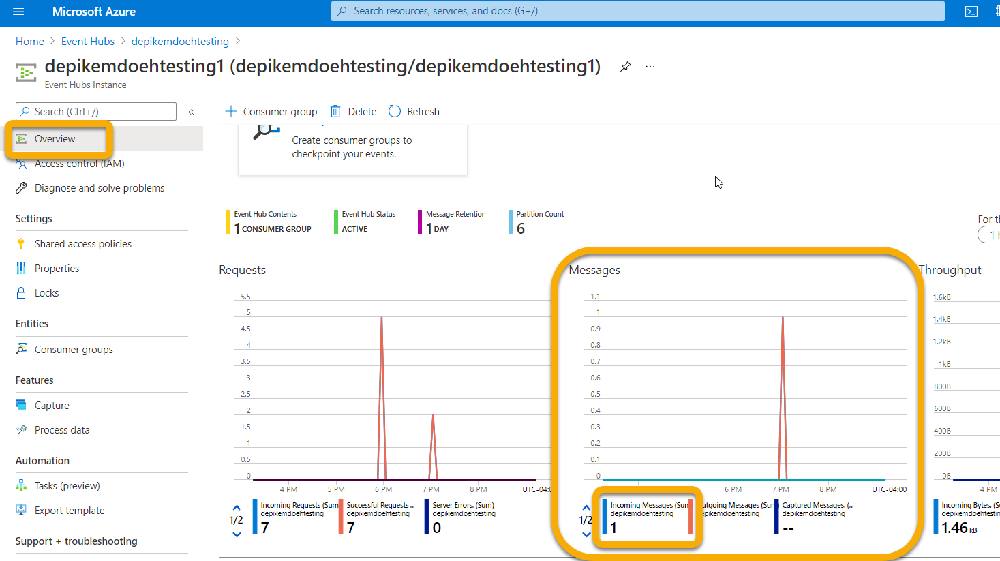
