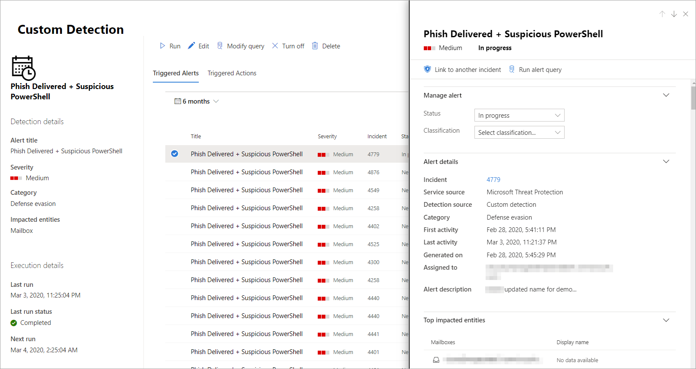

# Create and manage custom detections rules

[!INCLUDE [Microsoft 365 Defender rebranding](../includes/microsoft-defender.md)]


**Applies to:**
- Microsoft 365 Defender

Custom detection rules are rules you can design and tweak using [advanced hunting](advanced-hunting-overview.md) queries. These rules let you proactively monitor various events and system states, including suspected breach activity and misconfigured endpoints. You can set them to run at regular intervals, generating alerts and taking response actions whenever there are matches.

## Required permissions for managing custom detections

To manage custom detections, you need to be assigned one of these roles:

- **Security administrator**—Users with this [Azure Active Directory role](/azure/active-directory/users-groups-roles/directory-assign-admin-roles#security-administrator) can manage security settings in Microsoft 365 security center and other portals and services.

- **Security operator**—Users with this [Azure Active Directory role](/azure/active-directory/users-groups-roles/directory-assign-admin-roles#security-administrator) can manage alerts and have global read-only access to security-related features, including all information in Microsoft 365 security center. This role is sufficient for managing custom detections only if role-based access control (RBAC) is turned off in Microsoft Defender for Endpoint. If you have RBAC configured, you also need the **manage security settings** permission for Defender for Endpoint.

To manage required permissions, a **global administrator** can:

- Assign the **security administrator** or **security operator** role in [Microsoft 365 admin center](https://admin.microsoft.com/) under **Roles** > **Security admin**.
- Check RBAC settings for Microsoft Defender for Endpoint in [Microsoft Defender Security Center](https://securitycenter.windows.com/) under **Settings** > **Permissions** > **Roles**. Select the corresponding role to assign the **manage security settings** permission.

> [!NOTE]
> To manage custom detections, **security operators** will need the **manage security settings** permission in Microsoft Defender for Endpoint if RBAC is turned on.

## Create a custom detection rule
### 1. Prepare the query.

In Microsoft 365 security center, go to **Advanced hunting** and select an existing query or create a new query. When using a new query, run the query to identify errors and understand possible results.

>[!IMPORTANT]
>To prevent the service from returning too many alerts, each rule is limited to generating only 100 alerts whenever it runs. Before creating a rule, tweak your query to avoid alerting for normal, day-to-day activity.


#### Required columns in the query results
To create a custom detection rule, the query must return the following columns:

- `Timestamp`—used to set the timestamp for generated alerts
- `ReportId`—enables lookups for the original records
- One of the following columns that identify specific devices, users, or mailboxes:
    - `DeviceId`
    - `DeviceName`
    - `RemoteDeviceName`
    - `RecipientEmailAddress`
    - `SenderFromAddress` (envelope sender or Return-Path address)
    - `SenderMailFromAddress` (sender address displayed by email client)
    - `RecipientObjectId`
    - `AccountObjectId`
    - `AccountSid`
    - `AccountUpn`
    - `InitiatingProcessAccountSid`
    - `InitiatingProcessAccountUpn`
    - `InitiatingProcessAccountObjectId`

>[!NOTE]
>Support for additional entities will be added as new tables are added to the [advanced hunting schema](advanced-hunting-schema-tables.md).

Simple queries, such as those that don't use the `project` or `summarize` operator to customize or aggregate results, typically return these common columns.

There are various ways to ensure more complex queries return these columns. For example, if you prefer to aggregate and count by entity under a column such as `DeviceId`, you can still return `Timestamp` and `ReportId` by getting it from the most recent event involving each unique `DeviceId`.

The sample query below counts the number of unique devices (`DeviceId`) with antivirus detections and uses this count to find only the devices with more than five detections. To return the latest `Timestamp` and the corresponding `ReportId`, it uses the `summarize` operator with the `arg_max` function.

```kusto
DeviceEvents
| where Timestamp > ago(1d)
| where ActionType == "AntivirusDetection"
| summarize (Timestamp, ReportId)=arg_max(Timestamp, ReportId), count() by DeviceId
| where count_ > 5
```

> [!TIP]
> For better query performance, set a time filter that matches your intended run frequency for the rule. Since the least frequent run is _every 24 hours_, filtering for the past day will cover all new data.

### 2. Create new rule and provide alert details.

With the query in the query editor, select **Create detection rule** and specify the following alert details:

- **Detection name**—name of the detection rule
- **Frequency**—interval for running the query and taking action. [See additional guidance below](#rule-frequency)
- **Alert title**—title displayed with alerts triggered by the rule
- **Severity**—potential risk of the component or activity identified by the rule
- **Category**—threat component or activity identified by the rule
- **MITRE ATT&CK techniques**—one or more attack techniques identified by the rule as documented in the [MITRE ATT&CK framework](https://attack.mitre.org/). This section is hidden for certain alert categories, including malware, ransomware, suspicious activity, and unwanted software
- **Description**—more information about the component or activity identified by the rule 
- **Recommended actions**—additional actions that responders might take in response to an alert

#### Rule frequency
When you save a new rule, it runs and checks for matches from the past 30 days of data. The rule then runs again at fixed intervals, applying a lookback duration based on the frequency you choose:

- **Every 24 hours**—runs every 24 hours, checking data from the past 30 days
- **Every 12 hours**—runs every 12 hours, checking data from the past 24 hours
- **Every 3 hours**—runs every 3 hours, checking data from the past 6 hours
- **Every hour**—runs hourly, checking data from the past 2 hours

When you edit a rule, it will run with the applied changes in the next run time scheduled according to the frequency you set.


>[!TIP]
> Match the time filters in your query with the lookback duration. Results outside of the lookback duration are ignored.  

Select the frequency that matches how closely you want to monitor detections. Consider your organization's capacity to respond to the alerts.

### 3. Choose the impacted entities.
Identify the columns in your query results where you expect to find the main affected or impacted entity. For example, a query might return sender (`SenderFromAddress` or `SenderMailFromAddress`) and recipient (`RecipientEmailAddress`) addresses. Identifying which of these columns represent the main impacted entity helps the service aggregate relevant alerts, correlate incidents, and target response actions.

You can select only one column for each entity type (mailbox, user, or device). Columns that are not returned by your query can't be selected.

### 4. Specify actions.
Your custom detection rule can automatically take actions on devices, files, or users that are returned by the query.

#### Actions on devices
These actions are applied to devices in the `DeviceId` column of the query results:
- **Isolate device**—uses Microsoft Defender for Endpoint to apply full network isolation, preventing the device from connecting to any application or service. [Learn more about Microsoft Defender for Endpoint machine isolation](/windows/security/threat-protection/microsoft-defender-atp/respond-machine-alerts#isolate-devices-from-the-network)
- **Collect investigation package**—collects device information in a ZIP file. [Learn more about the Microsoft Defender for Endpoint investigation package](/windows/security/threat-protection/microsoft-defender-atp/respond-machine-alerts#collect-investigation-package-from-devices)
- **Run antivirus scan**—performs a full Windows Defender Antivirus scan on the device
- **Initiate investigation**—initiates an [automated investigation](m365d-autoir.md) on the device
- **Restrict app execution**—sets restrictions on device to allow only files that are signed with a Microsoft-issued certificate to run. [Learn more about app restrictions with Microsoft Defender for Endpoint](/microsoft-365/security/defender-endpoint/respond-machine-alerts#restrict-app-execution)

#### Actions on files
When selected, you can choose to apply the **Quarantine file** action on files in the `SHA1`, `InitiatingProcessSHA1`, `SHA256`, or `InitiatingProcessSHA256` column of the query results. This action deletes the file from its current location and places a copy in quarantine.

#### Actions on users
When selected, the **Mark user as compromised** action is taken on users in the `AccountObjectId`, `InitiatingProcessAccountObjectId`, or `RecipientObjectId` column of the query results. This action sets the users risk level to "high" in Azure Active Directory, triggering corresponding [identity protection policies](/azure/active-directory/identity-protection/overview-identity-protection).

> [!NOTE]
> The allow or block action for custom detection rules is currently not supported on Microsoft 365 Defender.

### 5. Set the rule scope.
Set the scope to specify which devices are covered by the rule. The scope influences rules that check devices and doesn't affect rules that check only mailboxes and user accounts or identities.

When setting the scope, you can select:

- All devices
- Specific device groups

Only data from devices in scope will be queried. Also, actions will be taken only on those devices.

### 6. Review and turn on the rule.
After reviewing the rule, select **Create** to save it. The custom detection rule immediately runs. It runs again based on configured frequency to check for matches, generate alerts, and take response actions.


>[!Important] 
>Custom detections should be regularly reviewed for efficiency and effectiveness. To make sure you are creating detections that trigger true alerts, take time to review your existing custom detections by following the steps in [Manage existing custom detection rules](#manage-existing-custom-detection-rules). <br>  
You maintain control over the broadness or specificity of your custom detections so any false alerts generated by custom detections might indicate a need to modify certain parameters of the rules.


## Manage existing custom detection rules
You can view the list of existing custom detection rules, check their previous runs, and review the alerts they have triggered. You can also run a rule on demand and modify it.

### View existing rules

To view all existing custom detection rules, navigate to **Hunting** > **Custom detections**. The page lists all the rules with the following run information:

- **Last run**—when a rule was last run to check for query matches and generate alerts
- **Last run status**—whether a rule ran successfully
- **Next run**—the next scheduled run
- **Status**—whether a rule has been turned on or off

### View rule details, modify rule, and run rule

To view comprehensive information about a custom detection rule, go to **Hunting** > **Custom detections** and then select the name of rule. You can then view general information about the rule, including information its run status and scope. The page also provides the list of triggered alerts and actions.

<br>
*Custom detection rule details*

You can also take the following actions on the rule from this page:

- **Run**—run the rule immediately. This also resets the interval for the next run.
- **Edit**—modify the rule without changing the query
- **Modify query**—edit the query in advanced hunting
- **Turn on** / **Turn off**—enable the rule or stop it from running
- **Delete**—turn off the rule and remove it

### View and manage triggered alerts

In the rule details screen (**Hunting** > **Custom detections** > **[Rule name]**), go to  **Triggered alerts**, which lists the alerts generated by matches to the rule. Select an alert to view detailed information about it and take the following actions:

- Manage the alert by setting its status and classification (true or false alert)
- Link the alert to an incident
- Run the query that triggered the alert on advanced hunting

### Review actions
In the rule details screen (**Hunting** > **Custom detections** > **[Rule name]**), go to **Triggered actions**, which lists the actions taken based on matches to the rule.

>[!TIP]
>To quickly view information and take action on an item in a table, use the selection column [&#10003;] at the left of the table.

## See also
- [Custom detections overview](custom-detections-overview.md)
- [Advanced hunting overview](advanced-hunting-overview.md)
- [Learn the advanced hunting query language](advanced-hunting-query-language.md)
- [Migrate advanced hunting queries from Microsoft Defender for Endpoint](advanced-hunting-migrate-from-mde.md)
