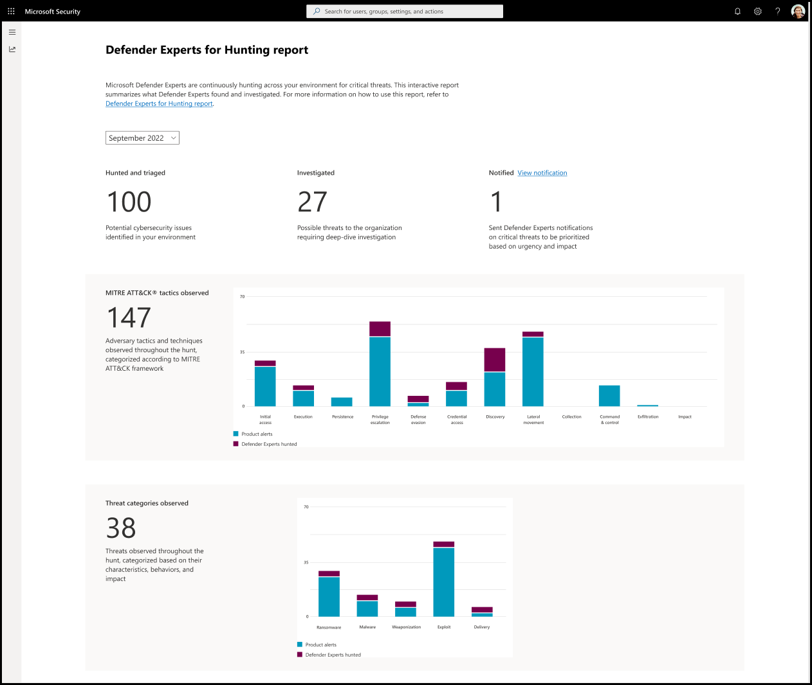

# Understand the Defender Experts for Hunting report in Microsoft 365 Defender

[!INCLUDE [Microsoft 365 Defender rebranding](../../includes/microsoft-defender.md)]

**Applies to:**

- [Microsoft 365 Defender](https://go.microsoft.com/fwlink/?linkid=2118804)

Microsoft Defender Experts for Hunting layers human intelligence and expert-trained technology to help Microsoft 365 Defender customers understand the significant threats they face. It showcases how Defender Expert's threat hunting skills, thorough understanding of the threat landscape, and knowledge of emerging threats can help you identify, prioritize, and address those threats in your environment. 

The Defender Experts for Hunting service publishes monthly reports to help you understand all the threats the hunting service surfaced in your environment, alongside the alerts generated by your Microsoft 365 Defender products.

To view the latest report in your Microsoft 365 Defender portal, go to **Reports**, select **Defender Experts** > **Defender Experts for Hunting report**.

## Scan the Defender Experts for Hunting report to know what to prioritize

Each section of the report is designed to provide more insights about the threats our Defender Experts found in your environment. The reports include the sections described in the following table:

| Report section | Description |
|--|--|
| Hunted and triaged | The total number of potential cybersecurity issues found in your environment. |
| Investigated | The number of cybersecurity issues that need further analysis to determine their nature and extent. |
| Notified (View notification) | The number of Defender Experts Notifications the Defender Experts sent. These notifications are related to the investigated possible threat activities in your environment that must be prioritized based on urgency and impact. |
| MITRE ATT&CK tactics observed | The number of attack tactics and techniques observed in your environment and mapped according to the [MITRE ATT&CK framework](https://attack.mitre.org/). This section visualizes how many attacks reached each tactic so you can take appropriate actions like reviewing those that progressed further first. |
| Threat categories observed | The categories depict the most significant threats and risks observed in your environment. The most critical categories are highlighted to help you further assess and evaluate your security posture based on the threats' known characteristics, behavior, and potential impact. It also enables you to focus and prioritize urgent tasks to address. |

Refer to the following screenshot of a sample report:

## View Defender Experts Notifications

A Defender Experts Notification describes the significant threat activity Defender Experts for Hunting observed in your environment and provides recommendations to remediate and defend your organization.

The Defender Experts for Hunting reports provide you with the total number of Defender Experts Notifications our Defender Experts have sent for your chosen time. To view these notifications, select **View notification** beside **Notified**.

This link redirects you to the Microsoft 365 Defender incidents page. Defender Expert for Hunting alerts or Defender Experts Notifications are labeled with **Defender Experts**.

> [!NOTE]
> The **View notification** link only appears if the value displayed in **Notified** is at least 1.

## Identify potential attack entry points and other security weak spots

The MITRE ATT&CK tactics represent adversary goals—what they're trying to achieve in each attack phase. The **MITRE ATT&CK tactics observed** section of the report tracks the progression of attack against the phase they reached:

1. Reconnaissance
2. Resource Development
3. Initial access
4. Execution
5. Persistence
6. Privilege escalation
7. Defense evasion
8. Credential access
9. Discovery
10. Lateral movement
11. Collection
12. Command and control
13. Exfiltration
14. Impact

Signals from Microsoft 365 Defender and investigations by Defender Experts for Hunting help identify these tactics, represented in the bar chart. This chart helps you visualize where the surge is and provides you with the information you need to plan the corresponding containment and remediation actions.

## Know and understand the prevalent threats in your environment

Threat categories help identify and organize security threats into classes to assess and evaluate their impact and develop strategies to prevent or mitigate these threats to your environment. The **Threat categories observed** section of the report shows a bar chart with significant risks and threats detected in your environment, helping you understand the breadth and scope of your exposure.

Among the various threat categories available, the following categories are carefully chosen because they aren't covered under the purview of MITRE ATT&CK framework:

- Ransomware
- Malware
- Weaponization
- Exploit
- Delivery

You can prioritize remediation based on the most impacted category, as depicted in the bar chart.
