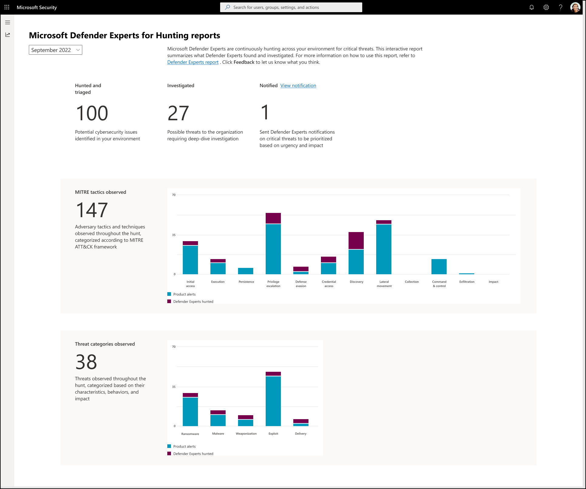

# Understand the Defender Experts for Hunting report in Microsoft 365 Defender

[!INCLUDE [Microsoft 365 Defender rebranding](../includes/microsoft-defender.md)]

**Applies to:**

- Microsoft 365 Defender

[!INCLUDE [Prerelease](../includes/prerelease.md)]

Microsoft Defender Experts for Hunting layers human intelligence and expert-trained technology to help Microsoft 365 Defender customers understand the significant threats they face. It showcases how Defender Expert’s threat hunting skills, thorough understanding of the threat landscape, and knowledge of emerging threats can help you identify, prioritize and address those threats in your environment. 

The Defender Experts for Hunting service publishes monthly reports to help you understand all the threats the hunting service surfaced in your environment, alongside the alerts generated by your Microsoft 365 Defender products. You also can view and download reports for as far as the last six months.

To view the latest report in your Microsoft 365 Defender portal, go to Reports, select **General** > **Defender Experts**.

## Scan the Defender Experts for Hunting report to prioritize SecOps tasks

Each section of the report is designed to provide more insights about the threats our Defender Experts found in your environment. The reports include the sections described in the following table:

| Report section | Description |
|--|--|
| Hunted and triaged | The total number of potential cybersecurity issues found in your environment. |
| Investigated | The number of cybersecurity issues that need further analysis to determine their nature and extent. |
| Notified (View notification) | The number of targeted attack notifications the Defender Experts sent. These notifications are related to the investigated possible threat activities in your environment that must be prioritized based on urgency and impact. |
| MITRE tactics observed | The number of attack tactics and techniques observed in your environment and mapped according to the [MITRE ATT&CK framework](https://attack.mitre.org/). This section visualize how many attacks reached each tactic so you can take appropriate actions like reviewing those that progressed . |
| Threat categories observed | The categories depict the most significant threats and risks observed in your environment. The most critical categories are highlighted to help you further assess and evaluate your security posture based on the threats' known characteristics, behavior, and potential impact. It also enables you to focus and prioritize urgent tasks to address. |
| Recommended actions | A list of actionable steps that aims to improve your organization's security posture based on the threats and risk observed in your environment. Click each recommendation to view additional information and related resources. |

Refer to the following screenshot of a sample report:

## View targeted attack notifications

A targeted attack notification describes the significant threat activity Defender Experts for Hunting observed in your environment and provides recommendations to remediate and defend your organization.

The Defender Experts for Hunting reports provide you with the total number of targeted attack notifications our Defender Experts have sent for your chosen period. To view these notifications, click **View notification** beside **Notified**.

This link redirects you to the Microsoft 365 Defender incidents page. Defender Expert for Hunting alerts or targeted attack notifications are labelled with “Defender Experts.”

> [!NOTE]
> The View notification link only appears if the vale displayed in **Notified** is atleast 1.

## Identify potential attack entry points and other security weak spots

The MITRE ATT&CK tactics represent an adversary goals—what they’re trying to achieve in each attack phase. The **MITRE ATT&CK tactics observed** section of the report tracks the progression of attack against the phase they reached.

1.	Reconnaissance
2.  Resource Development
1.  Initial access
2.	Execution	
3.	Persistence	
4.	Privilege escalation	
5.	Defense evasion	
6.	Credential access
7.	Discovery
8.	Lateral movement	
9.	Collection
10.	Command and control
11.	Exfiltration	
12.	Impact

> [!NOTE]
> The Reconnaissance and Resource Development tactics are outside Microsoft 365 Defender’s visibility scope, so they’re not included in the bar chart visualization.

Signals from Microsoft 365 Defender and investigations by Defender Experts for Hunting help identify these tactics, represented in the bar chart. This chart helps you visualize where the surge is and provides you with the information you need to plan the corresponding containment and remediation actions in the recommendation section.

## Know and understand the prevalent threats in your environment

Threat categories help identify and organize security threats into classes to assess and evaluate their impact and develop strategies to prevent or mitigate these threats to your environment. The Threat categories observed section of the report shows a bar chart with significant risks and threats detected in your environment, helping you understand the breadth and scope of your exposure.

Threats are broadly classified into five categories. Among the various threat categories available, the following are carefully chosen because they are not covered under the purview of MITRE framework:

- Ransomware
- Malware
- Weaponization
- Exploit
- Delivery

You can prioritize remediation based on the mostly-impacted category, as depicted in the bar graph.

## Address security gaps and apply additional mitigations

Each security recommendation in the Recommended action section includes actionable remediation steps customized based on the observations and findings in the current threat landscape in the context of what’s been happening in your environment . This set of references also help you shorten the time to deploy your mitigations or solutions.

Some recommendation actions provide additional information and have quick access to relevant resources within Microsoft 365 Defender portal and other documentation. Click the arrow beside a recommendation to expand it.

## Submit feedback about the report

Microsoft Defender Experts are continuously improving this report to measure its effectiveness and ensure that you’re getting the relevant information and insights you need to defend your environments from attacks.

To submit feedback, click **Feedback** at the top of this page.

## Related topics

- [Threat analytics overview](threat-analytics.md)
- [Proactively find threats with advanced hunting](advanced-hunting-overview.md)
- [Custom detection rules](custom-detection-rules.md)