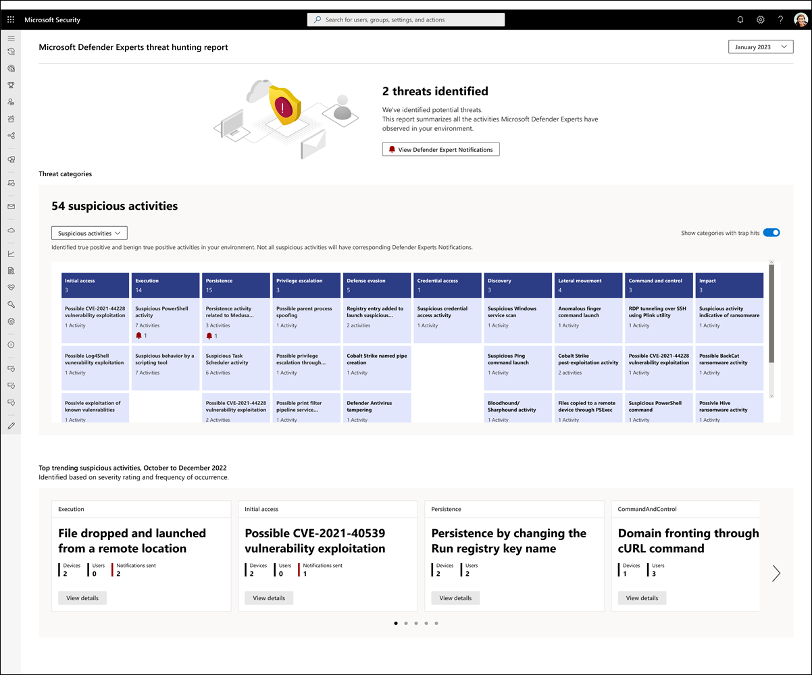
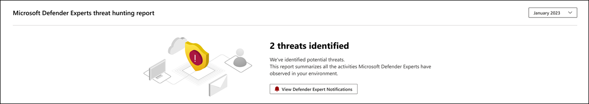
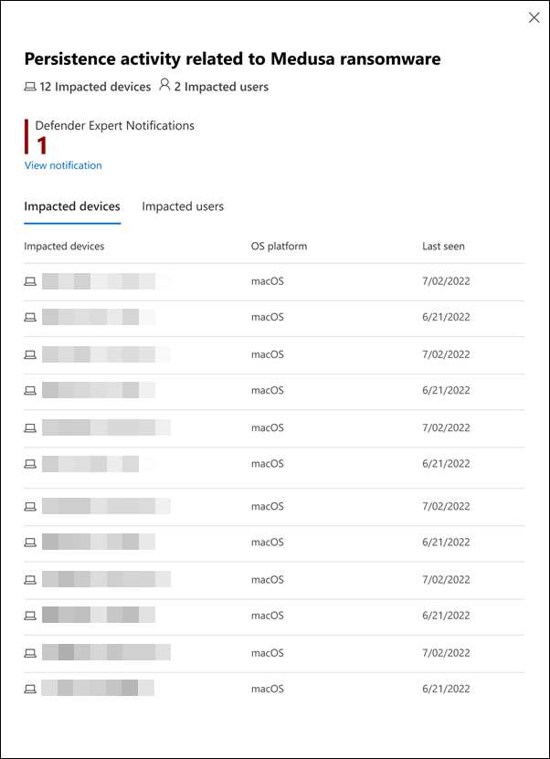
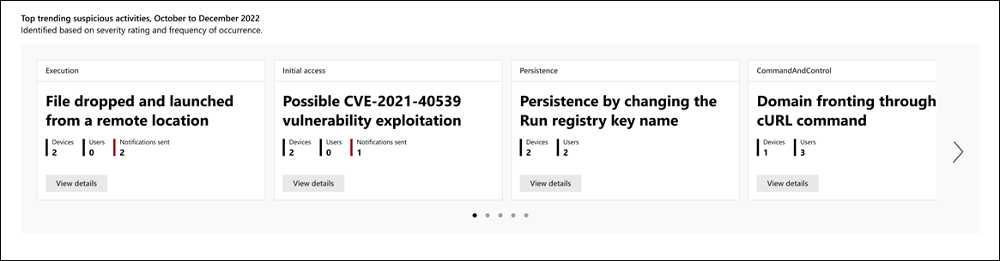

# Understand the Defender Experts for Hunting report in Microsoft 365 Defender

[!INCLUDE [Microsoft 365 Defender rebranding](../../includes/microsoft-defender.md)]

**Applies to:**

- [Microsoft 365 Defender](https://go.microsoft.com/fwlink/?linkid=2118804)

Microsoft Defender Experts for Hunting layers human intelligence and expert-trained technology to help Microsoft 365 Defender customers understand the significant threats they face. It highlights how Defender Expert's threat hunting skills, thorough understanding of the threat landscape, and knowledge of emerging threats can help you identify, prioritize, and address those threats in your environment.

The Defender Experts for Hunting service generates reports to help you understand all the threats the hunting service surfaced in your environment, alongside the alerts generated by your Microsoft 365 Defender products. You can view the report in the current (running) month, or in one-, three-, or six-month periods.

To view the report in your Microsoft 365 Defender portal, go to **Reports**, select **Defender Experts** > **Defender Experts for Hunting report**. Each section of the report is designed to provide more insights into the threats and suspicious activities our Defender Experts found in your environment. 

Refer to the following screenshot of a sample report:

## Identify prevalent threats and other potential attack entry points

Signals from Microsoft 365 Defender and investigations by Defender Experts for Hunting help identify suspicious activities in your environment. Significant threat activities will have corresponding [Defender Experts Notifications](/microsoft-365/security/defender/onboarding-defender-experts-for-hunting#receive-defender-experts-notifications), which also provide recommendations to remediate and defend your organization. 

The report provides you with the total number of Defender Experts Notifications our experts have sent for your chosen period: 

To view these notifications, select **View Defender Experts Notifications**. This button redirects you to the Microsoft 365 Defender incidents page. Defender Expert for Hunting alerts or Defender Experts Notifications are labeled with **Defender Experts**.

> [!NOTE]
> The **View Defender Experts Notifications** button only appears if the number of threats identified is at least 1.

All other identified activities are summarized in a table in the **Threat categories** section of the report. The columns represent the different threat attack tactics and categories to help you visualize what an activity is trying to achieve in each attack phase so you can plan the corresponding containment and remediation actions.

You can filter the activities displayed in the table by choosing any of the following options in the dropdown menu:

- **Suspicious activities** (default) – Displays identified true positive and benign true positive activities in your environment. Note that not all suspicious activities will have corresponding Defender Expert Notifications.
- **DEX notified** – Displays activities with corresponding Defender Expert Notifications only.
- **All activities** – Displays all true positive, benign true positive, and false positive activities.  

If an activity has a related Defender Expert Notification, its corresponding icon also appears under the activity name.
Selecting an identified suspicious activity opens a flyout panel detailing the impacted devices and users: 

If applicable, the page also provides links to view related Defender Expert Notifications.

## Know and understand the security weak spots in your environment

The **Top trending suspicious activities** section of the report identifies up to 20 suspicious activities that were consistently observed in your environment in the last three months, sorted based on their severity rating and frequency of occurrence:

By showing the most critical and frequently observed activities, you can assess and evaluate their impact and develop strategies to prevent or mitigate potential threats to your environment

Select **View details** in each card to open a flyout panel detailing the impacted devices and users. If applicable, the page also provides links to view related Defender Expert Notifications.
[!INCLUDE [Microsoft 365 Defender rebranding](../../includes/defender-m3d-techcommunity.md)]
