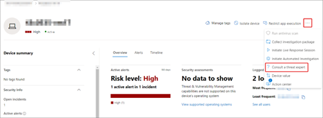
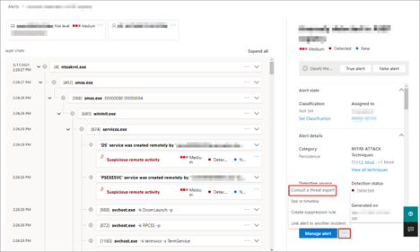
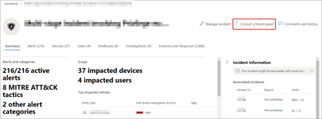

# Microsoft Defender Experts for Hunting preview

> [!IMPORTANT]
> Some information relates to pre-released products which may be substantially modified before it's commercially released. Microsoft makes no warranties, express or implied, with respect to the information provided here.
]

[!INCLUDE [Microsoft 365 Defender rebranding](../../includes/microsoft-defender.md)]

**Applies to:**

- [Microsoft 365 Defender](https://go.microsoft.com/fwlink/?linkid=2118804)

Microsoft Defender Experts for Hunting (Hunting Experts) is a managed threat hunting service that can help your Security Operation Centers (SOCs) with expert level monitoring, analysis, and support to identify and respond to critical threats in your unique environment.

After your application is accepted, you'll receive targeted attack notifications from Hunting Experts. These notifications will help you protect your organization's endpoints, email, and identities. You will also receive access to Experts on Demand, that lets you get expert advice about threats your organization is facing. You can consult experts and seek help with the threats your organization faces. In this preview, you can try the service for free and enjoy the following capabilities:

- **Targeted attack notification** - Provides proactive hunting for the most important threats to your network, including human adversary intrusions, hands-on keyboard attacks, or advanced attacks like cyber-espionage. These notifications show up as new alerts in  Microsoft 365 Defender and Azure Sentinel portals.
- **Experts on Demand** - Click a button to consult with an assigned expert threat analyst.
- **Reports** - What we hunted, what we found, what we recommended.

## Apply for Hunting Experts preview

>[!IMPORTANT]
>Before you apply, make sure to discuss the eligibility requirements for Hunting Experts with your Microsoft Technical Service provider and account team.

If you haven’t done so yet, you can apply for Hunting Experts

1. Click **Apply**. Only the global administrators can register and complete the application process. If you’re not a global administrator, contact your global administrator to fill out the application form.
2. Enter your **company email ID** and **Tenant ID**.
    1. To find your tenant ID, click the Where do I find my Tenant ID to go to the Microsoft 365 Defender portal.  
    2. From the navigation pane, go to **Settings > Defender 365** to view the tenant ID.
    3. Copy the tenant ID and paste it in the form.
3. Select **Submit**. You will get a confirmation message that your application has been received.  
4. Upon approval, you will receive an email to register.

## Register to Hunting Experts preview

You need to follow these steps to join the preview:

1. In the application acceptance email that you’ve received, select **Register**. This opens the **sign-in** dialog box to your Microsoft 365 account.
2. Ask your global administrator to register *insert LINK* your company. Sign in. The **Settings** page opens.
3. Go to **Settings > Microsoft Defender Experts**.
4. Read the **Microsoft Defender Experts for Hunting preview terms and conditions**. If you have any questions or concerns, contact the Microsoft Defender Experts Team at defenderexpertsphelp@microsoft.com.
5. Click **Accept**, to accept the terms and conditions.
6. Get your free license in Microsoft 365 admin center *insert LINK*. In the **Checkout** page, select **Place order**.  

## Start using your expanded Microsoft Defender Experts preview service

After you place your order and get confirmation, you will receive a welcome email after six hours, that says your expanded Microsoft Threat Experts preview is set up and ready to use.

Our experts will immediately start hunting for advanced threats inside your environment.

## Receive targeted attack notification

The Targeted Attack Notification capability includes:

- Threat monitoring and analysis, reducing dwell time and the risk to your business.
- Hunter-trained artificial intelligence to discover and target both known attacks and emerging threats.
- Identification of the most pertinent risks, helping SOCs maximize their effectiveness.
- Help scoping compromises and providing as much context as can be quickly delivered to enable a swift SOC response.

## Collaborate with experts on demand

You can consult with Hunting Experts directly inside the Microsoft 365 security portal, for a swift and accurate threat response. Experts can provide insight to better understand the complex threats your organization may face. Consult an expert to:

- Gather additional information on alerts and incidents, including root causes and scope
- Gain clarity into suspicious devices, alerts, or incidents and get next steps if faced with an advanced attacker
- Determine risks and available protections related to threat actors, campaigns, or emerging attacker techniques

The option to **Consult a threat expert** is available in several places throughout the portal:

### Device page actions menu

### Device inventory page flyout menu

### Alerts page flyout menu

### Incidents page actions menu

### Incidents inventory page

>[!NOTE]
> If you would like to track the status of your Experts on Demand cases through Microsoft Services Hub, reach out to your Customer Success Account Manager. Watch this **[video](https://www.microsoft.com/videoplayer/embed/RE4pk9f)** for a quick overview of the Microsoft Services Hub.

## Opt out of preview

In case you change your mind and don’t want to continue with the Hunting Experts preview, you can follow the steps to [cancel a self-service subscription](https://docs.microsoft.com/en-us/microsoft-365/commerce/subscriptions/manage-self-service-purchases-admins?view=o365-worldwide#cancel-a-self-service-purchase-subscription).  

### Related topics

- [Microsoft Threat Experts overview](microsoft-threat-experts.md)
- [Microsoft Threat Experts in Microsoft 365 Overview](https://docs.microsoft.com/microsoft-365/security/mtp/microsoft-threat-experts)
- [Configure and manage Microsoft Threat Experts capabilities](configure-microsoft-threat-experts.md)
