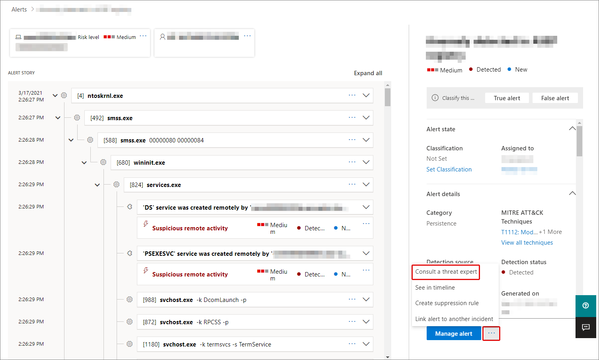

# Microsoft Defender Experts for Hunting preview

> [!IMPORTANT]
> Some information relates to pre-released products which may be substantially modified before it's commercially released. Microsoft makes no warranties, express or implied, with respect to the information provided here.

[!INCLUDE [Microsoft 365 Defender rebranding](../../includes/microsoft-defender.md)]

**Applies to:**

- [Microsoft 365 Defender](https://go.microsoft.com/fwlink/?linkid=2118804)

Microsoft Defender Experts for Hunting (Defender Experts for Hunting) is a managed threat hunting service that can help your Security Operation Centers (SOCs) with expert level monitoring, analysis, and support to identify and respond to critical threats in your unique environment.

Watch this short video to learn more about how Microsoft Defender Experts for Hunting can help you track the latest advanced threats in your environment.
>[!VIDEO https://youtu.be/4t1JgE0X0jc]

After your application is accepted, you'll receive targeted attack notifications from Defender Experts for Hunting. These notifications will help you protect your organization's endpoints, email, and identities. You will also receive access to Experts on Demand, that lets you get expert advice about threats your organization is facing. You can consult experts and seek help with the threats your organization faces. In this preview, you can try the service for free and enjoy the following capabilities:

- **Threat hunting and analysis** – Defender Experts for Hunting look deeper to expose advanced threats and identify the scope and impact of malicious activity associated with human adversaries or hands-on-keyboard attacks. 
- **Targeted attack notification** – Notifications show up as incidents in Microsoft 365 Defender, helping to improve your security operations' incident response with specific information about the scope, method of entry, and remediation instructions. 
- **Experts on Demand** – Consult a threat expert about a specific incident, nation-state actor, or attack vector. 
- **Hunter-trained AI** – Our Defender Experts for Hunting share their learning back into the automated tools they use to improve threat discovery and prioritization. 
- **Reports** – An interactive report summarizing what we hunted, what we found, and what we recommended

## Apply for Microsoft Defender Experts for Hunting service preview

>[!IMPORTANT]
>Before you apply, make sure to discuss the eligibility requirements for Defender Experts for Hunting with your Microsoft Technical Service provider and account team.

If you haven’t done so yet, you can apply for Defender Experts for Hunting:

1. Click [**Apply**](https://aka.ms/expandedMTEprev). Only the global administrators can register and complete the application process. If you’re not a global administrator, contact your global administrator to fill out the application form.
2. Enter your **company email ID** and **Tenant ID**.
    - To find your tenant ID, click the **Where do I find my Tenant ID** to go to the Microsoft 365 Defender portal.
    - From the navigation pane, go to **Settings > Defender 365** to view the tenant ID.
    - Copy the tenant ID and paste it in the form.
3. Select **Submit**. You will get a confirmation message that your application has been received.  
4. Upon approval, you will receive an email to register.

## Register to Microsoft Defender Experts for Hunting service preview

You need to follow these steps to join the preview:

1. In the application acceptance email that you’ve received, click **Register**. This opens the sign-in dialog box to your Microsoft 365 account.
2. Ask your global administrator to register your company (the link will be provided in the email you’ll get). Sign in. The **Settings** page opens.
3. Go to **Settings > Microsoft Defender Experts**.
4. Read the **Microsoft Defender Experts for Hunting preview terms and conditions**. If you have any questions or concerns, contact the Microsoft Defender Experts Team at defenderexpertsphelp@microsoft.com.
5. Click **Accept**, to accept the terms and conditions.
6. Get your free preview in [Microsoft 365 admin center](https://www.microsoft.com/en-us/microsoft-365/business/office-365-administration). 
You can only place the order after you've accepted the terms and conditions. Select **Get license** to initiate provisioning in the admin center. This will take you to the checkout page to verify the order details. The service might become commercially available less than 6 months after you begin your free preview.  Microsoft reserves the right to end your preview at that time.
7. In the **Checkout** page, select **Place order**.  

## Start using your Microsoft Defender Experts for Hunting service preview

Around six hours after you place your order and get confirmation, you will receive a welcome email that says your Microsoft Defender Experts preview is set up and ready to use. Our experts will immediately start hunting for advanced threats inside your environment.

However, the preview is filling up fast and availability is very limited. If we can't get you in, we'll reach out to you soon as Microsoft Defender Experts for Hunting service is ready for generally availability. 

## Receive targeted attack notification

The targeted attack notification capability includes:

- Threat monitoring and analysis, reducing dwell time and the risk to your business.
- Hunter-trained artificial intelligence to discover and target both known attacks and emerging threats.
- Identification of the most pertinent risks, helping SOCs maximize their effectiveness.
- Help scoping compromises and providing as much context as can be quickly delivered to enable a swift SOC response.

See the screenshot of a sample below:

## Collaborate with experts on demand

You can consult with Defender Experts for Hunting directly inside the Microsoft 365 security portal, for a swift and accurate threat response. Experts can provide insight to better understand the complex threats your organization may face. Consult an expert to:

- Gather additional information on alerts and incidents, including root causes and scope
- Gain clarity into suspicious devices, alerts, or incidents and get next steps if faced with an advanced attacker
- Determine risks and available protections related to threat actors, campaigns, or emerging attacker techniques

The option to **Consult a threat expert** is available in several places throughout the portal:

### Device page actions menu

### Device inventory page flyout menu

### Alerts page flyout menu

### Incidents page actions menu
The Microsoft Defender Experts for Hunting - Experts on Demand menu option in the Device page action menu in the Microsoft 365 Defender portal

### Incidents inventory page

>[!NOTE]
> If you would like to track the status of your Experts on Demand cases through Microsoft Services Hub, reach out to your Customer Success Account Manager. Watch this **[video](https://www.microsoft.com/videoplayer/embed/RE4pk9f)** for a quick overview of the Microsoft Services Hub.

## Opt out of preview

In case you change your mind and don’t want to continue with the Defender Experts for Hunting preview, you can follow the steps to [cancel a self-service subscription](../../commerce/subscriptions/manage-self-service-purchases-admins.md#cancel-a-self-service-purchase-subscription).

### Related topics

- [Microsoft Threat Experts overview](microsoft-threat-experts.md)
- [Configure and manage Microsoft Threat Experts capabilities](configure-microsoft-threat-experts.md)
