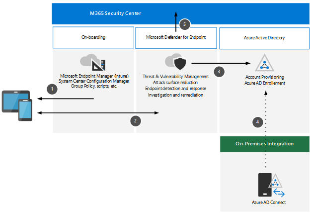

# Review architecture requirements and key concepts for Microsoft Defender for Endpoint

**Applies to:**
- Microsoft 365 Defender

Before enabling Microsoft Defender for Endpoint, be sure you understand the architecture and can meet the requirements.

## Understand the architecture

The following diagram illustrates MDE architecture and integrations:

Step | Description
:---|:---|
1 | Devices are on-boarded via Microsoft Intune, SCCM co-management, etc.
2 | On-boarded devices provide and respond to MDE signal data.
3 | Managed devices are joined and/or enrolled in Azure AD.
4 | Domain-joined Windows 10 devices are synchronized to Azure AD using AAD Connect.
5 | MDE alerts, investigations, and responses are managed in M365 Security Center.

## Concepts

The following table identified key concepts that are important to understand when evaluating, configuring, and deploying MDO:

Concept | Description | Reference
:---|:---|:---|
Administration Portal | Microsoft Defender Security Center to monitor and assist in responding to alerts of potential advanced persistent threat activity or data breaches. | [Microsoft Defender Advanced Threat Protection portal overview - Windows security \| Microsoft Docs](https://docs.microsoft.com/microsoft-365/security/defender-endpoint/portal-overview)
Attack Surface Reduction | Help reduce your attack surfaces by minimizing the places where your organization is vulnerable to cyberthreats and attacks. | [Overview of attack surface reduction - Windows security \| Microsoft Docs](https://docs.microsoft.com/windows/security/threat-protection/microsoft-defender-atp/overview-attack-surface-reduction)
Endpoint Detection and Response | Endpoint detection and response capabilities provide advanced attack detections that are near real-time and actionable. | [Overview of endpoint detection and response capabilities - Windows security \| Microsoft Docs](https://docs.microsoft.com/windows/security/threat-protection/microsoft-defender-atp/overview-endpoint-detection-response)
Behavioral Blocking and Containment | Behavioral blocking and containment capabilities can help identify and stop threats, based on their behaviors and process trees even when the threat has started execution. | [Behavioral blocking and containment - Windows security \| Microsoft Docs](https://docs.microsoft.com/windows/security/threat-protection/microsoft-defender-atp/behavioral-blocking-containment)
Automated Investigation and Response | Automated investigation uses various inspection algorithms based on processes that are used by security analysts and designed to examine alerts and take immediate action to resolve breaches. | [Use automated investigations to investigate and remediate threats - Windows security \| Microsoft Docs](https://docs.microsoft.com/windows/security/threat-protection/microsoft-defender-atp/automated-investigations)
Advanced Hunting | Advanced hunting is a query-based threat-hunting tool that lets you explore up to 30 days of raw data so that you can proactively inspect events in your network to locate threat indicators and entities. | [Overview of advanced hunting in Microsoft Defender ATP - Windows security \| Microsoft Docs](https://docs.microsoft.com/windows/security/threat-protection/microsoft-defender-atp/advanced-hunting-overview)
Threat Analytics |  | [Track and respond to emerging threats with Microsoft Defender ATP threat analytics - Windows security \| Microsoft Docs](https://docs.microsoft.com/windows/security/threat-protection/microsoft-defender-atp/threat-analytics)

## Review architecture requirements

## SIEM integration

??