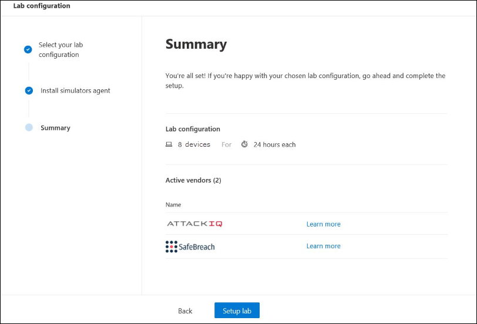

# Enable Microsoft Defender for Endpoint evaluation environment

Use the following guidance to enable the evaluation for Microsoft Defender for Endpoint.

- [Step 1. Check license state](#step-1-check-license-state)
- [Step 2. Onboard endpoints](#step-2-onboard-endpoints-using-any-of-the-supported-management-tools)
- [Step 3. Setup the evaluation lab](#step-3-setup-the-evaluation-lab)

## Step 1. Check license state

Checking for the license state and whether it got properly provisioned, can be done through the admin center or through the **Microsoft Azure portal**.

1. To view your licenses, go to the **Microsoft Azure portal** and navigate to the [Microsoft Azure portal license section](https://portal.azure.com/#blade/Microsoft_AAD_IAM/LicensesMenuBlade/Products).

   

1. Alternately, in the admin center, navigate to **Billing** > **Subscriptions**.

    On the screen, you'll see all the provisioned licenses and their current **Status**.

    

## Step 2. Onboard endpoints using any of the supported management tools

The [Plan deployment](../defender-endpoint/deployment-strategy.md) topic outlines the general steps you need to take to deploy Defender for Endpoint.  

Watch this video for a quick overview of the onboarding process and learn about the available tools and methods.

> [!VIDEO https://www.microsoft.com/videoplayer/embed/RE4bGqr]

After identifying your architecture, you'll need to decide which deployment method to use. The deployment tool you choose influences how you onboard endpoints to the service.

### Onboarding tool options

The following table lists the available tools based on the endpoint that you need to onboard.

Endpoint | Tool options
:---|:---
**Windows** | [Local script (up to 10 devices)](../defender-endpoint/configure-endpoints-script.md),  [Group Policy](../defender-endpoint/configure-endpoints-gp.md),  [Microsoft Endpoint Manager/ Mobile Device Manager](../defender-endpoint/configure-endpoints-mdm.md),  [Microsoft Endpoint Configuration Manager](../defender-endpoint/configure-endpoints-sccm.md),  [VDI scripts](../defender-endpoint/configure-endpoints-vdi.md),  [Integration with Azure Defender](../defender-endpoint/configure-server-endpoints.md#integration-with-azure-defender)
**macOS** | [Local scripts](../defender-endpoint/mac-install-manually.md),  [Microsoft Endpoint Manager](../defender-endpoint/mac-install-with-intune.md),  [JAMF Pro](../defender-endpoint/mac-install-with-jamf.md),  [Mobile Device Management](../defender-endpoint/mac-install-with-other-mdm.md)
**Linux Server** | [Local script](../defender-endpoint/linux-install-manually.md),  [Puppet](../defender-endpoint/linux-install-with-puppet.md),  [Ansible](../defender-endpoint/linux-install-with-ansible.md)
**iOS** | [App-based](../defender-endpoint/ios-install.md)
**Android** | [Microsoft Endpoint Manager](../defender-endpoint/android-intune.md)

## Step 3. Setup the evaluation lab

The Microsoft Defender for Endpoint evaluation lab is designed to eliminate the complexities of device and environment configuration so that you can  focus on evaluating the capabilities of the platform, running simulations, and seeing the prevention, detection, and remediation features in action.

### Before you begin
You'll need to fulfill the [licensing requirements](../defender-endpoint/minimum-requirements.md#licensing-requirements) or have trial access to Microsoft Defender for Endpoint to access the evaluation lab.

You must have **Manage security settings** permissions to:
- Create the lab
- Create devices
- Reset password
- Create simulations 
 
If you enabled role-based access control (RBAC) and created at least a one machine group, users must have access to All machine groups.

### Get started with the lab
You can access the lab from the menu. In the navigation menu, select **Evaluation and tutorials > Evaluation lab**.

>[!NOTE]
>- Depending the type of environment structure you select, devices will be available for the specified number of hours from the day of activation.
>- Each environment is provisioned with a limited set of test devices. When you've used up the provisioned devices and have deleted them, you can request for more devices. 
>- You can request for lab resources once a month. 

Already have a lab? Make sure to enable the new threat simulators and have active devices.

### Setup the evaluation lab

1. In the navigation pane, select **Evaluation and tutorials** > **Evaluation lab**, then select **Setup lab**.

    

2. Depending on your evaluation needs, you can choose to setup an environment with fewer devices for a longer period or more devices for a shorter period. Select your preferred lab configuration then select **Next**.

     

3. (Optional) You can choose to install threat simulators in the lab. 

    

    >[!IMPORTANT]
    >You'll first need to accept and provide consent to the terms and information sharing statements. 

4. Select the threat simulation agent you'd like to use and enter your details. You can also choose to install threat simulators at a later time. If you choose to install threat simulation agents during the lab setup, you'll enjoy the benefit of having them conveniently installed on the devices you add.  
    
    

5.  Review the summary and select **Setup lab**.  

After the lab setup process is complete, you can add devices and run simulations. 

## Next step
 - [Setup the pilot for Microsoft Defender for Endpoint](eval-defender-endpoint-pilot.md)