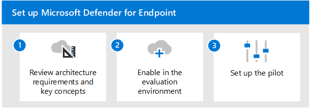

# Evaluate Microsoft Defender for Endpoint overview

**Applies to:**

- Microsoft 365 Defender

This article outlines the process to enable and pilot Microsoft Defender for Endpoint. Before starting this process, be sure you've reviewed the overall process for [evaluating Microsoft 365 Defender](eval-overview.md) and you have [created the Microsoft 365 Defender evaluation environment](eval-create-eval-environment.md). 
 

Use the following steps to enable and pilot Microsoft Defender for Endpoint.

Use the following steps to enable and pilot Microsoft Defender for Identity.

The following table describes the steps in the illustration.

 |Step   |Description
|---------|---------|
| [Step 1. Review architecture requirements and key concepts](eval-defender-endpoint-architecture.md)    | Understand the Defender for Endpoint architecture and the capabilities available to you.       |
|[Step 2. Enable the evaluation environment](eval-defender-office-365-enable-eval.md)     |   Follow the steps to setup the evaluation environment.      |
|[Step 3. Set up the pilot ](eval-defender-office-365-pilot.md)    |    Verify your pilot group, run simulations, and become familiar with key features and dashboards.     |

