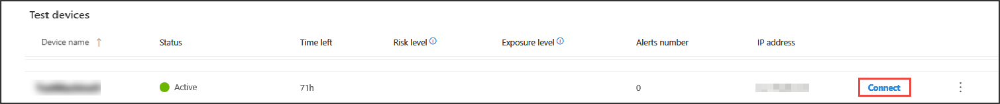
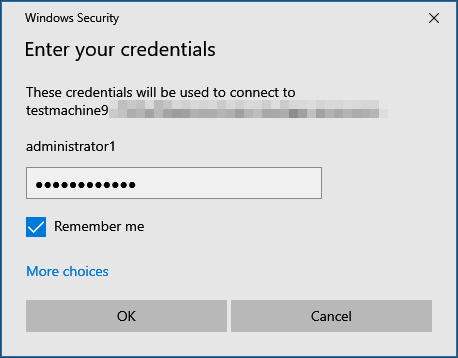

# Pilot Microsoft Defender for Endpoint 
>[!TIP]
>
>- Learn about the latest enhancements in Microsoft Defender for Endpoint: [What's new in Defender for Endpoint?](https://cloudblogs.microsoft.com/microsoftsecure/2018/11/15/whats-new-in-windows-defender-atp/).
>- Defender for Endpoint demonstrated industry-leading optics and detection capabilities in the recent MITRE evaluation. Read: [Insights from the MITRE ATT&CK-based evaluation](https://cloudblogs.microsoft.com/microsoftsecure/2018/12/03/insights-from-the-mitre-attack-based-evaluation-of-windows-defender-atp/).

When you pilot Microsoft Defender for Endpoint, you may choose to onboard a few devices to the service before onboarding your entire organization. 

You might want to experience Defender for Endpoint before you onboard more than a few devices to the service. To do this, you can run controlled attack simulations on a few test devices. After running the simulated attacks, you can review how Defender for Endpoint surfaces malicious activity and explore how it enables an efficient response.

## Review the device inventory

The device inventory shows a list of endpoints, network devices, and IoT devices in your network where alerts were generated. By default, the queue displays devices seen in the last 30 days.  

At a glance you'll see information such as domain, risk level, OS platform, and other details for easy identification of devices most at risk.

From here you can then run simulations and see how Microsoft Defender for Endpoint generates alerts when malicious activity is detected on devices. 

## Before you begin running a simulation

To run any of the provided simulations, you need at least [one onboarded device](../defender-endpoint/onboard-configure.md).

Read the walkthrough document provided with each attack scenario. Each document includes OS and application requirements as well as detailed instructions that are specific to an attack scenario.

## Run a simulation

1. In **Help** > **Simulations & tutorials**, select which of the available attack scenarios you would like to simulate:

   - **Scenario 1: Document drops backdoor** - simulates delivery of a socially engineered lure document. The document launches a specially crafted backdoor that gives attackers control.

   - **Scenario 2: PowerShell script in fileless attack** - simulates a fileless attack that relies on PowerShell, showcasing attack surface reduction and device learning detection of malicious memory activity.

   - **Scenario 3: Automated incident response** - triggers automated investigation, which automatically hunts for and remediates breach artifacts to scale your incident response capacity.

2. Download and read the corresponding walkthrough document provided with your selected scenario.

3. Download the simulation file or copy the simulation script by navigating to **Help** > **Simulations & tutorials**. You can choose to download the file or script on the test device but it's not mandatory.

4. Run the simulation file or script on the test device as instructed in the walkthrough document.

> [!NOTE]
> Simulation files or scripts mimic attack activity but are actually benign and will not harm or compromise the test device.
>

## Simulate attack scenarios

Use the test devices to run your own attack simulations by connecting to them.

You can simulate attack scenarios using:

- The ["Do It Yourself" attack scenarios](https://securitycenter.windows.com/tutorials)
- Threat simulators

You can also use [Advanced hunting](advanced-hunting-overview.md) to query data and [Threat analytics](threat-analytics.md) to view reports about emerging threats.

### Do-it-yourself attack scenarios

If you are looking for a pre-made simulation, you can use our ["Do It Yourself" attack scenarios](https://securitycenter.windows.com/tutorials). These scripts are safe, documented, and easy to use. These scenarios will reflect Defender for Endpoint capabilities and walk you through investigation experience.

>[!NOTE]
>The connection to the test devices is done using RDP. Make sure that your firewall settings allow RDP connections.

1. Connect to your device and run an attack simulation by selecting **Connect**.

    

2. Save the RDP file and launch it by selecting **Connect**.

    

    >[!NOTE]
    >If you don't have a copy of the password saved during the initial setup, you can reset the password by selecting **Reset password** from the menu:
    > 
    >
    > The device will change it’s state to “Executing password reset", then you’ll be presented with your new password in a few minutes.

3. Enter the password that was displayed during the device creation step.

   

4. Run Do-it-yourself attack simulations on the device.

### Threat simulator scenarios

If you chose to install any of the supported threat simulators during the lab setup, you can run the built-in simulations on the evaluation lab devices.

Running threat simulations using third-party platforms is a good way to evaluate Microsoft Defender for Endpoint capabilities within the confines of a lab environment.

>[!NOTE]
>
>Before you can run simulations, ensure the following requirements are met:

>- Devices must be added to the evaluation lab
>- Threat simulators must be installed in the evaluation lab

1. From the portal select **Create simulation**.

2. Select a threat simulator.

    

3. Choose a simulation or look through the simulation gallery to browse through the available simulations.

    You can get to the simulation gallery from:
    - The main evaluation dashboard in the **Simulations overview** tile or
    - By navigating from the navigation pane **Evaluation and tutorials** > **Simulation & tutorials**, then select **Simulations catalog**.

4. Select the devices where you'd like to run the simulation on.

5. Select **Create simulation**.

6. View the progress of a simulation by selecting the **Simulations** tab. View the simulation state, active alerts, and other details.

    

After running your simulations, we encourage you to walk through the lab progress bar and explore **Microsoft Defender for Endpoint triggered an automated investigation and remediation**. Check out the evidence collected and analyzed by the feature.

Hunt for attack evidence through advanced hunting by using the rich query language and raw telemetry and check out some world-wide threats documented in Threat analytics.
