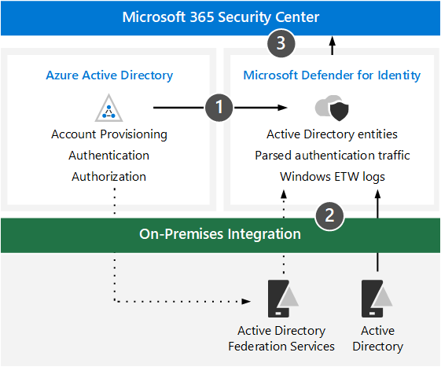

# Review architecture requirements and key concepts for Microsoft Defender for Identity

**Applies to:**
- Microsoft 365 Defender

This article is [Step 1 of 2](eval-defender-identity-overview.md) in the process of setting up the evaluation environment for Microsoft Defender for Identity. For more information about this process, see the [overview article](eval-defender-identity-overview.md).

Before enabling Microsoft Defender for Identity, be sure you understand the architecture and can meet the requirements. 

Microsoft Defender for Identity uses machine learning and behavioral analytics to identify attacks across your on-premises network along with detecting and proactively preventing user sign-in risks associated with cloud identities. For more information, see [What is Microsoft Defender for Identity?](/defender-for-identity/what-is)

Defender for Identity protects your on-premises Active Directory users and/or users synced to your Azure Active Directory. To protect an environment made up of only AAD users, see [Azure AD Identity Protection](/azure/active-directory/identity-protection/overview-identity-protection).

## Understand the architecture

The following diagram illustrates the baseline architecture for Defender for Identity. 

The following table describes this illustration.

|Call-out  |Description  |
|---------|---------|
|1     |  Sensors installed on AD domain controllers parse logs and network traffic and send them to Microsoft Defender for Identity for analysis and reporting. Sensors can also parse Active Directory Federation Services (AD FS) when Azure is configured to use federated authentication. |
|2     |  Microsoft Defender for Identity aggregates and analyzes Azure AD and sensor data for monitoring, investigating, and responding to authentication and authorization signals. |
|3     |Microsoft Defender for Identity shares signals to the Microsoft 365 Security Center. |
| | |

For a deeper look into the architecture of Defender for Identity, including integration with Cloud App Security, see [Microsoft Defender for Identity architecture](/defender-for-identity/architecture).

## Understand key concepts

The following table identified key concepts that are important to understand when evaluating, configuring, and deploying Microsoft Defender for Identity.

|Concept  |Description |More information  |
|---------|---------|---------|
| Monitored activities | Defender for Identity monitors signals generated from within your organization to detect suspicious or malicious activity and helps you determine the validity of each potential threat so that you can effectively triage and respond.  |  [Microsoft Defender for Identity monitored activities](/defender-for-identity/monitored-activities)       |
| Security alerts    | Defender for Identity security alerts explain the suspicious activities detected by sensors on your network along with the actors and computers involved in each threat.   | [Microsoft Defender for Identity Security Alerts](/defender-for-identity/suspicious-activity-guide?tabs=external)    |
| Entity profiles    | Entity profiles provide a comprehensive deep-dive investigation of users, computers, devices, and resources along with their access history.   | [Understanding entity profiles](/defender-for-identity/entity-profiles)  |
| Lateral movement paths    | A key component of MDI security insights is identifying lateral movement paths in which an attacker uses non-sensitive accounts to gain access to sensitive accounts or machines throughout your network.  | [Microsoft Defender for Identity Lateral Movement Paths (LMPs)](/defender-for-identity/use-case-lateral-movement-path)  |
| Network Name Resolution    |  Network Name Resolution (NNR) is a component of MDI functionality which captures activities based on network traffic, Windows events, ETW, etc. and correlates this raw data to the relevant computers involved in each activity.       | [What is Network Name Resolution?](/defender-for-identity/nnr-policy)      |
| Reports    | Defender for Identity reports allow you to schedule or immediately generate and download reports that provide system and entity status information.  You can create reports about system health, security alerts, and potential lateral movement paths detected in your environment.   | [Microsoft Defender for Identity Reports ](/defender-for-identity/reports)       |
| Role groups    | Defender for Identity offers role-based groups and delegated access to safeguard data according to your organization's specific security and compliance needs which includes Administrators, Users and Viewers.        |  [Microsoft Defender for Identity role groups](/defender-for-identity/role-groups)       |
| Administrative portal    |  In addition to the Microsoft 365 Security Center, the Defender for Identity portal cab be used to monitor and respond to suspicious activity.      | [Working with the Microsoft Defender for Identity portal](/defender-for-identity/workspace-portal)        |
| Microsoft Cloud App Security integration   | Microsoft Cloud App Security integrates with Microsoft Defender for Identity to provide user entity behavioral analytics (UEBA) across a hybrid environment - both cloud app and on-premises   | Microsoft Defender for Identity integration  |
| | | |

## Review prerequisites

Defender for Identity requires some prerequisite work to ensure that your on-premises identity and networking components meet minimum requirements. Use this article as a checklist to ensure your environment is ready: [Microsoft Defender for Identity prerequisites](/defender-for-identity/prerequisites).

## Next steps

Step 2 of 2: [Enable the evaluation environment Defender for Identity](eval-defender-identity-enable-eval.md)

Return to the overview for [Evaluate Microsoft Defender for Identity](eval-defender-identity-overview.md)

Return to the overview for [Evaluate and pilot Microsoft 365 Defender](../office-365-security/defender/eval-overview.md) 