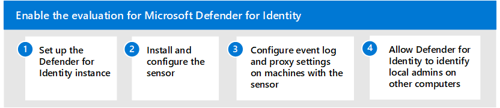

# Enable the evaluation environment for Microsoft Defender for Identity

**Applies to:**
- Microsoft 365 Defender

Intro

replace this illustration with DfI steps

## Step 1. Set up the Defender for Identity Instance

|  |Step     |More information  |
|---------|---------|---------|
|1     | Create the Defender for Identity instance        | [Quickstart: Create your Microsoft Defender for Identity instance](/defender-for-identity/install-step1)        |
|2     | Connect the Defender for Identity instance to your Active Directory forest   | [Quickstart: Connect to your Active Directory Forest](/defender-for-identity/install-step2)  |

<!-->
|  |Step     |More information  |
|---------|---------|---------|
|1     | Create the Defender for Identity instance        | [Quickstart: Create your Microsoft Defender for Identity instance](/defender-for-identity/install-step1)        |
|2     | Connect the Defender for Identity instance to your Active Directory forest   | [Quickstart: Connect to your Active Directory Forest](/defender-for-identity/install-step2)  |
|3     | Download the sensor setup package  |  [Quickstart: Download the Microsoft Defender for Identity sensor setup package](/defender-for-identity/install-step3)   |
|4     | Install the Defender for Identity sensor    |  [Quickstart: Install the Microsoft Defender for Identity sensor](/defender-for-identity/install-step4)       |
|5     | Configure the sensor       |  [Configure Microsoft Defender for Identity sensor settings ](/defender-for-identity/install-step5)   |
|6     | Configure Windows event log collection         | [Configure Windows Event collection](/defender-for-identity/configure-windows-event-collection)        |
|7     | Configure Internet proxy settings        | [Configure endpoint proxy and Internet connectivity settings for your Microsoft Defender for Identity Sensor](/defender-for-identity/configure-proxy)        |
|8     | Configure remote calls to SAM        |  [Configure Microsoft Defender for Identity to make remote calls to SAM](/defender-for-identity/install-step8-samr)       |
|9     | Plan for capacity        | [Plan capacity for Microsoft Defender for Identity](/defender-for-identity/capacity-planning)   |
|   |         |         |

-->

## Step 2. Install and configure the sensor

|  |Step     |More information  |
|---------|---------|---------|
|1     | Plan for capacity        | [Plan capacity for Microsoft Defender for Identity](/defender-for-identity/capacity-planning)   |
|2     | Download the sensor setup package  |  [Quickstart: Download the Microsoft Defender for Identity sensor setup package](/defender-for-identity/install-step3)   |
|3     | Install the Defender for Identity sensor    |  [Quickstart: Install the Microsoft Defender for Identity sensor](/defender-for-identity/install-step4)       |
|4     | Configure the sensor       |  [Configure Microsoft Defender for Identity sensor settings ](/defender-for-identity/install-step5)   |
|   |         |         |

## Step 3. Configure event log and proxy settings on machines with the sensor

|  |Step     |More information  |
|---------|---------|---------|
|1     | Configure Windows event log collection         | [Configure Windows Event collection](/defender-for-identity/configure-windows-event-collection)        |
|2     | Configure Internet proxy settings        | [Configure endpoint proxy and Internet connectivity settings for your Microsoft Defender for Identity Sensor](/defender-for-identity/configure-proxy)        |
|   |         |         |

## Step 4. Allow Defender for Identity to identify local admins on other computers

Microsoft Defender for Identity lateral movement path detection relies on queries that identify local admins on specific machines. These queries are performed with the SAM-R protocol, using the Defender for Identity Service account. 

To ensure Windows clients and servers allow your Defender for Identity account to perform SAM-R, a modification to Group Policy must be made to add the Defender for Identity service account in addition to the configured accounts listed in the Network access policy. Make sure to apply group policies to all computers **except domain controllers**.

For instructions on how to do this, see [Configure Microsoft Defender for Identity to make remote calls to SAM](/defender-for-identity/install-step8-samr). 

## Next steps

