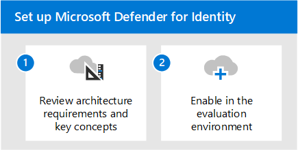

# Evaluate Microsoft 365 Defender for Identity overview

**Applies to:**
- Microsoft 365 Defender

This article outlines the process to enable and pilot Microsoft Defender for Identity. Before starting this process, be sure you've reviewed the overall process for [evaluating Microsoft 365 Defender](eval-overview.md) and you have [created the Microsoft 365 Defender evaluation environment](eval-create-eval-environment.md). 
 

Use the following steps to enable and pilot Microsoft Defender for Identity.

The following table describes the steps in the illustration.

| |Step  |Description  |
|---------|---------|---------|
|1|[Review architecture requirements and key concepts](eval-defender-identity-architecture.md)    | Understand the Defender for Identity architecture and be sure your environment meets the architecture prerequisites.       |
|2|[Enable the evaluation environment](eval-defender-identity-enable-eval.md)     |   Follow the steps to setup the evaluation environment.      |
||||

