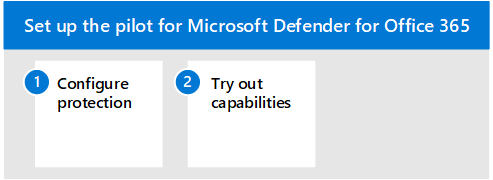

# Pilot Microsoft Defender for Identity

**Applies to:**
- Microsoft 365 Defender

This article is [Step 3 of 3](eval-defender-identity-overview.md) in the process of setting up the evaluation environment for Microsoft Defender for Identity. For more information about this process, see the [overview article](eval-defender-identity-overview.md).

Use the following steps to setup and configure the pilot for Microsoft Defender for identity. Note that the recommendations don't include setting up a pilot group. The best practice is to go ahead and install the sensor on all of your servers running Active Directory Domain Services (AD DS) and Active Directory Federated Services (AD FS).

The following table describes the steps in the illustration.

- [Step 1: Configure benchmark recommendations for your identity environment](#step-1-configure-benchmark-recommendations-for-your-identity-environment)
- [Step 2: Try out capabilities — Walk through tutorials for identifying and remediating different attack types ](#step-2-try-out-capabilities--walk-through-tutorials-for-identifying-and-remediating-different-attack-types)

## Step 1. Configure benchmark recommendations for your identity environment

Microsoft provides security benchmark recommendations for customers using Microsoft Cloud services. The [Azure Security Benchmark](/security/benchmark/azure/overview) (ASB) provides prescriptive best practices and recommendations to help improve the security of workloads, data, and services on Azure.

These benchmark recommendations include [Azure security baseline for Microsoft Defender for Identity](/security/benchmark/azure/baselines/defender-for-identity-security-baseline). Implementing these recommendations can take some time to plan and implement. While these will greatly increase the security of your identity environment, they shouldn't prevent you from continuing to evaluate and implement Microsoft Defender for Identity. These are provided here for your awareness.

## Step 2. Try out capabilities — Walk through tutorials for identifying and remediating different attack types

The Microsoft Defender for Identity documentation includes a series of tutorials that walk through the process of identifying and remediating various attack types.

Try out Defender for Identity tutorials:
- [Reconnaissance alerts](/defender-for-identity/reconnaissance-alerts)
- [Compromised credential alerts](/defender-for-identity/compromised-credentials-alerts)
- [Lateral movement alerts](/defender-for-identity/lateral-movement-alerts)
- [Domain dominance alerts](/defender-for-identity/domain-dominance-alerts)
- [Exfiltration alerts](/defender-for-identity/exfiltration-alerts)
- [Investigate a user](/defender-for-identity/investigate-a-user)
- [Investigate a computer](/defender-for-identity/investigate-a-computer)
- [Investigate lateral movement paths](/defender-for-identity/investigate-lateral-movement-path)
- [Investigate entities](/defender-for-identity/investigate-entity)

## Next steps

[Evaluate Microsoft Defender for Office 365](eval-defender-office-365-overview.md)

Return to the overview for [Evaluate Microsoft Defender for Office 365](eval-defender-office-365-overview.md)

Return to the overview for [Evaluate and pilot Microsoft 365 Defender](../office-365-security/defender/eval-overview.md)