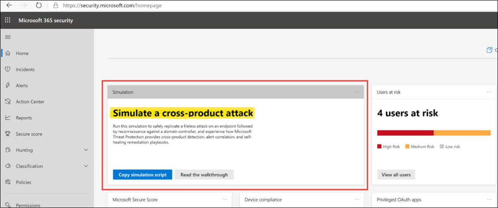

# Generate a test alert for Microsoft 365 Defender

[!INCLUDE [Microsoft 365 Defender rebranding](../includes/microsoft-defender.md)]

Based on: generate-test-alert.md

**Applies to:**
- Microsoft 365 Defender

Now that you've completed your Microsoft 365 Defender evaluation lab setup and configuration, you can run a threat attack simulation to experience the detection, alert correlation, and self-healing remediation capabilities of the integrated security solution.  

1. Log on to https://security.microsoft.com
2. On the Home page, look for a tile titled **Simulation**.  Review the walkthrough guide for steps to create a test incident in Microsoft 365 Defender.
   

## Next steps

Browse through the [Microsoft 365 solution and architecture center](../../solutions/index.yml) to understand how to design the solution and architecture that is right for your organization.