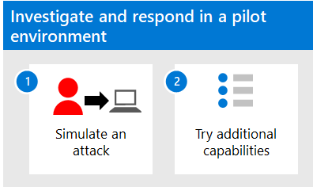

# Investigate and respond using Microsoft 365 Defender in a pilot environment

**Applies to:**
- Microsoft 365 Defender

This article outlines the process to create an incident with a simulated attack and use Microsoft 365 Defender to investigate and respond. Before starting this process, be sure you've reviewed the overall process for [evaluating Microsoft 365 Defender](eval-overview.md) and you have [created the Microsoft 365 Defender evaluation environment](eval-create-eval-environment.md). 

Use the following steps.

The following table describes the steps in the illustration.

| |Step  |Description  |
|---------|---------|---------|
|1|[Add endpoints](eval-defender-investigate-respond-endpoints.md)    | Add a domain controller and a Windows device to your Microsoft 365 Defender evaluation environment.       |
|2|[Simulate an attack](eval-defender-investigate-respond-simulate-attack.md)     |   Follow the steps to simulate an attack on the evaluation environment.      |
|3|[Try additional incident response capabilities ](eval-defender-investigate-respond-additional.md)    |    Try additional features and capabilities for performing incident response in Microsoft 365 Defender.     |
||||

### Navigation you may need

[Create the Microsoft 365 Defender Evaluation Environment](eval-create-eval-environment.md)
