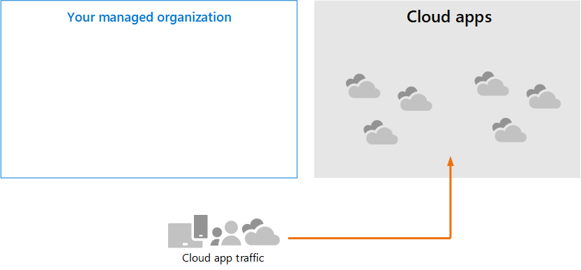
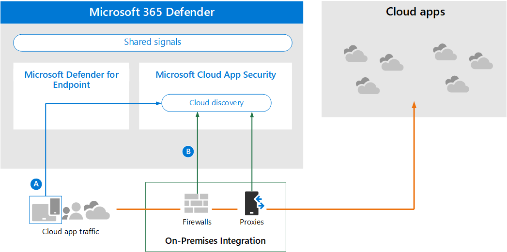
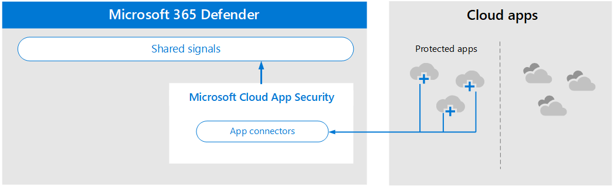
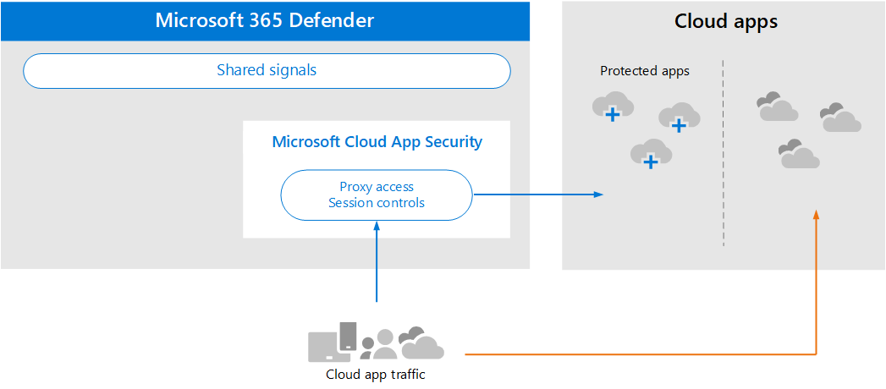
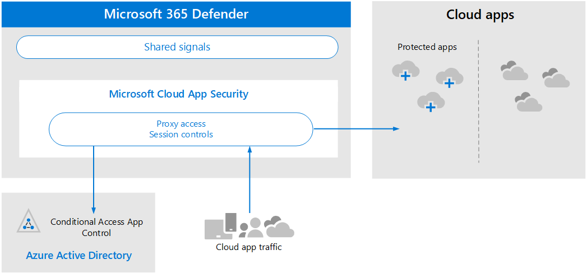

# Review architecture requirements and key concepts for Microsoft Cloud App Security

**Applies to:**

- Microsoft 365 Defender

This article is [Step 1 of 3](eval-defender-mcas-overview.md) in the process of setting up the evaluation environment for Microsoft Cloud App Security alongside Microsoft 365 Defender. For more information about this process, see the [overview article](eval-defender-identity-overview.md).

Before enabling Microsoft Cloud App Security, be sure you understand the architecture and can meet the requirements. 

## Understand the architecture

Microsoft Cloud App Security is a Cloud Access Security Broker (CASB). CASBs act a gatekeeper to broker access in real time between your enterprise users and cloud resources they use, wherever your users are located and regardless of the device they are using. Microsoft Cloud App Security natively integrates with Microsoft security capabilities, including Microsoft 365 Defender. 

Without Cloud App Security, cloud apps that are used by your organization are unmanaged and unprotected, as illustrated.

In the illustration:
- The use of cloud apps by an organization is unmonitored and unprotected. 
- This use falls outside the protections achieved within a managed organization. 

#### Discovering cloud apps

The first step to managing the use of cloud apps is to discover which cloud apps are used by your organization. This next diagram illustrates how cloud discovery works with Cloud App Security.

In this illustration, there are two methods that can be used to monitor network traffic and discover cloud apps that are being used by your organization.
- A. Cloud App Discovery integrates with Microsoft Defender for Endpoint natively. Defender for Endpoint reports cloud apps and services being accessed from IT-managed Windows 10 devices. 
- B. For coverage on all devices connected to a network, the Cloud App Security log collector is installed on firewalls and other proxies to collect data from endpoints. This data is sent to Cloud App Security for analysis.

#### Managing cloud apps

After you discover cloud apps and analyze the behavior of how these are used by your organization, you can begin managing cloud apps that you choose. 

In this illustration:
- Some apps are sanctioned for use. This is a simple way of beginning to manage apps.
- You can enable greater visibility and control by connecting apps with app connectors. App connectors use the APIs of app providers.

#### Applying session controls to cloud apps

Microsoft Cloud App Security serves as a reverse proxy, providing proxy access to sanctioned cloud apps. This allows Cloud App Security to apply session controls that you configure. 

In this illustration:
- Access to sanctioned cloud apps from users and devices in your organization is routed through Cloud App Security.
- This proxy access allows session controls to be applied.
- Cloud apps that you have not sanctioned or explicitly unsanctioned are not affected.

Session controls allow you to apply parameters to how cloud apps are used by your organization. For example, if your organization is using Salesforce, you can configure a session policy that allows only managed devices to access your organization's data in Salesforce. A simpler example could be configuring a policy to monitor traffic from unmanaged devices so you can analyze the risk of this traffic before applying stricter policies.

#### Integrating with Azure AD with Conditional Access App Control

You might already have SaaS apps added to your Azure AD tenant to enforce multi-factor authentication and other conditional access policies. Microsoft Cloud App Security natively integrates with Azure AD. All you have to do is configure a policy in Azure AD to use Conditional Access App Control in Cloud App Security. This routes network traffic for these managed SaaS apps through Cloud App Security as a proxy, which allows Cloud App Security to monitor this traffic and to apply session controls. 

In this illustration:
- SaaS apps are integrated with the Azure AD tenant. This allows Azure AD to enforce conditional access policies, including multi-factor authentication.
- A policy is added to Azure Active Directory to direct traffic for SaaS apps to Cloud App Security. The policy specifies which SaaS apps to apply this policy to. Consequently, after Azure AD enforces any conditional access policies that apply to these SaaS apps, Azure AD then directs (proxies) the session traffic through Cloud App Security.
- Cloud App Security monitors this traffic and applies any session control policies that have been configured by administrators. 

You might have discovered and sanctioned cloud apps using Cloud App Security that have not been added to Azure AD. You can take advantage of Conditional Access App Control by adding these cloud apps to your Azure AD tenant and the scope of your conditional access rules.

#### Protecting your organization from hackers

Cloud App Security provides powerful protection on its own. However, when combined with the other capabilities of Microsoft 365 Defender, Cloud App Security provides data into the shared signals which, together, helps stop attacks.

It's worth repeating this illustration from the overview to this Microsoft 365 Defender evaluation and pilot guide. 

Focusing on the right side of this illustration, Microsoft Cloud App Security notices anomalous behavior like impossible-travel, credential access, and unusual download, file share, or mail forwarding activity and reports these to the security team. Consequently, Cloud App Security helps prevent lateral movement by hackers and exfiltration of sensitive data. Microsoft 356 Defender correlates the signals from all the components to provide the full attack story.

## Understand key concepts

The following table identified key concepts that are important to understand when evaluating, configuring, and deploying Microsoft Cloud App Security.

|Concept  |Description |More information  |
|---------|---------|---------|
| Cloud App Security Dashboard | Presents an overview of the most important information about your organization and gives links to deeper investigation.        | [Working with the dashboard ](/cloud-app-security/daily-activities-to-protect-your-cloud-environment)       |
| Conditional Access App Control    | Reverse proxy architecture that integrates with your Identity Provider (IdP) to give Azure AD conditional access policies and selectively enforce session controls.        |  [Protect apps with Microsoft Cloud App Security Conditional Access App Control](/cloud-app-security/proxy-intro-aad)       |
|  Cloud App Catalog   | The Cloud App Catalog gives you a full picture against Microsoft catalog of over 16,000 cloud apps that are ranked and scored based on more than 80 risk factors.    |  [Working with App risk scores](/cloud-app-security/risk-score)       |
| Cloud Discovery Dashboard    | Cloud Discovery analyzes your traffic logs and is designed to give more insight into how cloud apps are being used in your organization as well as give alerts and risk levels.     |  [Working with discovered apps   ](/cloud-app-security/discovered-apps)    |
|Connected Apps |Cloud App Security provides end-to-end protection for connected apps using Cloud-to-Cloud integration, API connectors, and real-time access and session controls leveraging our Conditional App Access Controls. |[Protecting connected apps](/cloud-app-security/protect-connected-apps) |
| | | |

## Review architecture requirements

### Discovering cloud apps

To discover cloud apps used in your environment, you can do one or both of the following:

- Get up and running quickly with Cloud Discovery by integrating with Microsoft Defender for Endpoint. This native integration enables you to immediately start collecting data on cloud traffic across your Windows 10 devices, on and off your network.
- To discover all cloud apps accessed by all devices connected to your network, deploy the Cloud App Security log collector on your firewalls and other proxies. This collects data from your endpoints and sends it to Cloud App Security for analysis. Cloud App Security natively integrates with some third-party proxies for even more capabilities.

These options are included in [Step 2. Enable the evaluation environment](eval-defender-mcas-enable-eval.md). 

### Applying Azure AD Conditional Access policies to cloud apps

Conditional Access App Control (the ability to apply Conditional Access policies to cloud apps) requires integration with Azure AD. This isn't a requirement for getting started with Cloud App Security. It is a step we encourage you to try out during the pilot phase — [Step 3. Pilot Microsoft Cloud App Security](eval-defender-mcas-pilot.md).

## SIEM integration

You can integrate Microsoft Cloud App Security with your generic SIEM server or with Azure Sentinel to enable centralized monitoring of alerts and activities from connected apps. 

Additionally, Azure Sentinel includes a Microsoft Cloud App Security connector to provide deeper integration with Azure Sentinel. This enables you to not only gain visibility into your cloud apps but to also get sophisticated analytics to identify and combat cyberthreats and to control how your data travels.

- [Generic SIEM integration](/cloud-app-security/siem)
- [Stream alerts and Cloud Discovery logs from MCAS into Azure Sentinel](/azure/sentinel/connect-cloud-app-security)

### Next steps

Step 2 of 3: [Enable the evaluation environment for Microsoft Cloud App Security](eval-defender-mcas-enable-eval.md)

Return to the overview for [Evaluate Microsoft Cloud App Security](eval-defender-mcas-overview.md)

Return to the overview for [Evaluate and pilot Microsoft 365 Defender](../office-365-security/defender/eval-overview.md)