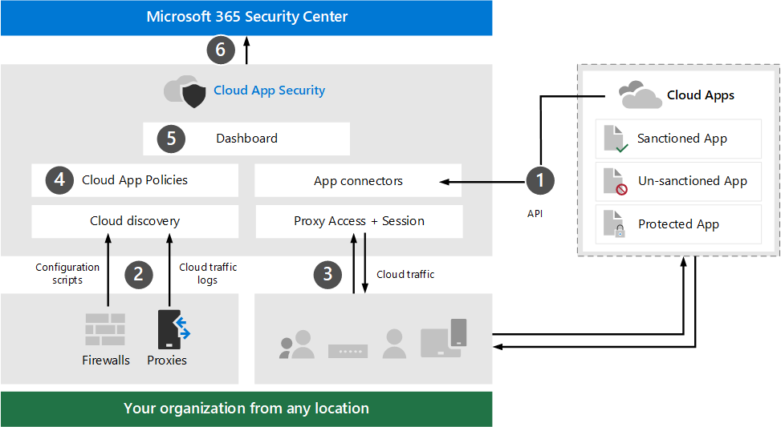

# Review architecture requirements and key concepts for Microsoft Cloud App Security

**Applies to:**
- Microsoft 365 Defender

This article is [Step 1 of 3](eval-defender-mcas-overview.md) in the process of setting up the evaluation environment for Microsoft Cloud App Security alongside Microsoft 365 Defender. For more information about this process, see the [overview article](eval-defender-identity-overview.md).

Before enabling Microsoft Cloud App Security, be sure you understand the architecture and can meet the requirements. 

## Understand the architecture

The following diagram illustrates . . .

coming soon . . .

<!--

The following table describes this illustration.

|Call-out  |Description  |
|---------|---------|
|1     | App connectors use APIs from cloud app providers, like Box, to integrate the Cloud App Security cloud with other cloud apps. App connectors extend control and protection. They also give you access to information directly from cloud apps for analysis.     |
|2     | Network traffic from clients, firewalls, proxy servers, etc. is parsed to identify sanctioned and unsanctioned cloud apps.   |
|3     |Clients leverage the  session proxy to enforce sanctioned and unsanctioned cloud apps access. |
|4 |Admins can create Cloud App Policies to configure granular control and protection for all apps or for specific apps.|
|5 | Currently, the Microsoft Cloud App Security dashboard is where you will configure policies, view alerts, and perform other tasks. |
|6 | Signals are shared with the Microsoft 365 Security Center for . . . |
| | |

-->

## Understand key concepts

The following table identified key concepts that are important to understand when evaluating, configuring, and deploying Microsoft Cloud App Security.

|Concept  |Description |More information  |
|---------|---------|---------|
| Cloud App Security Dashboard | Presents an overview of the most important information about your organization and gives links to deeper investigation.        | [Working with the dashboard ](/cloud-app-security/daily-activities-to-protect-your-cloud-environment)       |
| Conditional Access App Control    | Reverse proxy architecture that integrates with your Identity Provider (IdP) to give Azure AD conditional access policies and selectively enforce session controls.        |  [Protect apps with Microsoft Cloud App Security Conditional Access App Control](/cloud-app-security/proxy-intro-aad)       |
|  Cloud App Catalog   | The Cloud App Catalog gives you a full picture against Microsoft catalog of over 16,000 cloud apps that are ranked and scored based on more than 80 risk factors.    |  [Working with App risk scores](/cloud-app-security/risk-score)       |
| Cloud Discovery Dashboard    | Cloud Discovery analyzes your traffic logs and is designed to give more insight into how cloud apps are being used in your organization as well as give alerts and risk levels.     |  [Working with discovered apps   ](/cloud-app-security/discovered-apps)    |
|Connected Apps |Cloud App Security provides end-to-end protection for connected apps using Cloud-to-Cloud integration, API connectors, and real-time access and session controls leveraging our Conditional App Access Controls. |[Protecting connected apps](/cloud-app-security/protect-connected-apps) |
| | | |

## Review architecture requirements

To discover cloud apps being used in your environment, you can do one or both of the following:
- Get up and running quickly with Cloud Discovery by integrating with Microsoft Defender for Endpoint. This native integration enables you to immediately start collecting data on cloud traffic across your Windows 10 devices, on and off your network.
- To discover all cloud apps accessed by all devices connected to your network, deploy the Cloud App Security log collector on your firewalls and other proxies. This collects data from your endpoints and sends it to Cloud App Security for analysis. Cloud App Security natively integrates with some third-party proxies for even more capabilities.

These options are included in [Step 2. Enable the evaluation environment](eval-defender-mcas-enable-eval.md). 

## SIEM integration

You can integrate Microsoft Cloud App Security with your generic SIEM server or with Azure Sentinel to enable centralized monitoring of alerts and activities from connected apps. See [Generic SIEM integration](/cloud-app-security/siem).

### Next steps

Step 2 of 3: [Enable the evaluation environment for Microsoft Cloud App Security](eval-defender-mcas-enable-eval.md)

Return to the overview for [Evaluate Microsoft Cloud App Security](eval-defender-mcas-overview.md)

Return to the overview for [Evaluate and pilot Microsoft 365 Defender](../office-365-security/defender/eval-overview.md) 