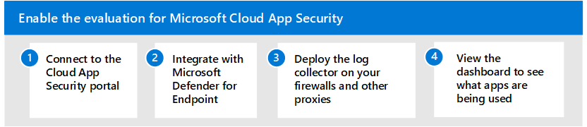

# Enable the evaluation environment for Microsoft Cloud App Security

**Applies to:**

- Microsoft 365 Defender

This article is [Step 2 of 2](eval-defender-mcas-overview.md) in the process of setting up the evaluation environment for Microsoft Cloud App Security. For more information about this process, see the [overview article](eval-defender-mcas-overview.md).

This article walks you through the process of accessing the Cloud App Security portal and configuring the necessary integration to collect cloud app traffic data.

To discover cloud apps used in your environment, you can do one or both of the following:

- Get up and running quickly with Cloud Discovery by integrating with Microsoft Defender for Endpoint. This native integration enables you to immediately start collecting data on cloud traffic across your Windows 10 devices, on and off your network.
- To discover all cloud apps accessed by all devices connected to your network, deploy the Cloud App Security log collector on your firewalls and other proxies. This collects data from your endpoints and sends it to Cloud App Security for analysis. Cloud App Security natively integrates with some third-party proxies for even more capabilities.

This article includes guidance for both methods.

Use the following steps to set up Microsoft Cloud App Security.

- [Step 1. Connect to the Cloud App Security portal](#step-1-connect-to-the-cloud-app-security-portal)
- [Step 2. Integrate with Microsoft Defender for Endpoint](#step-2-integrate-with-microsoft-defender-for-endpoint)
- [Step 3. Deploy the Cloud App Security log collector on your firewalls and other proxies](#step-3-deploy-the-cloud-app-security-log-collector-on-your-firewalls-and-other-proxies)
- [Step 4. View the Cloud Discovery dashboard to see what apps are being used in your organization](#step-4-view-the-cloud-discovery-dashboard-to-see-what-apps-are-being-used-in-your-organization)

## Step 1. Connect to the Cloud App Security portal

To verify licensing and to connect to the Cloud App Security portal, see [Quickstart: Get started with Microsoft Cloud App Security](/cloud-app-security/getting-started-with-cloud-app-security). 

If you're not immediately able to connect to the portal, you might need to add the IP address to the allow list of your firewall. See [Basic setup for Cloud App Security](/cloud-app-security/general-setup).

If you're still having trouble, review [Network requirements](/cloud-app-security/network-requirements).

## Step 2. Integrate with Microsoft Defender for Endpoint

Microsoft Cloud App Security integrates with Microsoft Defender for Endpoint natively. The integration simplifies roll out of Cloud Discovery, extends Cloud Discovery capabilities beyond your corporate network, and enables device-based investigation. This integration reveals cloud apps and services being accessed from IT-managed Windows 10 devices. 

If you've already set up Microsoft Defender for Endpoint, configuring integration with Cloud App Security is a toggle in Microsoft 365 Defender. After integration is turned on, you can return to the Cloud App Security portal and view rich data in the Cloud Discovery Dashboard.

To accomplish these tasks, see [Microsoft Defender for Endpoint integration with Microsoft Cloud App Security](/cloud-app-security/mde-integration). 

## Step 3. Deploy the Cloud App Security log collector on your firewalls and other proxies

For coverage on all devices connected to your network, deploy the Cloud App Security log collector on your firewalls and other proxies to collect data from your endpoints and send it to Cloud App Security for analysis. 

If you're using one of the following Secure Web Gateways (SWG), Cloud App Security provides seamless deployment and integration:
- Zscaler
- iboss
- Corrata
- Menlo Security

For more information on integrating with these network devices, see [Set up Cloud Discovery](/cloud-app-security/set-up-cloud-discovery). 
## Step 4. View the Cloud Discovery dashboard to see what apps are being used in your organization

The Cloud Discovery dashboard is designed to give you more insight into how cloud apps are being used in your organization. It provides an at-a-glance overview of what kinds of apps are being used, your open alerts, and the risk levels of apps in your organization. 

To get started using the Cloud Discovery dashboard, see [Working with discovered apps](/cloud-app-security/discovered-apps).

## Next steps

Step 3 of 3: [Pilot Microsoft Cloud App Security](eval-defender-mcas-pilot.md)

Return to the overview for [Evaluate Microsoft Cloud App Security](eval-defender-mcas-overview.md)

Return to the overview for [Evaluate and pilot Microsoft 365 Defender](../office-365-security/defender/eval-overview.md)