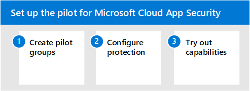

# Pilot Microsoft Cloud App Security with Microsoft 365 Defender

**Applies to:**
- Microsoft 365 Defender

This article is [Step 3 of 3](eval-defender-mcas-overview.md) in the process of setting up the evaluation environment for Microsoft Cloud App Security. For more information about this process, see the [overview article](eval-defender-mcas-overview.md).

Use the following steps to setup and configure the pilot for Microsoft Cloud App Security. 

- Step 1. [Create the pilot group — Scope your pilot deployment to certain user groups](#step-1-create-the-pilot-group--scope-your-pilot-deployment-to-certain-user-groups)
- [Step 2. Configure protection — Conditional Access App Control](#step-2-configure-protection--conditional-access-app-control)
- [Step 3. Try out capabilities — Walk through tutorials for protecting your environment](#step-3-try-out-capabilities--walk-through-tutorials-for-protecting-your-environment) 

## Step 1. Create the pilot group — Scope your pilot deployment to certain user groups

Microsoft Cloud App Security enables you to scope your deployment. Scoping allows you to select certain user groups to be monitored for apps or excluded from monitoring. You can include or exclude user groups. To scope your pilot deployment, see [Scoped Deployment](/cloud-app-security/scoped-deployment).

## Step 2. Configure protection — Conditional Access App Control

One of the most powerful protections you can configure is Conditional Access App Control. This requires integration with Azure Active Directory (Azure AD). It allows you to apply Conditional Access policies, including related policies (like requiring healthy devices), to cloud apps you've sanctioned. 

The first step in using Microsoft Cloud App Security to manage SaaS apps is to discover these and then add them to your Azure AD tenant. If you need help with discovery, see [Discover and manage SaaS apps in your network](/cloud-app-security/tutorial-shadow-it). After you've discovered apps, [add these to your Azure AD tenant](/azure/active-directory/manage-apps/add-application-portal).

You can begin to manage these by doing the following:

- First, in Azure AD, create a new conditional access policy and configure it to "Use Conditional Access App Control." This redirects the request to Cloud App Security. You can create one policy and add all SaaS apps to this policy.
- Next, in Cloud App Security, create session policies. Create one policy for each control you want to apply.

For more information, including supported apps and clients, see [Protect apps with Microsoft Cloud App Security Conditional Access App Control](/cloud-app-security/proxy-intro-aad). 

For example policies, see [Recommended Microsoft Cloud App Security policies for SaaS apps](../office-365-security/mcas-saas-access-policies.md). These policies build on a set of [common identity and device access policies](../office-365-security/microsoft-365-policies-configurations.md) that are recommended as a starting point for all customers. 

## Step 3. Try out capabilities — Walk through tutorials for protecting your environment 

The Microsoft Cloud App Security documentation includes a series of tutorials to help you discover risk and protect your environment. 

Try out Cloud App Security tutorials:

- [Detect suspicious user activity](/cloud-app-security/tutorial-suspicious-activity)
- [Investigate risky users](/cloud-app-security/tutorial-ueba)
- [Investigate risky OAuth apps](/cloud-app-security/investigate-risky-oauth)
- [Discover and protect sensitive information](/cloud-app-security/tutorial-dlp)
- [Protect any app in your organization in real time](/cloud-app-security/tutorial-proxy)
- [Block downloads of sensitive information](/cloud-app-security/use-case-proxy-block-session-aad)
- [Protect your files with admin quarantine](/cloud-app-security/use-case-admin-quarantine)
- [Require step-up authentication upon risky action](/cloud-app-security/tutorial-step-up-authentication)

## Next steps

[Investigate and respond using Microsoft 365 Defender in a pilot environment](eval-defender-investigate-respond.md)

Return to the overview for [Evaluate Microsoft Cloud App Security](eval-defender-mcas-overview.md)

Return to the overview for [Evaluate and pilot Microsoft 365 Defender](../office-365-security/defender/eval-overview.md)