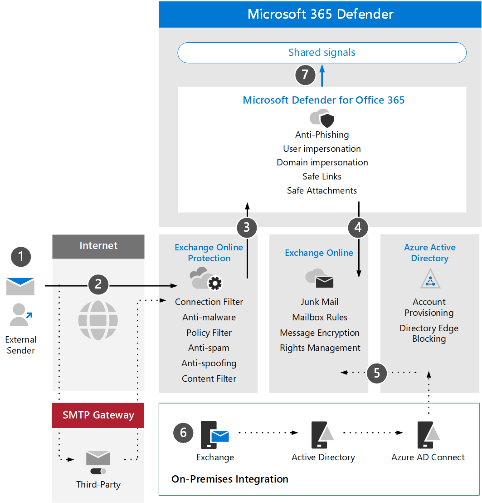

# Review Microsoft Defender for Office 365 architecture requirements and key concepts

**Applies to:**
- Microsoft 365 Defender

[Defender for Office 365 architecture](a)
[Understand key concepts](a)
[Review architecture requirements](a)
[Understand key concepts](a)
[SIEM integration](a)

Before enabling Defender for Office 365, be sure you understand the architecture and can meet the requirements.

## Understand the architecture

The following diagram illustrates baseline architecture for Microsoft Defender for Office which can include a third-party SMTP gateway or on-premises integration. Hybrid coexistence scenarios (i.e. production mailboxes are both on-premise and online) require more complex configurations and are not covered in this article or evaluation guidance.

The following table describes this illustration.

|Call-out  |Description  |
|---------|---------|
|1     | The host server for the external sender typically performs a public DNS lookup for an MX record which provides the target server to relay the message.  This referral can either be Exchange Online (EXO) directly or an SMTP gateway that has been configured to relay against EXO.  |
|2     | The host server for the external sender typically performs a public DNS lookup for an MX record which provides the target server to relay the message.  This referral can either be Exchange Online (EXO) directly or an SMTP gateway that has been configured to relay against EXO.  |
|3     | Exchange Online integrates with Microsoft Defender for Office 365 to offer more advanced threat protections, mitigations, and remediations. |
|4     | A message that is not malicious, blocked, or quarantined is processed and delivered to the recipient in EXO where user preferences related to junk mail, mailbox rules, or other settings are evaluated and triggered. |
|5     | Integration with on-premises Active Directory can be enabled using Azure AD Connect to synchronize and provision mail-enabled objects and accounts to Azure Active Directory and ultimately Exchange Online. |
|6     | When integrating an on-premises environment, it is strongly encouraged to utilize an Exchange server for supported management and administration of mail related attributes, settings, and configurations |
|7     | Microsoft 365 Security Center and Microsoft Defender for Office share signals. |

On-premises integration is common but optional. If your environment is cloud-only this guidance will also work for you.

## Understand key concepts

The following table identified key concepts that are important to understand when evaluating, configuring, and deploying MDO.

|Concept  |Description |More information  |
|---------|---------|---------|
|Administration Portal    |   The URL location where management of tools and features of Office 365 and device, as well as identity and app security takes place.      |    [The unified Microsoft 365 security center](overview-security-center.md)     |
|Exchange Online Protection      |    Exchange Online Protection (EOP) is the cloud-based filtering service that helps protect your organization against spam and malware emails. EOP is included in all Microsoft 365 licenses which include Exchange Online.     |   [Exchange Online Protection overview](../office-365-security/exchange-online-protection-overview.md)      |
|Anti-malware protection     |    Organizations with mailboxes in EXO are automatically protected against malware.     |  [Anti-malware protection in EOP](../office-365-security/anti-malware-protection.md)       |
|Anti-spam protection     |   Organizations with mailboxes in EXO are automatically protected against junk mail and spam policies.      |  [Anti-spam protection in EOP](../office-365-security/anti-spam-protection.md)       |
|Anti-phishing protection |  MDO offers more advanced anti-phishing  protection related to spear phishing, whaling, ransomware, and other malicious activities.   | [Additional anti-phishing protection in Microsoft Defender for Office 365](../office-365-security/anti-phishing-protection.md)   |
|Anti-spoofing protection     |   EOP includes features to help protect your organization from spoofed (forged) senders.      |   [Anti-spoofing protection in EOP](../office-365-security/anti-spoofing-protection.md)      |
|Safe attachments     |   Safe Attachments provides an additional layer of protection by using a virtual environment to check and "detonate" attachments in email messages before they are delivered.      |   [Safe Attachments in Microsoft Defender for Office 365](../office-365-security/safe-attachments.md)      |
|Safe attachments for SharePoint, OneDrive, and Microsoft Teams     |    In addition, Safe Attachments for SharePoint, OneDrive, and Microsoft Teams offers an additional layer of protection for files that have been uploaded to cloud storage repositories.     |  [Safe Attachments for SharePoint, OneDrive, and Microsoft Teams](../office-365-security/mdo-for-spo-odb-and-teams.md)       |
|Safe Links     | Safe Links is a feature that provides URL scanning and rewriting within inbound email messages and offers verification of those links before they are delivered or clicked.        |   [Safe Links in Microsoft Defender for Office 365](../office-365-security/safe-links.md)      |
|    |         |         |

For more detailed information about the capabilities included with Microsoft Defender for Office, see [Microsoft Defender for Office 365 service description](/office365/servicedescriptions/office-365-advanced-threat-protection-service-description).

## Review architecture requirements
A successful MDO evaluation or production pilot assumes the following pre-requisites:
- All your recipient mailboxes currently reside in Exchange Online.
- Your public MX record currently resolves directly to EOP or a third-party SMTP gateway which then relays inbound external email directly to EOP.
- Your primary email domain is configured as authoritative in Exchange Online.
- You have successfully deployed and configured Directory Based Edge Blocking (DBEB) as appropriate. For more information, see [Use Directory Based Edge Blocking to reject messages sent to invalid recipients](/exchange/mail-flow-best-practices/use-directory-based-edge-blocking).

IMPORTANT: If these requirements are not applicable or you are still in a hybrid coexistence scenario, then a Microsoft Defender for Office 365 evaluation can require more complex or advanced configurations which are not fully covered in this guidance.

## SIEM integration

You can integrate Microsoft Defender for Office 365 with Azure Sentinel to more comprehensively analyze security events across your organization and build playbooks for effective and immediate response. For more information, see [Connect alerts from Microsoft Defender for Office 365](/azure/sentinel/connect-office-365-advanced-threat-protection).

Microsoft Defender for Office 365 can also be integrated into other Security Information and Event Management (SIEM) solutions using the [Office 365 Activity Management API](/office/office-365-management-api/office-365-management-activity-api-reference).