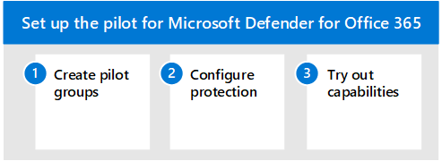

# Pilot Microsoft Defender for Office

**Applies to:**
- Microsoft 365 Defender

**Navigate to:**
- [Step 1: Create pilot groups](#step-1:-create-pilot-groups)
- [Step 2: Congfigure protection](#step-2:-configure-protection)
- [Step 3: Get familiar with simulation, monitoring, and metrics](#step-3:-get-familiar-with-simulation-monitoring-and-metrics)

When you evaluate Microsoft Defender for Office 365, you may choose to pilot specific users before enabling and enforcing policies for your entire organization. Creating distribution groups can help manage the deployment processes. For example, create groups such as *Defender for Office 365 Users - Standard Protection*, *Defender for Office 365 Users - Strict Protection*, *Defender for Office 365 Users - Custom Protection*, or *Defender for Office 365 Users - Exceptions*.

It may not be evident why 'Standard' and 'Strict' are the terms used for this, but that will become clear when you explore more about Defender for Office 365 security presets. Naming groups 'custom' and 'exceptions' speak for themselves, and though most of your users should fall under *standard* and *strict*, custom and exception groups will collect valuable data for you regarding managing risk.

## Step 1: Create pilot groups

Distribution groups can be created and defined directly in Exchange Online or synchronized from on-premises Active Directory.

1. Logon to Exchange Admin Center (EAC) using an account that has been granted Recipient Administrator role or been delegated group management permissions.
2. From the navigation menu, expand *Recipients* and select *Groups*.

:::image type="content" source="../../media/MDOEval/1-MDO-eval-pilot.png" alt-text="Exchange admin center on the navigation menu (the quick launch) with an arrow pointing at Groups. Click Groups.":::

3. From the Groups dashboard, select "Add a group".

:::image type="content" source="../../media/MDOEval/2-MDO-eval-pilot.png" alt-text="Add groups on the Groups panel.":::

4. For group type, select *Distribution* and click Next.

:::image type="content" source="../../media/MDOEval/3-MDO-eval-pilot.png" alt-text="Choose a distribution group type here.":::

5. Give the group a name and description and then click Next.

:::image type="content" source="../../media/MDOEval/4-MDO-eval-pilot.png" alt-text="Name and describe the group.":::

## Step 2: Configure protection

Some capabilities in Defender for Office 365 are configured and turned on by default, but security operations may want to raise the level of protection from the default.

Some capabilities are *not yet* configured. You have three options for configuring protection:

- **Assign preset security policies** — Preset security policies are provided as a method to quickly assign a uniform level of protection across all of the capabilities. You can choose from ***standard*** or ***strict***. A good approach is to start with preset security policies and then fine-tune the policies as you learn more about the capabilities and your own unique threat environment. The advantage here is that you protect groups of users as quickly as possible, with the ability to tweak protection afterward. (This method is recommended.)
- **Configure baseline protection manually** — If you prefer to configure the environment yourself, you can quickly achieve a *baseline* of protection by following the guidance in [Protect against threats](../office-365-security/protect-against-threats.md). With this approach you get to learn more about the settings that are configurable. And, of course, you can fine-tune the policies later.
- **Configure custom protection policies** — You can also build and assign custom protection policies as part of your evaluation. Before you start customizing policies, it's important to understand the precedence in which these protection policies are applied and enforced. Security ops will need to create some policies even if when the preset is applied, in specific in order to define security policies for Safe Links and Safe Attachments.

> [!IMPORTANT]
> What goes into the **Standard** and **Strict** preset security policies? See the full list of configurations here *[Recommended settings for EOP and Microsoft Defender for Office 365 security](../office-365-security/recommended-settings-for-eop-and-office365.md)*.

### Assign preset security policies

It's encouraged to begin with the *recommended baseline policies* when evaluating MDO and then refine them as needed over the course of your evaluation period.

You can enable recommended EOP and Defender for Office 365 protection policies fast, and assign them to specific pilot users or defined groups as part of your evaluation. Preset policies offer a baseline **Standard** protection template or a more aggressive **Strict** protection template which can be assigned independently, or combined.

Here is the [Preset security policies in EOP and Microsoft Defender for Office 365](../office-365-security/preset-security-policies.md) article outlining the steps.

1. Log on to your Microsoft 365 tenant. Use an account with access to the Security Center, added to Organization Management role in Office 365, or Security Administrator role in Microsoft 365.
2. From the navigation menu, select "Polices & Rules" under Email & Collaboration.
:::image type="content" source="../../media/MDOEval/5-MDO-eval-pilot.png" alt-text="Under Email & Collaboration on the navigation panel, click Policies & rules.":::
3. On the Policy & Rules dashboard, click "Threat Policies".
:::image type="content" source="../../media/MDOEval/6-MDO-eval-pilot.png" alt-text="a":::
4. From the Security Admin Center, expand Threat Management from the navigation menu and then select Policy from the submenu.
5. On the Policy dashboard, click the *Preset security policies* tile. 
:::image type="content" source="../../media/MDOEval/7-MDO-eval-pilot.png" alt-text="Click the Preset Security Policies tile.":::
6. Click *Edit* to configure and assign the Standard policy and/or Strict policy. :::image type="content" source="../../media/MDOEval/8-MDO-eval-pilot.png" alt-text="On the Preset security policies panel, click Edit.":::
7. Add conditions to apply baseline ***EOP*** protections to specific pilot users, or groups of users, as needed, and select *Next* to continue.
    - Example, a Defender for Office 365 condition for pilot evaluations could be applied if the recipients are *members* of a defined *Defender for Office 365 Standard Protection* group, and then managed by simply adding accounts to, or removing account from, the group.
 :::image type="content" source="../../media/MDOEval/9-MDO-eval-pilot.png" alt-text="Add the conditions needed to apply the EOP security level to your pilot group.":::
9. Add conditions to apply baseline ***MDO*** protections to specific pilot users, or groups of users, as needed. Click *Next* to continue.
    - For example, a Defender for Office 365 condition for pilot evaluations could be applied if the recipients are *members* of a defined *Defender for Office 365 Standard Protection* group and then managed by simply adding / removing accounts via the group.
1:::image type="content" source="../../media/MDOEval/10-MDO-eval-pilot.png" alt-text="Add the conditions needed to apply the Defender for Office 365 security level to your pilot group.":::
8. Review and confirm your changes for assigning preset security policies.
9. Preset protection policies can be managed (re-configured, re-applied, disabled, etc.) by returning to the Security Admin Center and clicking the *Preset security policies* tile.

### Configure custom protection policies

The pre-defined *Standard* or *Strict* Defender for Office 365 policy templates give your pilot users the recommended baseline protection. However, you can also build and assign custom protection policies as part of your evaluation.

It's *important* to be aware of the precedence these protection policies take when applied and enforced, as [Order and precedence of email protection - Office 365](../office-365-security/how-policies-and-protections-are-combined.md) explains.

The table below provides references and additional guidance for configuring and assigning custom protection policies:

|Policy   |Description  |Reference  |
|:---------:|---------|---------|
|Connection Filtering     |    Identify good or bad source email servers by their IP addresses.     |     [Configure the default connection filter policy in EOP](../office-365-security/configure-the-connection-filter-policy.md)    |
|Anti-Malware    |    Protect users from email malware including what actions to take and who to notify if malware is detected.     |    [Configure anti-malware policies in EOP](../office-365-security/configure-anti-malware-policies.md)     |
|Anti-Spoofing     |  Protect users from spoofing attempts using spoof intelligence and spoof intelligence insights.   |     [Configure spoof intelligence in Defender for Office 365](../office-365-security/learn-about-spoof-intelligence.md)    |
|Anti-Spam     |    Protect users from email spam including what actions to take if spam is detected.     |    [Configure anti-spam policies in Defender for Office 365](../office-365-security/configure-your-spam-filter-policies.md)     |
|Anti-Phishing     |   Protect users from phishing attacks and configure safety tips on suspicious messages      |     [Configure anti-phishing policies in Defender for Office 365](../office-365-security/configure-mdo-anti-phishing-policies.md)    |
|Safe Attachments     |    Protect users from malicious content in email attachments and files in SharePoint, OneDrive, and Teams.     |    [Set up safe attachment policies in Defender for Office 365](../office-365-security/set-up-safe-attachments-policies.md)     |
|Safe Links     |     Protect users from opening and sharing malicious links in email messages or Office desktop apps.    |    [Set up safe links policies in Defender for Office 365](../office-365-security/set-up-safe-links-policies.md)     |

## Step 3: Get familiar with simulation, monitoring, and metrics

Now that your pilot is set up and configured, it's helpful to become familiar with the reporting, monitoring, and attack simulation tools that are unique to Microsoft Defender for Microsoft 365.

|Capability  |Description  |More information  |
|---------|---------|---------|
|Threat Explorer     | Threat Explorer is a powerful near real-time tool to help Security Operations teams investigate and respond to threats and displays information about suspected malware and phish in email and files in Office 365, as well as other security threats and risks to your organization.        | [Views in Threat Explorer and real-time detections ](../office-365-security/threat-explorer-views.md)       |
|Attack Simulator     | You can use Attack Simulator in the Security & Compliance Center to run realistic attack scenarios in your organization which help you identify and find vulnerable users before a real attack impacts your environment.        |  [Attack Simulator in Microsoft Defender for Office 365](../office-365-security/attack-simulator.md)       |
|Reports dashboard     | On the left navigation menu, click Reports and expand the Email & collaboration heading. The Email & collaboration reports are about spotting security trends some of which will allow you to take action (through buttons like 'Go to submissions'), and others that will show trends, like Mailflow status summary, Top Malware, Spoof detections, Compromised users, Mail latency, Safe Links and Safe attachments reports. These metrics are generated automatically.  |    [v](../office-365-security/view-email-security-reports.md)     |

### Navigation you may need

[**Return to the Eval Overview** 'Evaluate and pilot Microsoft 365 Defender' | Microsoft Docs](../office-365-security/defender/eval-overview.md) 

[**Return to the evaluation environment** article | Microsoft Docs](/microsoft-365/security/defender/eval-defender-office365-enable-eval)

### Helpful information

[Recommended settings for EOP and Microsoft Defender for Office 365 security](../office-365-security/recommended-settings-for-eop-and-office365.md)