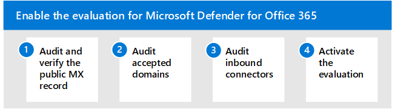

# Enable the evaluation environment

**Applies to:**
- Microsoft 365 Defender

Intro

## Step 1: Activate trial licenses

## Step 2: Audit and verify the public MX record

## Step 3: Audit accepted domains

## Step 4: Audit inbound connectors

## Step 5: Activate the evaluation