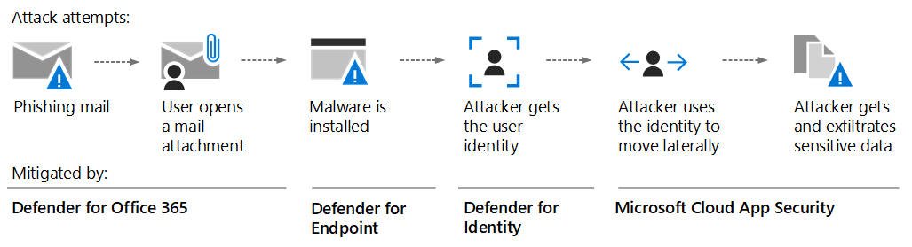
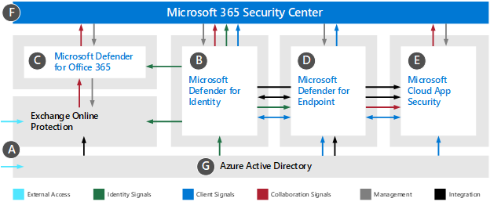
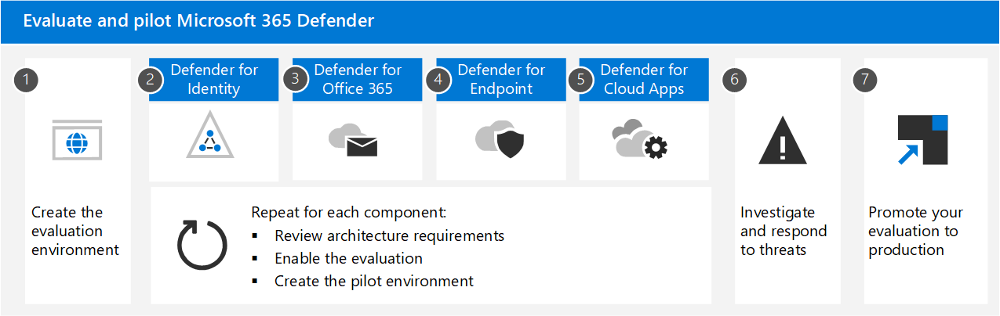

# Evaluate and pilot Microsoft 365 Defender

- [Microsoft 365 Defender evaluation gains](#evaluate-and-pilot-microsoft-365-defender)
- [The anatomy (of thwarting) an Attack](#anatomy-of-an-attack)
- [Understand Microsoft 365 Defender components](#understand-microsoft-365-defender-components)
- [Microsoft 365 Defender architecture](#microsoft-365-defender-architecture)
- [Plan your Evaluation](#plan-your-evaluation)
- [Other Articles in this series](#other-articles-in-this-series)

**Applies to:**
- Microsoft 365 Defender

<!--
Cyberattacks can cause major problems, from a loss of trust to financial woes, for your organization. Business-threatening downtime, and worse, isn't uncommon. Protecting against threats is *critical*, but it can be challenging to decide where to focus your organization's time, effort, and resources.-->

**The strength of Microsoft security solutions is built on *trillions* of signals Microsoft processes every day in the Intelligent Security Graph**. That experience becomes the basis for 'teaching' security solutions like *Microsoft 365 Defender*, which  brings together signals from across your *email*, *data*, *devices*, *apps*, and *identities* to paint a picture of advanced threats against your organization. Microsoft 365 E5 security solutions are *built into* Microsoft products and services, and include machine learning and automation that can lighten the load faced by security teams, by processing the flood of data and alerting security teams to only the signals they need to see.

Microsoft 365 Defender is a Cloud-based, unified, pre- and post-breach enterprise defense suite that coordinates *prevention*, *detection*, *investigation*, and *response* across endpoints, identities, apps, email, collaborative applications, and all of their data.

## The anatomy of thwarting an Attack

In this illustration an attack is underway. Phishing email arrives at the Inbox of an employee in your organization, who unknowingly opens the email attachment. This installs malware, which leads to a chain of events that could end with the theft of sensitive data. But in this case, Defender for Office 365 is in operation.

- **Exchange Online Protection**, part of Microsoft Defender for Office 365, can detect the phishing email and use mail flow rules to make certain it never arrives in the Inbox.
- **Defender for Office 365** safe attachments tests the attachment and determines it is harmful, so the mail that arrives either isn't actionable by the user, or policies prevent the mail from arriving at all.
- **Defender for Endpoint** manages devices that connect to the corporate network and detect device and network vulnerabilities that might otherwise be exploited.
- **Defender for Identity** takes note of sudden account changes like privilege escalation, or high-risk lateral movement. It also reports on easily exploited identity issues like unconstrained Kerberos delegation, for correction by the security team.
- **Microsoft Cloud App Security** notices anomalous behaviour like impossible-travel, credential access, and unusual download, file share, or mail forwarding activity and reports these behaviours.

## Understand Microsoft 365 Defender components

Microsoft 365 Defender is made up of these security technologies, operating in tandem:

|Component  |Acronym  |Description  |Reference material  |
|---------|---------|---------|---------|
|Microsoft Defender for Identity     |  MDI       |    Microsoft Defender for Identity uses Active Directory signals to identify, detect, and investigate advanced threats, compromised identities, and malicious insider actions directed at your organization.     |     [What is Microsoft Defender for Identity? | Microsoft Docs](/defender-for-identity/what-is)   |
|Exchange Online Protection     |    EOP     |   Exchange Online Protection is the native cloud-based SMTP relay and filtering service that helps protect your organization against spam and malware.      |   [Exchange Online Protection (EOP) overview - Office 365 | Microsoft Docs ](../office-365-security/overview.md)     |
|Microsoft Defender for Office 365     |   MDO      |   Microsoft Defender for Office 365 safeguards your organization against malicious threats posed by email messages, links (URLs) and collaboration tools.      |    [Microsoft Defender for Office 365 - Office 365 | Microsoft Docs ](../office-365-security/overview.md)    |
|Microsoft Defender for Endpoint     |    MDE     |   Microsoft Defender for Endpoint is a unified platform for device protection, post-breach detection, automated investigation, and recommended response.      |   [Microsoft Defender for Endpoint - Windows security | Microsoft Docs ](../defender-endpoint/microsoft-defender-endpoint.md)    |
|Microsoft Cloud App Security     |    MCAS     |  Microsoft Cloud App security is a comprehensive cross-SaaS solution bringing deep visibility, strong data controls, and enhanced threat protection to your cloud apps.       |    [What is Cloud App Security? | Microsoft Docs ](/cloud-app-security/what-is-cloud-app-security)    |

## Microsoft 365 Defender architecture

The diagram below illustrates high-level architecture for key Microsoft 365 Defender components and integrations. *Detailed* architecture for each Defender component, and use-case scenarios, are given throughout this series of articles.

|  |  |
|---------|---------|
|A     |     External access and entry points (including email, sharing, and collaboration) for Microsoft 365 services is primarily controlled by Azure Active Directory and Exchange Online Protection policies.    |
|B     |    Microsoft Defender for Office 365 is used to manage, monitor, and enforce advanced threat protection policies for Exchange Online, SharePoint Online, Microsoft Teams, and OneDrive for Business and can evaluate signals from Microsoft Defender for Identity.     |
|C     |    Microsoft Defender for Identity analyzes authentication and authorization signals from Azure Active Directory, Active Directory Domain Services, and Active Directory Federation services to evaluate and report risk-based conditional access and collaboration.     |
|D    |    Microsoft Defender for Endpoint manages and enforce advanced device protections while integrating and evaluating signals from Microsoft Defender for Identity.     |
|E    |   Microsoft Cloud App Security evaluates collaboration, identity, and client signals to provide policy-based protection and reporting related to M365 workloads and other cloud solutions.      |
|F    |    Microsoft 365 Security Center offers a unified dashboard to configure and manage various Defender components, perform investigations, and      |
|G    |    Azure Active Directory is the primary authentication provider for all Microsoft 365 services and used to evaluate, enforce, and control Microsoft Defender policies.     |
|H     |    Identity provisioning and federated authentication can be integrated with on-premises Active Directory Domain Services by deploying Azure Active Directory Connect and/or Active Directory Federation Services and then monitored using Microsoft Defender for Identity.     |
|I    |   Detailed signal data from all Microsoft Defender components can be integrated into Azure Sentinel and combined with other logging sources to offer full SIEM and SOAR capabilities and insights.      |

## Plan your Evaluation

> [!IMPORTANT]
> **Be sure to review** the architectural requirements before you enable the evaluation of each component in Microsoft 365 Defender.

**You can start** with the creation of an evaluation environment, or you can use an existing environment, but the *recommended* process is to start with Defender for Identity, and then enable evaluation for Defender for Office (this product includes EOP and so you will actually evaluate *both* here), Defender for Endpoint, and Cloud App Security.

Next create any pilot user groups or specifics of the pilot environment you want to evaluate in (if this is an environment without real business signals, some of the work here might include prepping to use Attack Simulator in Defender for Office). If you are aware of the reporting in Microsoft 365 Defender, you can choose any measurement metrics during this phase.

Now investigate and respond to threats, and keep a log of your experience. This may include taking note of the reports generated, who should see and act on them, and the number of threats logged, for example. Or it may involve polling your pilot group for feedback as you apply features and policies. The metrics should be determined by your priorities.

**At the end** of the evaluation process, if you are testing in an existing environment, simply promote your evaluation configurations to production. If you're testing in an isolated environment, you may plan to take what you've already learned and evaluate in an existing live environment next. This will give you the opportunity to apply your learnings and configurations to the live environment post evaluation.

> [!IMPORTANT]
> If you already have a production M365 tenant, then you can activate E5 trial licenses to evaluate M365 Defender in your *current environment* and ultimately retain these features with the purchase of licenses after the evaluation period.

> [!TIP]
> This is the *recommended* configuration. However, your configuration may vary according to the needs of your company.

## Other Articles in this series

List the other articles in this series.
