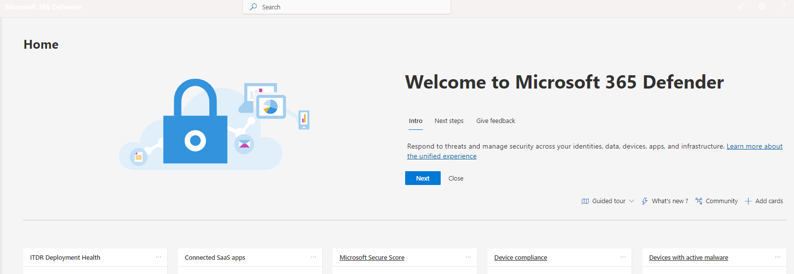

# Provide feedback on Microsoft 365 Defender

[!INCLUDE [Microsoft 365 Defender rebranding](../includes/microsoft-defender.md)]

**Applies to:**
- Microsoft 365 Defender

Your feedback helps us get better in protecting your environment from advanced attacks. Share your experience, impressions, and  requests by providing feedback.

Check out this video to see how easy it is to provide feedback.

> [!VIDEO https://www.microsoft.com/en-us/videoplayer/embed/RE4LWeP]

1. From any part of the portal, select **Give feedback**. 

    

2. Rate your experience and provide details on what you liked or where improvement can be made. You can also choose to be contacted about the feedback. 

3. Select **Submit**.
