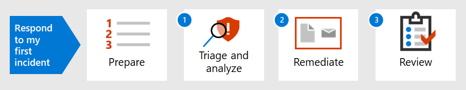

# Introduction to responding to your first incident

[!INCLUDE [Microsoft 365 Defender rebranding](../includes/microsoft-defender.md)]

**Applies to:**
- Microsoft 365 Defender

An organization's incident response strategy determines its ability to deal with increasingly disruptive security incidents and cybercrime. While taking preventative measures is important, the ability to act quickly to contain, eradicate, and recover from detected incidents can minimize damage and business losses.

This incident response walkthrough shows how you, as part of a security operations team, can perform most of the key incident response steps within Microsoft 365 Defender. Here are the steps:

- Preparation of your security posture
- For each incident:
  - Step 1: Triage and analysis
  - Step 2: Remediation (containment, eradication, and recovery)
  - Step 3: Post-incident review

A security incident is defined by National Institute of Standards and Technology (NIST) as "an occurrence that actually or potentially jeopardizes the confidentiality, integrity, or availability of an information system; or the information the system processes, stores, or transmits; or that constitutes a violation or imminent threat of violation of security policies, security procedures, or acceptable use policies."

Incidents in Microsoft 365 Defender are the logical starting points for analysis and incident response. Analyzing and remediating incidents typically makes up most of a security operations team's tasks.

## Next step

Make sure your organization and Microsoft 365 tenant is [prepared for incident handling](first-incident-prepare.md).

## See also

Incident response guidance for Microsoft 365 Defender:

- [Incidents overview](incidents-overview.md)
- [Investigate incidents](investigate-incidents.md)
- [Manage incidents](manage-incidents.md)

Additional examples of first incident responses:

- [Phishing email](first-incident-path-phishing.md)
- [Identity-base attack](first-incident-path-identity.md)

[Detailed incident response playbooks](https://docs.microsoft.com/security/compass/incident-response-playbooks)

