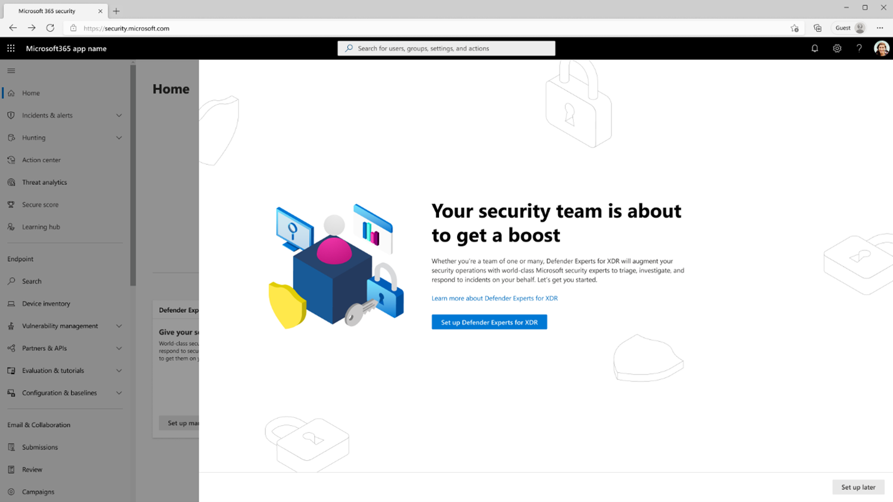
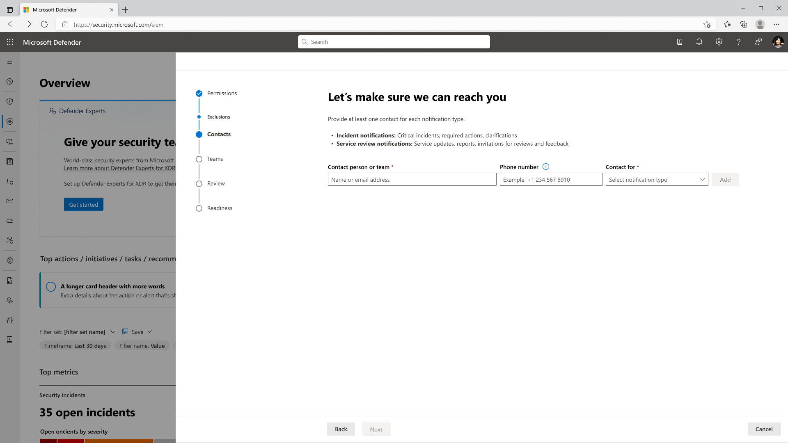

# Get started with Microsoft Defender Experts for XDR

**Applies to:**

- [Microsoft 365 Defender](https://go.microsoft.com/fwlink/?linkid=2118804)

Once the Defender Experts for XDR team is ready to onboard your organization, you’ll receive a welcome email to continue the setup and get you started.

Select the link in the welcome email to directly launch the Defender Experts settings wizard in the Microsoft 365 Defender portal. You can also open this wizard by going to **Settings** > **Defender Experts** and selecting **Get started**.

## Grant permissions to our experts

By default, Defender Experts for XDR requires Service provider access that lets our experts sign into your tenant and deliver services based on assigned security roles. [learn more about cross-tenant access](/azure/active-directory/external-identities/cross-tenant-access-overview)

You also need to grant our experts temporary, scoped access only as needed, depending on the type of work you’d like them to handle on your behalf:

- **Investigate incidents and guide my responses** (default) – This option lets our experts proactively monitor and investigate incidents and guide you through any necessary response actions. (Access level: Security Reader)
- **Respond directly to active threats** (recommended) – This option lets our experts contain and remediate active threats immediately while investigating, thus reducing the threat’s impact, and improving your overall response efficiency. (Access level: Security Operator)

[Learn more about access levels](/azure/active-directory/roles/permissions-reference)

Follow these steps to grant our experts permissions:

1. In the same Defender Experts settings page mentioned earlier, under **Permissions**, choose the access level(s) you want to grant our experts.
2. Select **Next**, to add contact persons or teams.[**link to current document-tell us who to contact for imp matters**]

> [!IMPORTANT]
> If you skip providing additional permissions, our experts won't be able to take certain response actions to secure your organization.

To edit or update permissions after the initial setup, go to **Settings** > **Defender Experts** > **Permissions**. In this page, you also have the option to turn **Access security data from all devices** on or off under the access levels.

> [!IMPORTANT]
> If you turn off Access security data from all devices, our experts won’t be able to investigate incidents involving devices that belong to Microsoft Defender for Endpoint device groups. Learn more about device groups. [Learn more about device groups](../defender-endpoint/machine-groups.md)

## Tell us who to contact for important matters

Defender Experts for XDR lets you identify who in your organization we’ll have to notify for critical incidents, service updates, occasional questions, and other recommendations. These persons or groups will then receive an email informing them that they’ve been selected as an incident response or a service review contact.

1. In the same Defender Experts settings wizard mentioned earlier, under **Incident contact**, search for, and add your contact persons or teams. These are the contacts we’ll use for guided response notifications or any communication that requires a prompt response.

> [!NOTE]
> Given the urgent nature of the communications, it is recommended to have someone available at all times.

1. Select **Next**. Under Service review contact, search for and add your contact persons or teams. These are the contacts we’ll use for ongoing security briefings done by our service delivery team.

1. Select Next. The settings wizard will then provide you with information about the **Next steps**, including working with our experts to [optimize your security posture](**to be linked to run initial defender experts readiness checks**).

1. Select **Close** to exit the settings wizard.

To edit or update your notification contacts after the initial setup, go to **Settings** > **Defender Experts** > **Notification contacts**:

1. Search for your **Contact person or team** in the text field provided.
2. Select the **Notification type** from the dropdown box.
3. Select **Add**.

## Run initial Defender Experts readiness checks

Apart from onboarding service delivery, our expertise on the Microsoft 365 Defender product suite enables Defender Experts for XDR to run an initial readiness assessment to help you get the most out of your Microsoft security products.

The initial readiness engagement will be based on your [Microsoft Secure Score](../defender/microsoft-secure-score.md) and Defender Experts' policy recommendations. Our experts will help prioritize and customize our recommendations to fit your environment. They'll request your engagement to get those configurations implemented.

Once you’ve completed the readiness checks, our experts will start monitoring your environment closely to identify latent threats, sources of risk, and normal activity. As we get better understanding of your critical assets, we’ll be able to streamline the service and fine-tune our responses.

## Go to the next step

[Start using Microsoft Defender Experts for XDR preview service](start-using-mdex-xdr.md)
