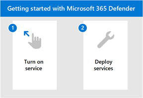

# Get started with Microsoft 365 for Defender

[!INCLUDE [Microsoft 365 Defender rebranding](../includes/microsoft-defender.md)]

**Applies to:**
- Microsoft 365 Defender

[!INCLUDE [Prerelease](../includes/prerelease.md)]

Microsoft 365 Defender is a unified experience where you can monitor and manage security across your enterprise. With the integrated alerts across identities, endpoints, data, apps, email, and collaboration tools - investigating and responding to threats now happen in a central location. 

Whether you're new to the Microsoft suite of security products or familiar with individual workflows, this topic will guide you in the simple steps you need to take to get started with Microsoft 365 Defender.

In general, you'll need to take the following steps to get started:

- **[Step 1: Turn on Microsoft 365 Defender](m365d-enable.md)**  
    You'll first need to turn on the service by making sure you have the right license in place and roles are assigned so that you can access the portal. 

    You'll then go through some simple settings and then you can confirm that the service is on.

- **[Step 2: Deploy supported services](deploy-supported-services.md)**  
    After completing the initial steps, you'll need to deploy the supported services that come with Microsoft 365 Defender. Deploying services effectively increases your visibility in the signals from assets across your network.

## Key capabilities
Turning on Microsoft 365 Defender and deploying services will give you access to the following key capabilities:

| Capability | Description |
| ------ | ------ |
| Microsoft Defender for Endpoint | Endpoint protection suite built around powerful behavioral sensors, cloud analytics, and threat intelligence |
|Microsoft Defender for Office 365 | Advanced protection for your apps and data in Office 365, including email and other collaboration tools |
| Microsoft Defender for Identity | Defend against advanced threats, compromised identities, and malicious insiders using correlated Active Directory signals |
| Microsoft Cloud App Security | Identify and combat cyberthreats across your Microsoft and third-party cloud services |

