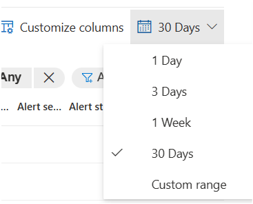
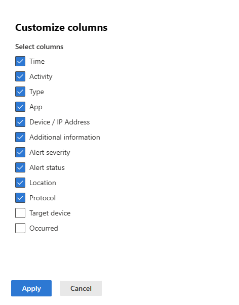
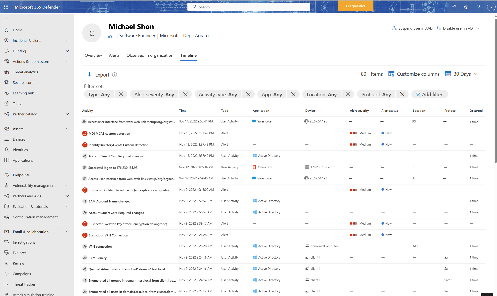

# Investigate users in Microsoft 365 Defender

[!INCLUDE [Microsoft 365 Defender rebranding](../includes/microsoft-defender.md)]

**Applies to:**

- Microsoft 365 Defender

The user entity page in Microsoft 365 Defender helps you in your investigation of user identities. The page has all the important information about each identity. If an alert or incident indicates that a user might be compromised or is suspicious, check and investigate the user profile. 

You can find identity information in the following views:

- Identities page
- Alerts queue
- Any individual alert/incident
- Device page
- Activity log
- Advanced hunting queries
- Action center
 
A clickable identity link is available in these views that will take you to the **User** page where more details about the user are shown. For example, you can see the details of user accounts identified in the alerts of an incident in the Microsoft 365 Defender portal at **Incidents & alerts** \> ***incident*** \> **Users**.

:::image type="content" source="../../media/investigate-users/Fig1-user-incident-overview.png" alt-text="The Users page for an incident in the Microsoft 365 Defender portal." lightbox="../../media/investigate-users/Fig1-user-incident-overview.png":::

When you investigate a specific identity, you'll see the:

- [Overview](#overview), including identity details, incident and alerts visual view, investigation priority, and scored timeline
- [Active Alerts](#alerts) tab
- [Observed in organization](#observed-in-organization) tab
- [Identity timeline](#timeline) tab
- [Remediation actions](#remediation-actions)

:::image type="content" source="../../media/investigate-users/Fig2-user-incident-overview.png" alt-text="A specific user's page in the Microsoft 365 Defender portal" lightbox="../../media/investigate-users/Fig2-user-incident-overview.png":::

> [!NOTE]
> The user page shows the Azure Active Directory (Azure AD) organization as well as groups, helping you understand the groups and permissions associated with a user.

## Overview

### Entity details

The **Entity details** on the left of the page provide information about the user, such as the Azure Active Directory (Azure AD) Identity risk level, the number of devices the user is signed in to, when the user was first and last seen, the user's accounts, groups that the user belongs to, contact information, and more. You'll see other details depending on the integration features you've enabled.

### Visual view of incidents and alerts

This card includes all incidents and alerts, grouped into severities, associated with an identity.

### Investigation priority

This card includes the calculated investigation priority score breakdown and a two-week trend for an identity, including whether the identity score is on the high percentile for that tenant.

### Active directory account control 

In this card, Defender for Identity surfaces security settings that may need your attentions. You can see important flags about the user, such as if the user can press enter to bypass the password, and if the user has a password that never expires, etc.

For more information, see [User Account Control flags](/windows/win32/adschema/a-useraccountcontrol).

### Scored activities

This card includes all activities and alerts contributing to the overall Investigation priority score over the last seven days.

### Organization tree

This section shows the hierarchy for the identity as reported by Microsoft Defender for Identity.

### Account tags

Defender for Identity pulls tags out of Active Directory to give you a single interface for monitoring your Active Directory users and entities. Tags provide you with details from Active Directory about the entity, and include:

|Name | Description |
|-----|-------------|
| **New** | Indicates that the entity was created less than 30 days ago. |
| **Deleted** | Indicates that the entity was permanently deleted from Active Directory. |
| **Disabled** |  Indicates that the entity is currently disabled in Active Directory. The *disabled* attribute is an Active Directory flag that's available for user accounts, computer accounts, and other objects to indicate that the object is not currently in use.   When an object is disabled, it can't be used to sign in or perform actions in the domain.|
| **Enabled** | Indicates that the entity is currently enabled in Active Directory, indicating that the entity is currently in use, and can be used to sign in or perform actions in the domain.  |
| **Expired** |  Indicates that the entity is expired in Active Directory. When a user account is expired, the user is no longer able to log in to the domain or access any network resources. The expired account is essentially treated as if it were disabled, but with an explicit expiration date set.   Any services or applications that the user was authorized to access may also be affected, depending on how they are configured. |
| **Honeytoken** |   Indicates that the entity is manually tagged as a honeytoken. |
| **Locked** |  Indicates that the entity supplied the wrong password too many times, and is now locked. |
| **Partial** | Indicates that the user, device, or group is not in synch with the domain, and is partially resolved via a global catalog. In this case, some attributes aren't available. |
| **Unresolved** |  Indicates that the device doesn't resolve to a valid identity in the Active Directory forest. No directory information is available. |
| **Sensitive** |  Indicates that the entity is considered as sensitive. |

For more information, see [Defender for Identity entity tags in Microsoft 365 Defender](/defender-for-identity/entity-tags).

> [!NOTE]
> The organization tree section and the account tags are available when a Microsoft Defender for Identity license is available.

## Alerts

You can see all active alerts involving the user from the last 180 days in this tab. Information like alert severity and the time the alert was generated is available in this tab. Clicking on the alert row shows you additional information about the alert.

:::image type="content" source="../../media/investigate-users/Fig3-user-incident-alertstab.png" alt-text="The user account's related alerts seen in the Alerts tab in the Microsoft 365 Defender portal" lightbox="../../media/investigate-users/Fig3-user-incident-alertstab.png":::

## Observed in organization

- Devices - this section includes information on the devices the identity signed in to, including most and least used in the last 180 days.
- Locations - this section includes all the observed locations for the identity in the last 30 days.
- Groups - this section includes all observed on-premises groups for the identity, as reported by Defender for Identity.
- Lateral movement paths - this section includes all profiled lateral movement paths from the on-premises environment detected by Defender for Identity.

> [!NOTE]
> Groups and lateral movement paths are available when a Microsoft Defender for Identity license is available.

Selecting the **Lateral movements** tab lets you view a fully dynamic and clickable map where you can see the lateral movement paths to and from a user. An attacker can use the path information to infiltrate your network.

The map provides a list of other devices or users an attacker can take advantage of to compromise a sensitive account. If the user has a sensitive account, you can see how many resources and accounts are directly connected.

The lateral movement path report, which can be viewed by date, is always available to provide information about the potential lateral movement paths discovered and can be customized by time. Select a different date using **View a different date** to view previous lateral movement paths found for an entity. The graph only displays if a potential lateral movement path has been found for an entity in the past two days.

:::image type="content" source="../../media/investigate-users/Fig4-user-incident-difftabs.png" alt-text="The Observed in organization view showing device, group, location, and lateral movement paths for a user in the Microsoft 365 Defender portal" lightbox="../../media/investigate-users/Fig4-user-incident-difftabs.png":::

## Timeline

The timeline represents activities and alerts observed from a user's identity in the last 30 days. It unifies the user's identity entries across Microsoft Defender for Identity, Microsoft Defender for Cloud Apps, and Microsoft Defender for Endpoint workloads. By using the timeline, you can focus on activities a user performed or were performed on them in specific timeframes.

- **Custom time range picker:** You can choose a timeframe to focus your investigation on the last 24 hours, the last 3 days and so on. Or you can choose a specific timeframe by clicking on **Custom range**. For example:

  
  
- **Timeline filters:** In order to improve your investigation experience, you can use the timeline filters: Type (Alerts and/or user's related activities), Alert severity, Activity type, App, Location, Protocol. Each filter depends on the others, and the options in each filter (drop-down) only contains the data that is relevant for the specific user.

- **Export button:** You can export the timeline to a CSV file. Export is limited to the first 5000 records and contains the data as it displays in the UI (same filters and columns). 

- **Customized columns:** You can choose which columns to expose in the timeline by selecting the **Customize columns** button. For example:

  

### What data types are available?

The following data types are available in the timeline:
- A user's impacted alerts
- Active Directory and Azure AD activities
- Cloud apps' events
- Device logon events
- Directory services changes

### What information is displayed?

The following information is displayed in the timeline:
- Activity/alert description
- Date and time of the activity
- Application that performed the activity
- Source device/IP address
- [MITRE ATT&CK](https://attack.mitre.org/) techniques 
- Alert status and severity
- Country/region where the client IP address is geolocated
- Protocol used during the communication
- Target device (customized column)
- Number of times the activity happened (customized column)

For example:

> [!NOTE]
> Microsoft 365 Defender can display date and time information using either your local time zone or UTC. The selected time zone will apply to all date and time information shown in the Identity timeline. 
> To set the time zone for these features, go to **Settings** > **Security center** > **Time zone**.

## Remediation actions

From the Overview page, you can do these additional actions:

- Enable, disable, or suspend the user in Azure AD
- Direct user to do certain actions such as require the user to sign in again or force password reset
- Reset investigation priority score for the user
- View Azure AD account settings, related governance, the user's owned files, or the user's shared files

:::image type="content" source="../../media/investigate-users/Fig6-user-incident-actions.png" alt-text="The actions for remediation for a user in the Microsoft 365 Defender portal" lightbox="../../media/investigate-users/Fig6-user-incident-actions.png":::

For more information, see [Remediation actions in Microsoft Defender for Identity](/defender-for-identity/remediation-actions).

## Next steps

As needed for in-process incidents, continue your [investigation](investigate-incidents.md).

## See also

- [Incidents overview](incidents-overview.md)
- [Prioritize incidents](incident-queue.md)
- [Manage incidents](manage-incidents.md)

[!INCLUDE [Microsoft 365 Defender rebranding](../../includes/defender-m3d-techcommunity.md)]
