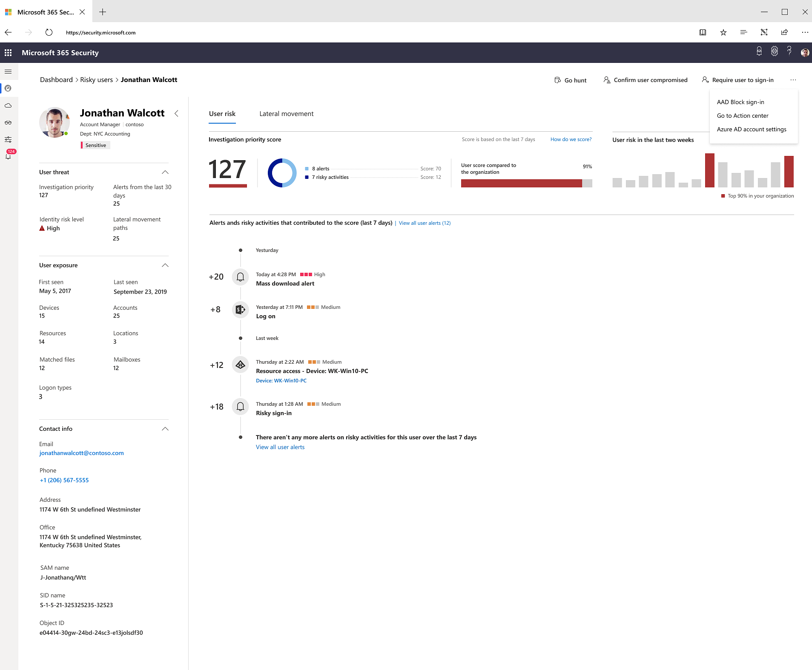

# Investigate users in Microsoft 365 security center

[!INCLUDE [Microsoft 365 Defender rebranding](../includes/microsoft-defender.md)]

[!INCLUDE [Prerelease](../includes/prerelease.md)]

**Applies to:**

- Microsoft 365 Defender

As part of your investigation, you might find that a user has been compromised.

The Microsoft 365 security center user page combines information from Microsoft Defender for Endpoint, Microsoft Defender for Identity, and Microsoft Cloud App Security (depending on what licenses you have). This page is the ideal starting place for investigating users and potential incidents.

This page shows information specific to the security risk of a user. This includes a score that helps assess risk, recent events and alerts that contributed to the overall risk of the user, and more.

You can access this page from multiple areas in the Microsoft 365 security center. You can access this page from a specific incident in the **Users** tab. Some alerts might include users as a specific affected asset. You can also search for users.  

Learn more about how to investigate users and potential risk [in this Cloud App Security tutorial](https://docs.microsoft.com/cloud-app-security/tutorial-ueba#:~:text=To%20identify%20who%20your%20riskiest,user%20page%20to%20investigate%20them).

## Related topics

- [Incidents overview](incidents-overview.md)
- [Prioritize incidents](incident-queue.md)
- [Manage incidents](manage-incidents.md)