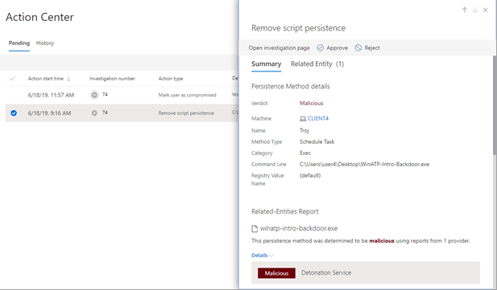

# View and manage actions in the Action center

[!INCLUDE [Microsoft 365 Defender rebranding](../includes/microsoft-defender.md)]

**Applies to:**
- Microsoft 365 Defender

Threat protection features in Microsoft 365 Defender can result in certain remediation actions. Here are some examples:
- [Automated investigations](m365d-autoir.md) can result in remediation actions that are taken automatically or await approval.
- Antivirus, antimalware, and other threat protection features can result in remediation actions, such as blocking a file, URL, or process, or sending an artifact to quarantine.
- Your security operations team can take remediation actions manually, such as during [advanced hunting](advanced-hunting-overview.md) or while investigating [alerts](investigate-alerts.md) or [incidents](investigate-incidents.md).

> [!NOTE]
> You must have [appropriate permissions](m365d-action-center.md#required-permissions-for-action-center-tasks) to approve or reject remediation actions. For more information, see [Prerequisites for automated investigation and response in Microsoft 365 Defender](m365d-configure-auto-investigation-response.md#prerequisites-for-automated-investigation-and-response-in-microsoft-365-defender).

## Review pending actions in the Action center

It's important to approve (or reject) pending actions as soon as possible so that your automated investigations can proceed and complete in a timely manner. 

1. Go to [https://security.microsoft.com](https://security.microsoft.com) and sign in. 

2. In the navigation pane, choose **Action center**. 

3. In the Action Center, on the **Pending** tab, select an item in the list. Its flyout pane opens.

4. Review the information in the flyout pane, and then take one of the following steps:
   - Select **Open investigation page** to view more details about the investigation.
   - Select **Approve** to initiate a pending action.
   - Select **Reject** to prevent a pending action from being taken.
   - Select **Go hunt** to go into [Advanced hunting](advanced-hunting-overview.md). 

## Undo completed actions

If you’ve determined that a device or a file is not a threat, you can undo remediation actions that were taken, whether those actions were taken automatically or manually. In the Action center, on the **History** tab, you can undo any of the following actions:  

| Action source | Supported Actions |
|:---|:---|
| - Automated investigation  - Microsoft Defender Antivirus  - Manual response actions | - Isolate device  - Restrict code execution  - Quarantine a file  - Remove a registry key  - Stop a service  - Disable a driver  - Remove a scheduled task |

### Undo one remediation action

1. Go to the Action center ([https://security.microsoft.com/action-center](https://security.microsoft.com/action-center)) and sign in.

2. On the **History** tab, select an action that you want to undo.

3. In the pane on the right side of the screen, select **Undo**.

### Undo multiple remediation actions

1. Go to the Action center (https://security.microsoft.com/action-center) and sign in.

2. On the **History** tab, select the actions that you want to undo. Make sure to select items that have the same Action type. A flyout pane opens.

3. In the flyout pane, select **Undo**.

### To remove a file from quarantine across multiple devices 

1. Go to the Action center ([https://security.microsoft.com/action-center](https://security.microsoft.com/action-center)) and sign in.

2. On the **History** tab, select a file that has the Action type **Quarantine file**.

3. In the pane on the right side of the screen, select **Apply to X more instances of this file**, and then select **Undo**.

## Next steps

- [View the details and results of an automated investigation](m365d-autoir-results.md)
- [Learn how to handle false positives/negatives (if you get one)](m365d-autoir-report-false-positives-negatives.md)
